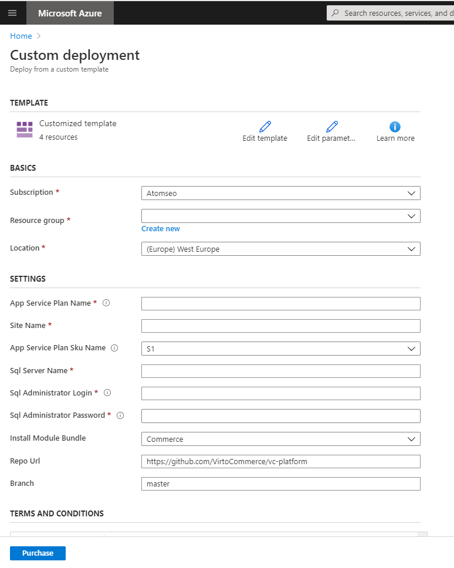
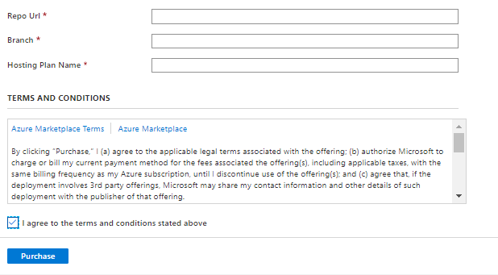
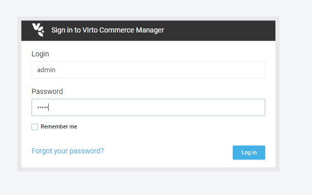
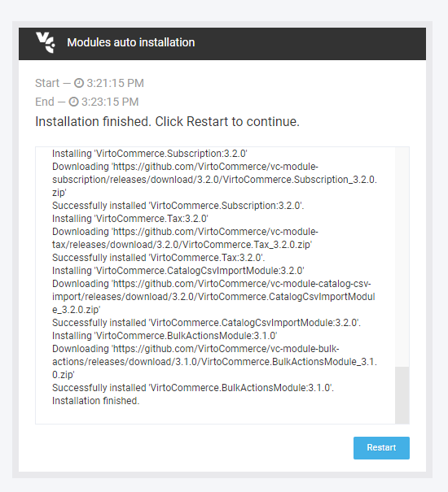
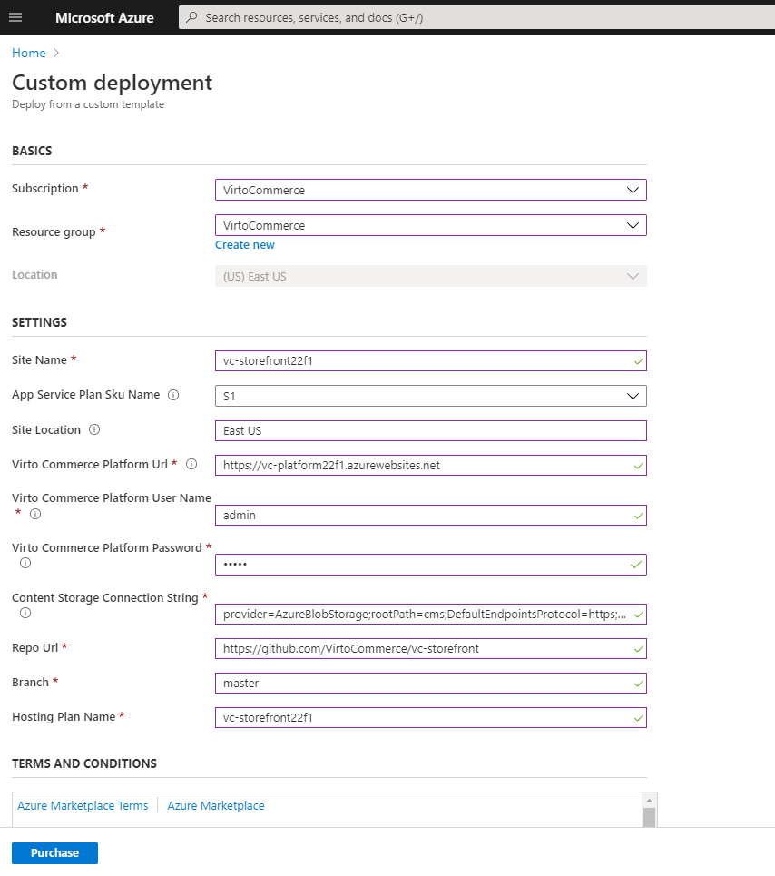

# Deploy to Azure

## Deploy Platfrom
You can deploy Virto Commerce Platform to Azure Cloud. To run the deployment of Platform, select the following button:

The following resources will be created during deployment:
 
* **Website** - Virto Commerce Platform.
* **Azure Storage** - as Primary blob storage for CMS and Assets.
* **SQL Azure** - database.

!!! tip
    * Deploy problem can be related of using “Free” plan, change to Basic or Standard. [Read More](https://www.virtocommerce.org/t/deploy-virto-commerce-to-azure-and-getting-a-deployment-failure/72).
    * Your login name must not contain a SQL Identifier or a typical system name (like admin, administrator, sa, root, dbmanager, loginmanager, etc.) or a built-in database user or role (like dbo, guest, public, etc.)
    * Your password must be at least 8 characters in length.
    * Your password must contain characters from three of the following categories – English uppercase letters, English lowercase letters, numbers (0-9), and non-alphanumeric characters (!, $, #, %, etc.).
    * You can install modules and sample data later from Virto Commerce Admin UI.

1. The portal displays a pane that allows you to easily provide parameter values. The parameters are pre-filled with the default values from the template.
    
1. Select Subscription and Fill required parameters.  
1. Select **Purchase**. 
    
1. Wait until the deployment has been completed.
1. Copy **WebSite URL**, **Content Storage Connection String** from output.
1. Open **WebSite URL** in your browser. 
1. The application will create and initialize database on the first request. After that you should see the sign in page. Use the following credentials:
    * User Name: **admin**
    * Password: **store**
    
1. Install Commerce modules and restart the platform.
    
1. Install sample data if required. 

## Deploy Storefront

You can deploy Virto Commerce Storefront to Azure Cloud. To run the deployment of Platform, select the following button:

The following resources will be created during deployment:

* **Website** - Virto Commerce Storefront.

!!! note
    1. The Virto Commerce Platform should be installed. 
    1. Sample data should be installed or a Store should be configured.

!!! tip
    How to get Content Storage Connection String if you have not copied it from platform deployment:

    1. Open [Azure Portal](https://portal.azure.com/)
    1. Select **Storage Account** which you created when deploy the Virto Commerce Platform.
    1. Select **Access Keys** and copy **Connection string**. Ex:
        `DefaultEndpointsProtocol=https;AccountName=vc...`
    1. Add prefix **provider=AzureBlobStorage;rootPath=cms;**
    1. So, Content Storage Connection String is: 
        `provider=AzureBlobStorage;rootPath=cms;DefaultEndpointsProtocol=https;AccountName=vc...`

1. The portal displays a pane that allows you to easily provide parameter values. The parameters are pre-filled with the default values from the template.
    
1. Select Subscription and Fill required parameters.  
1. Select **Purchase**. 
1. Wait until the deployment has been completed.
1. Open url in your browser.  

## Extra Deployment

### Deploy via PowerShell
Read [Azure Resource Manager documentation](https://docs.microsoft.com/en-us/azure/azure-resource-manager/templates/deploy-powershell) to
deploy Virto Commerce Platform from Custom Template [azuredeploy.json](https://github.com/VirtoCommerce/vc-platform/blob/master/azuredeploy.json) to Azure via PowerShell.

### Deploy via Azure CLI
Read  [Azure Resource Manager documentation](https://docs.microsoft.com/en-us/azure/azure-resource-manager/templates/deploy-cli) to
deploy Virto Commerce Platform from Custom Template [azuredeploy.json](https://github.com/VirtoCommerce/vc-platform/blob/master/azuredeploy.json)  to Azure via CLI.
