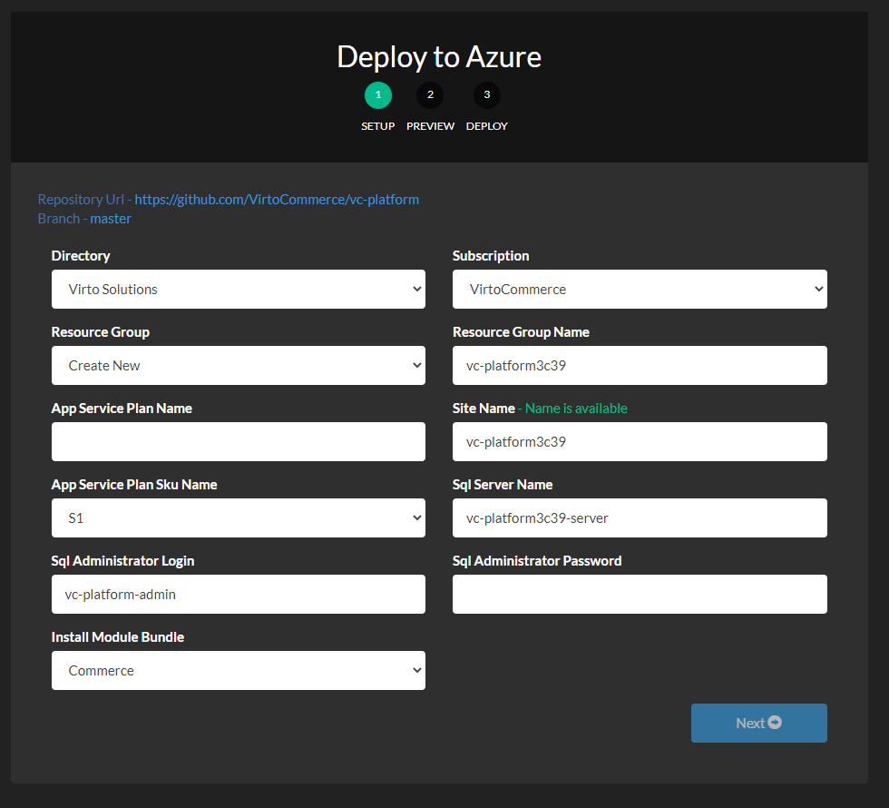
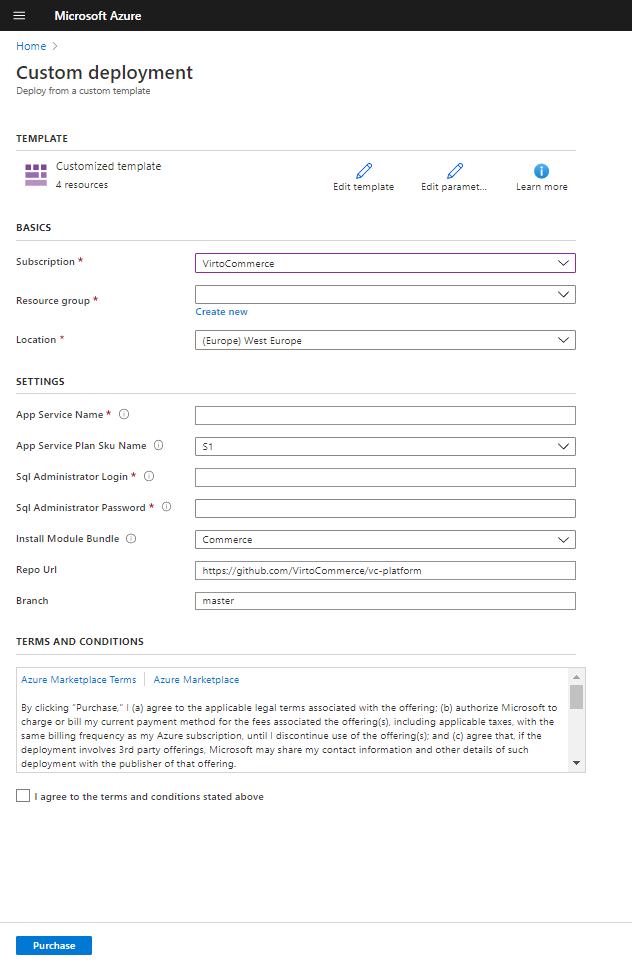
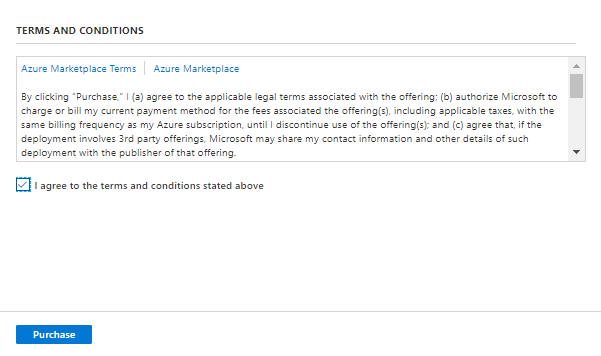

# Deploy to Azure
Use this guide to <a class="crosslink" href="https://virtocommerce.com/ecommerce-hosting" target="_blank">deploy</a> to Azure and configure Virto Commerce Platform.

!!! note
    You can install modules and sample data later from Virto Commerce Admin UI.

Virto Commerce Team creates default ARM template [azuredeploy.json](https://github.com/VirtoCommerce/vc-platform/blob/master/azuredeploy.json) to simplify deployment of Virto Commerce Platform to Azure.
You can use this template as base for your custom solution.
Read [Azure Resource Manager documentation](https://docs.microsoft.com/en-us/azure/azure-resource-manager/).

The following resources will be created during deployment:
 
* Azure Storage - as Primary blob storage for CMS and Assets.
* SQL Azure - database.
* Website - Virto Commerce Platform.

## Deploy to Azure from GitHub
This sections describes how to use the Deploy to Azure button to deploy Virto Commerce Platform from a GitHub repository.

!!! note
    When a user clicks on the **Deploy to Azure** button, a “referrer” header is sent to azuredeploy.net which contains the location of the Git repository to deploy from.
    This scenario is good if you want to install Virto Commerce platform from the sources.

!!! tip
    * Deploy problem can be related of using “Free” plan, change to Basic or Standard. [Read More](https://www.virtocommerce.org/t/deploy-virto-commerce-to-azure-and-getting-a-deployment-failure/72).
    * Your login name must not contain a SQL Identifier or a typical system name (like admin, administrator, sa, root, dbmanager, loginmanager, etc.) or a built-in database user or role (like dbo, guest, public, etc.)
    * Your password must be at least 8 characters in length.
    * Your password must contain characters from three of the following categories – English uppercase letters, English lowercase letters, numbers (0-9), and non-alphanumeric characters (!, $, #, %, etc.).

1. Open GitHub repository https://github.com/VirtoCommerce/vc-platform and select  button.
1. It opens Deploy to Azure wizard and takes control over how Virto Commerce Application gets deployed to the Azure cloud.
   
1. Select Subscription and Fill required parameters.  
1. Select **Next**. 
    
1. Select **Deploy** and wait. 
    
1. It can take time to crate resources, download and compile the source from GitHub.
    
1. Open url in your browser. 
    
1. The application will create and initialize database on the first request. After that you should see the sign in page. Use the following credentials:
    * Login: **admin**
    * Password: **store**
    
1. Install Commerce modules and restart the platform.
    
1. Install sample data if required. 

## Deploy to Azure from Custom Template

This sections describes how to deploy Virto Commerce Platform from Custom ARM Template.

1. Sign-in to [Azure Portal](https://portal.azure.com/).
1. Select **Template deployment** to deploy using custom templates.
   
1. Select **Create**.
   
1. Select **Build your own template in the editor**.
   
1. Load template file from [azuredeploy.json](zuredeploy.json).
1. Select **Save**.
    
1. Select Subscription and Fill required parameters.  
1. Select **Purchase**. 
    
1. Wait until the deployment has been completed.
1. Navigate to the <a href="https://github.com/VirtoCommerce/vc-platform/releases">Releases section of Virto Commerce Platform in GitHub.</a>
1. You will find **VirtoCommerce.Platform.3.x.x.zip** file. In this file the site has already been built and can be run without additional compilation. The source code is not included. 
1. Select **Application Services** > **Application Service** > **Advanced Tools** and Open Kudu console. 
1. Unpack release to `D:\home\site\wwwroot\platform` folder.  
    
1. Open url in your browser. 
1. The application will create and initialize database on the first request. After that you should see the sign in page. Use the following credentials:
    * Login: **admin**
    * Password: **store**
1. Install Commerce modules and restart the platform.
1. Install sample data if required. 

## Deploy to Azure via PowerShell
Read [Azure Resource Manager documentation](https://docs.microsoft.com/en-us/azure/azure-resource-manager/templates/deploy-powershell) to
deploy Virto Commerce Platform from Custom Template [azuredeploy.json](https://github.com/VirtoCommerce/vc-platform/blob/master/azuredeploy.json) to Azure via PowerShell.

## Deploy to Azure via Azure CLI
Read  [Azure Resource Manager documentation](https://docs.microsoft.com/en-us/azure/azure-resource-manager/templates/deploy-cli) to
deploy Virto Commerce Platform from Custom Template [azuredeploy.json](https://github.com/VirtoCommerce/vc-platform/blob/master/azuredeploy.json)  to Azure via CLI.
