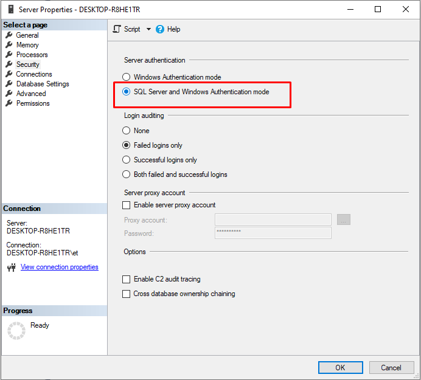

# Deploy on Windows
Use this guide to <a class="crosslink" href="https://virtocommerce.com/ecommerce-hosting" target="_blank">deploy</a> and configure precompiled Virto Commerce Platform V3.

## Prerequisites

* [Prerequisites for .NET 8.0 on Windows](https://docs.microsoft.com/en-us/dotnet/core/install/windows?tabs=net80#dependencies)
* [.NET 8.0 SDK](https://dotnet.microsoft.com/download/dotnet/8.0)
* [Microsoft SQL Server](https://www.microsoft.com/en-us/sql-server/sql-server-downloads)

> Please switch SQL server authentication to mixed mode

  

## You have two options for installing the platform 

* Manual downloading the precomplied binaries
* Using VirtoCommerce global tool CLI
  
## Downloading the precomplied binaries

* Navigate to the <a href="https://github.com/VirtoCommerce/vc-platform/releases">Releases section of Virto Commerce Platform in GitHub.</a>

* You will find **VirtoCommerce.Platform.3.x.x.zip** file. In this file the site has already been built and can be run without additional compilation. The source code is not included.

* Unpack this zip to a local directory **C:\vc-platform-3**. After that you will have the directory with Platform precompiled files.

## Using `vc-build` CLI

* Install vc-build 
```console
dotnet tool install -g VirtoCommerce.GlobalTool
```
* Install platform and modules
```console
vc-build install
```
Also you can specify the platform version:
```console
vc-build install -platform -version 3.800.0
```
Check out [vc-build for packages management](https://github.com/VirtoCommerce/vc-build/blob/main/docs/CLI-tools/package-management.md)  for more info.

## Setup

### Configure

* Open the **appsettings.json** file in a text editor.
* In the **ConnectionStrings** section change **VirtoCommerce** node (provided user should have permission to create new database):

```json
    "ConnectionStrings": {
        "VirtoCommerce" : "Data Source={SQL Server URL};Initial Catalog={Database name};Persist Security Info=True;User ID={User name};Password={User password};MultipleActiveResultSets=True;Connect Timeout=30"
    },

```

### Run on HTTPS schema (Prefered)

* Install and trust HTTPS certificate

Run to trust the .NET Core SDK HTTPS development certificate:

```console
    dotnet dev-certs https --trust
```

Read more about [enforcing HTTPS in ASP.NET Core](https://docs.microsoft.com/en-us/aspnet/core/security/enforcing-ssl?view=aspnetcore-3.0&tabs=visual-studio#trust)

* Run the Platform:

You can start platform by CLI "dotnet"

```console
cd C:\vc-platform-3\
dotnet.exe VirtoCommerce.Platform.Web.dll
```

The output in the console will say something like:

```console
[19:38:43] Virto Commerce is loading OK
[19:38:45] Getting server certificate OK
[19:38:47] Initializing module catalog OK
[19:39:40] Loading modules OK
[19:39:40] Registering API controllers OK
[19:39:46] Post initializing modules
[19:39:51 INF] Welcome to Virto Commerce 3.800.0.0!
[19:39:51 INF] Now listening on: http://localhost:5000
[19:39:52 INF] Application started. Press Ctrl+C to shut down.
[19:39:52 INF] Hosting environment: Production
...
```

### Run on HTTP schema
 
* In order to run the platform only at HTTP schema in production mode, it's enough to pass only HTTP URLs in `--urls` argument of the `dotnet` command.

```console
  dotnet VirtoCommerce.Platform.Web.dll --urls=http://localhost:5000
```

### First Run

The default HTTPS address and port have been removed from Kestrel in .NET 7. Users must now manually bind to HTTPS and specify the address and port explicitly, [through one of the following means](https://learn.microsoft.com/en-us/dotnet/core/compatibility/aspnet-core/7.0/https-binding-kestrel).

```console
  dotnet VirtoCommerce.Platform.Web.dll --urls=https://localhost:5000
```

* Open `https://localhost:5001` url in your browser. "Your connection is not private" might appear. Click "Advanced" and "Proceed to ...".
Read more on removing this error and using a self-signed certificate: [Trust the ASP.NET Core HTTPS development certificate](https://www.hanselman.com/blog/DevelopingLocallyWithASPNETCoreUnderHTTPSSSLAndSelfSignedCerts.aspx)
* The application will create and initialize database on the first request. After that you should see the sign in page. Use the following credentials:
  * Login: **admin**
  * Password: **store**

### Configure Content Storage
If you plan to run Virto Commerce on either custom domain or port, you will need to change public url for Assets and Content:

* Open the **appsettings.json** file in a text editor.

* In the **Assets** section set public url for assets `Assets:FileSystem:PublicUrl` with url of your application, this step is needed in order for display images

```json
"Assets": {
        "Provider": "FileSystem",
        "FileSystem": {
            "RootPath": "~/assets",
            "PublicUrl": "https://localhost:5001/assets/" <-- Set your platform application url with port localhost:5001
        },
    },
```

* In the **Content** section set public url for content `Content:FileSystem:PublicUrl` with url of your application, this step is needed in order for configure CMS content storage

```json
"Content": {
        "Provider": "FileSystem",
        "FileSystem": {
            "RootPath": "~/cms-content",
            "PublicUrl": "https://localhost:5001/cms-content/" <-- Set your platform application url with port localhost:5001
        },
    },
```

### Host on Windows with IIS

The required web.config file was already included in the release package. It contains all the necessary settings for running in IIS.

Read more in the official Microsoft ASP.NET Core documentation:
[Host ASP.NET Core on Windows with IIS](https://docs.microsoft.com/en-us/aspnet/core/publishing/iis)

Open the VirtoCommerce Platform application in the browser.
