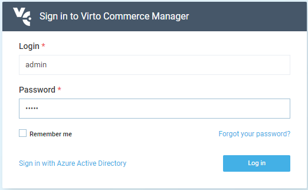
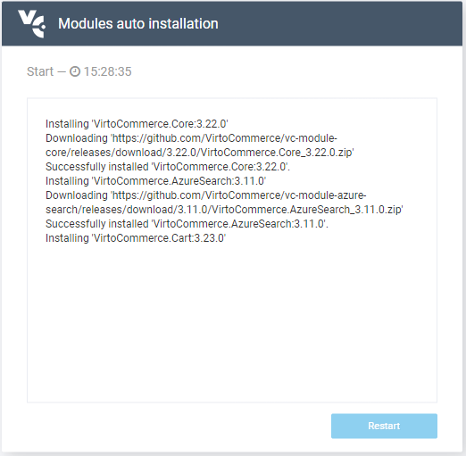
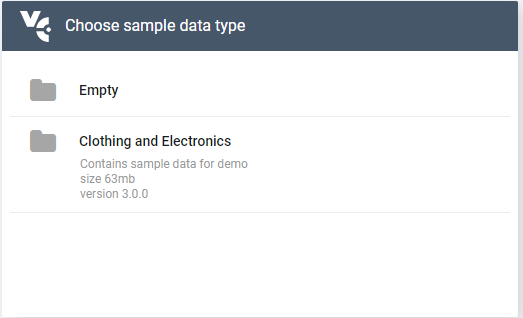
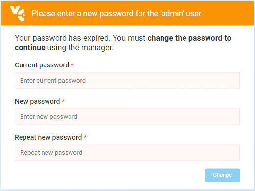
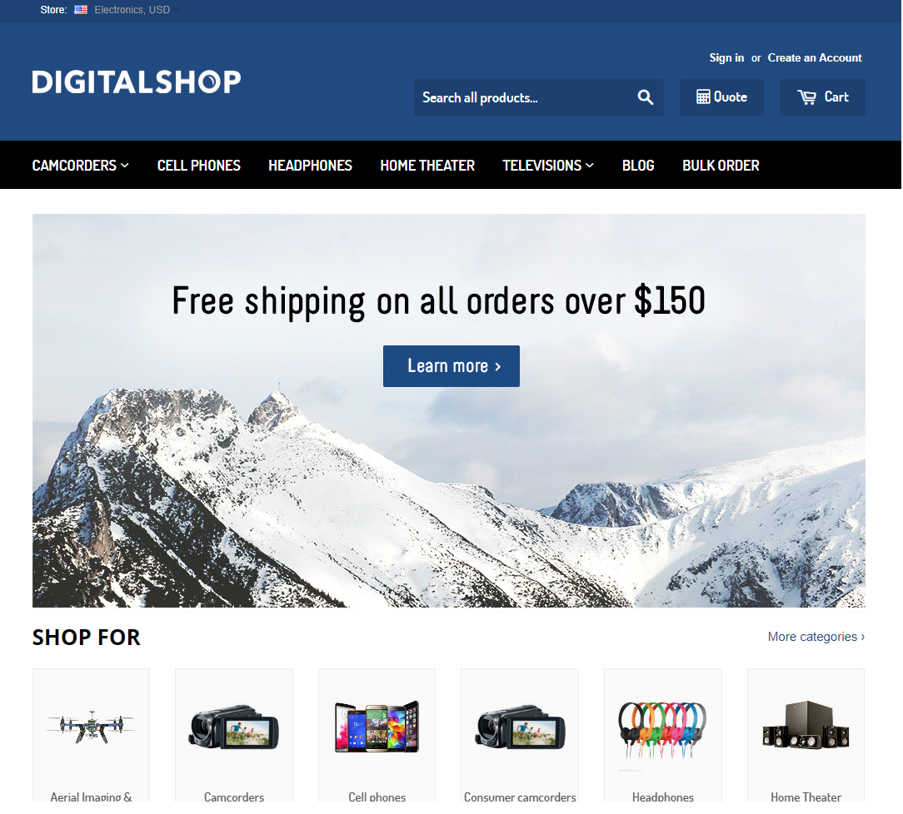

## Summary

Use this guide to [deploy](https://virtocommerce.com/ecommerce-hosting) and configure precompiled Virto Commerce Platform (backend) and Virto Commerce Storefront (frontend).

## Video

* [How to deploy and configure Virto Commerce Platform](https://youtu.be/A1h9hUA5rHk)

## Prerequisites

* [Microsoft SQL Server 2019 or later](https://www.microsoft.com/en-us/sql-server/) with SQL Management Studio(free MS SQL Express would be enough)
* [Prerequisites for .NET 6 on Windows](https://learn.microsoft.com/en-us/dotnet/core/install/windows)
* [.NET 6 Runtime](https://dotnet.microsoft.com/download/dotnet/6.0/runtime)

## Initial configuration of Virto Commerce Platform (backend)

* Navigate to the [Releases section of Virto Commerce Platform in GitHub](https://github.com/VirtoCommerce/vc-platform/releases)
* You will find and download **VirtoCommerce.Platform.3.x.x.zip** file.
* Unpack follow zip to the **C:\vc-platform-3** directory.

## Setup of Virto Commerce Platform

### Configure connection strings

* Open the **C:\vc-platform-3\appsettings.json** file in a text editor.
* In the **ConnectionStrings** section change **VirtoCommerce** node, specify connection string SQL server database. Change (local) to IP address of your SQL Server. For locally running instance SQL Express set **Data Source=.\SQLEXPRESS**.
  
```json
"ConnectionStrings": {
        "VirtoCommerce" : "Data Source=(local);Initial Catalog=VirtoCommerce3;Persist Security Info=True;User ID=virto;Password=virto;MultipleActiveResultSets=True;Connect Timeout=30"
    },
```

### Create virto user in SQL Server Manager

* Open SQL Server Manager and connect to the local sql server on Database Engine. Add to Security/Logins new login name virto with password virto, give him in Server Roles dbcreator and public roles.

### Running the Platform on HTTPS schema

* Install and trust HTTPS certificate

Run to trust the .NET Core SDK HTTPS development certificate:

```cmd
dotnet dev-certs https --trust
```

Read more about [enforcing HTTPS in ASP.NET Core](https://docs.microsoft.com/en-us/aspnet/core/security/enforcing-ssl?view=aspnetcore-3.0&tabs=visual-studio#trust)

* Run the Platform:

You can start Platform by CLI "dotnet"

```console
cd C:\vc-platform-3\
dotnet.exe VirtoCommerce.Platform.Web.dll
```

The output in the console will say something like:

```console
Now listening on: http://localhost:5000
Now listening on: https://localhost:5001
```

## First sign in

* Open `https://localhost:5001` url in your browser. "Your connection is not private" might appear. Click "Advanced" and "Proceed to ...".
Read more on removing this error and using a self-signed certificate: [Trust the ASP.NET Core HTTPS development certificate](https://www.hanselman.com/blog/DevelopingLocallyWithASPNETCoreUnderHTTPSSSLAndSelfSignedCerts.aspx)
* On the first request the application will create and initialize **Virtocommerce3 database**. Wait a minute...
* After that you should see the sign in page.



* Use the following credentials:
  * Login: **admin**.
  * Password: **store**.

## Modules auto installation

* Next step - Platform modules auto installation, after that you should click the **Restart** button.



* When **Restart** button have been pressed **Virto Commerce Platform** will be stopped. Start the  platform by CLI "dotnet":

```console
dotnet.exe VirtoCommerce.Platform.Web.dll
```

## Sample data installation

* After restart you should see next page with possibility to sample data installation (you should choose **Closing and Electronics** option - new products would be added to your **Virtocommerce3** database).



## Change administrator password

After **Sample data installation** step completed user is forced to change the password.



### Content Configuration in application settings

* Open the **C:\vc-storefront\appsettings.json** file in a text editor.

* In the **Assets** section set public url for assets `Assets:FileSystem:PublicUrl` with url of your application, this step is needed in order for display images

```json
"Assets": {
        "Provider": "FileSystem",
        "FileSystem": {
            "RootPath": "~/assets",
            "PublicUrl": "https://localhost:5001/assets/" <-- Set your platform application url with port localhost:5001
        },
    },
```

* In the **Content** section set public url for content `Content:FileSystem:PublicUrl` with url of your application, this step is needed in order for configure CMS content storage

```json
"Content": {
        "Provider": "FileSystem",
        "FileSystem": {
            "RootPath": "~/cms-content",
            "PublicUrl": "https://localhost:5001/cms-content/" <-- Set your platform application url with port localhost:5001
        },
    },
```

## Initial configuration of Virto Commerce Storefront (frontend)

* Navigate to the [Releases section of Virto Commerce Storefront Kit in GitHub](https://github.com/VirtoCommerce/vc-storefront-core/releases)
You will find and download **VirtoCommerce.Storefront.5.x.x.zip** file.
* Unpack this zip to a local directory **C:\vc-storefront**. After that you will have the directory with Storefront precompiled files.

## Setup of Virto Commerce Storefront

### Configuring Virto Commerce Platform Endpoint

* Open the **C:\vc-storefront\appsettings.json** in a text editor.
* In the **Endpoint** section change **Url**, **UserName**, **Password** with correct path and credentials for Virto Commerce Platform:

```json
...
 "Endpoint": {
     "Url": "https://localhost:5001",
     "UserName": "admin",
     "Password": "store",
```

### Configure CMS content storage

* Open the **C:\vc-storefront\appsettings.json** in a text editor.
* In the **ConnectionStrings** section find the attribute named **ContentConnectionString**. Make sure that its rootPath value is **~/App_Data/cms-content**.

```json
...
"ConnectionStrings": {
    //For themes stored in local file system
    "ContentConnectionString": "provider=LocalStorage;rootPath=~/cms-content"
	//For themes stored in azure blob storage
    //"ContentConnectionString" connectionString="provider=AzureBlobStorage;rootPath=cms-content;DefaultEndpointsProtocol=https;AccountName=yourAccountName;AccountKey=yourAccountKey"
  },
...
```

Platform already contains `~/cms-content` folder with themes for sample stores. It was created earlier in the **Sample data installation** step. You need to make symbolic link to this folder by this command:

```cli
mklink /d C:\vc-storefront\wwwroot\cms-content C:\vc-platform-3\wwwroot\cms-content
```

### Running the Storefont

There are 2 options for launching the application:

* Running the Storefont by CLI "dotnet run".

#### Running the Storefont by CLI "dotnet run"

* Open command prompt console.
* Change working directory to the **C:\vc-storefront** and run the **Storefront** by following commands

```cli
cd C:\vc-storefront
dotnet VirtoCommerce.Storefront.dll --urls=https://localhost:5002/
```

The output in the console will say something like:

```cli
Now listening on: http://localhost:5002
```

Now you could first open the local **Virto Commerce Storefront** instance for the first time.

Navigate to `https://localhost:5002`:


