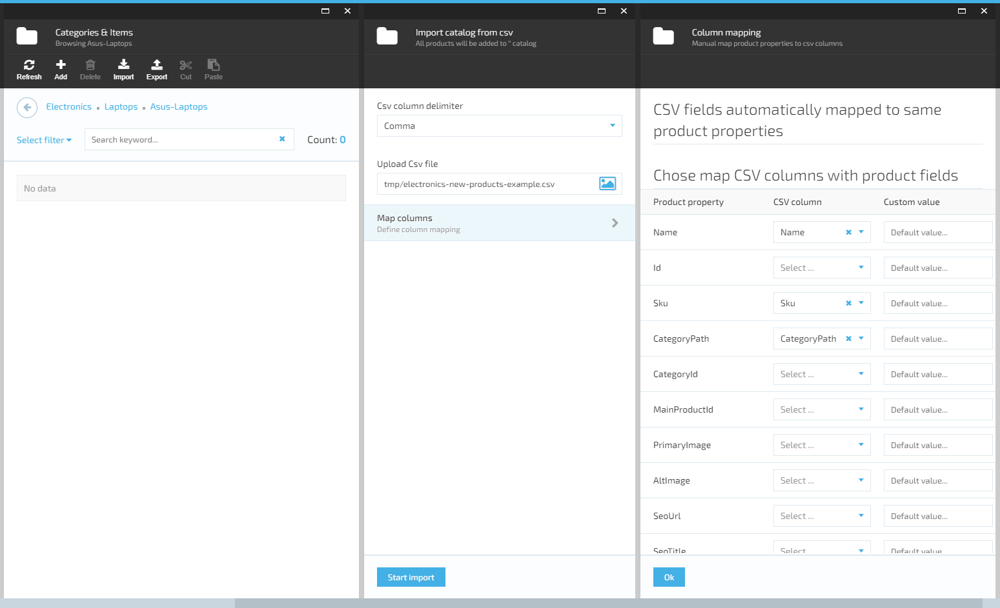
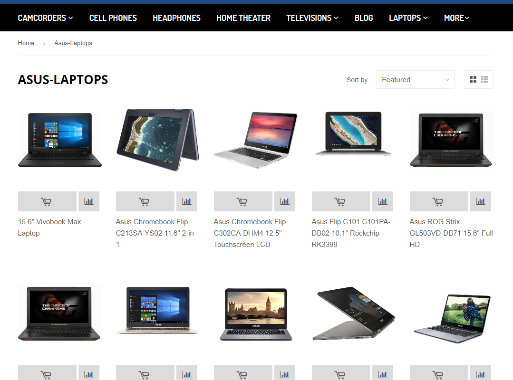
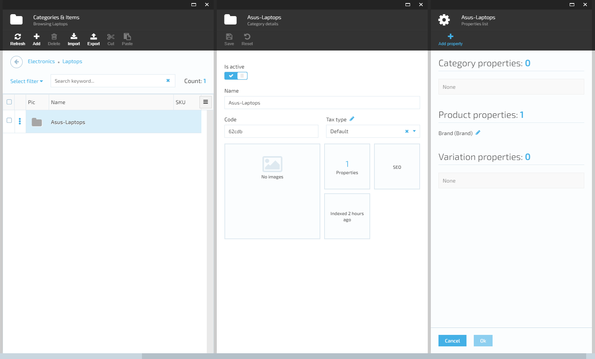

## Summary

Use this guide to import new products into Virto Commerce Platform (backend) catalog and can observe them locally on Virto Commerce Storefront (frontend).

## Prerequisites

* You need to have locally preinstalled Virto Commerce Platform (backend) and Virto Commerce Storefront (frontend) - see how to deploy and open them in <a href="https://virtocommerce.com/docs/lessons/lesson1" target="_blank">Lesson 1</a>.
* Download the <a href="https://github.com/VirtoCommerce/vc-content/blob/deploy/pages/docs/lessons/electronics-new-products-example.csv" target="_blank">electronics-new-products-example.csv</a> file with new products.
* Download the <a href="https://github.com/VirtoCommerce/vc-content/blob/deploy/pages/docs/lessons/images-example.zip" target="_blank">images-example.zip</a> file and extract the content. There will be 15 images of new products.
* Microsoft Excel, <a href="https://www.libreoffice.org/" target="_blank">LibreOffice(*free*)</a> or any other .csv file editor.

## Create catalog data file in .csv format

In order to have a file with your own products like downloaded **electronics-new-products-example.csv**, you need to create new .csv file in csv file editor.
* In Excel just select the product properties you need from the list and fill in the product properties columns as in our document. Set the PrimaryImage column values to URLs to your images in **Assets**.
* In LibreOffice you need to create table with the number of columns equal to the number of properties of your products and fill it. For a delimiter, select a comma.
* Save file in .csv format.

## Create new Catalog or use an existing one

* Open Virto Commerce Platform (see how to deploy and open it in [Lesson 1](https://virtocommerce.com/docs/latest/getting-started/lessons/lesson1/))
* There are 2 scenarios for adding new products: adding to a new catalog or to an existing one.

### Creating new category and subcategory

* To create new category in **Electronics** catalog click on **More > Catalog > Electronics>** click **+Add** > choose **Category >** fill category name **Laptops** and code (optional), click **Create** button.

* Click on the **Laptops** in categories list. To create new subcategory, click **+Add >** choose **Category >** add category name **Asus-Laptops** and code (optional), click **Create**.
* By clicking on **More > Catalog > Electronics > Laptops > Asus-Laptops** you will see all created categories. If you want to get Asus-Laptops CategoryId for using it in .csv file - click on categories list menu, select **Id** by check box and copy the Id value.

### Using an existing catalog and category

* Click on **More > Catalog**. Select the catalog and category names in which you want to add new products, click on categories list menu, select **Id** by check box and copy category Id value to use in your .csv file.

## Upload images for new products

You need to add images for products: go to **More > Assets > catalog >** click on the **New folder** icon, type **ASUS** folder name, click **Ok** button.

* Click on the **Upload** icon. An **Asset upload** blade opens. Select all the previously extracted sample images from **images-example.zip** in File Explorer and drag&drop onto specified area. Now you should see all images in the **ASUS** folder uploaded.

## Importing and mapping your catalog data into Virto Commerce

* At the top of the **Asus-Laptops** category blade click the **Import** icon **> VirtoCommerce CSV import >** select **Semicolon** in **Csv column delimiter >** click on the image and select **electronics-new-products-example.csv** file to upload. Wait a little... 

>Note: importing new products from the file without specifying either the category id or the category path in it, defaults to the root directory - to the catalog.

* After uploading your data, click on **Map columns**. On this blade you will see and configure how the properties of your products will be mapped to the default properties defined in application, just so they will be saved to the database after you click buttons **Ok** and **Start Import**. Wait a little...

## Open new products in Virto Commerce Platform (*backend*)

Now you can see and edit all new products by navigating to **More > Catalog > Electronics > Laptops > Asus-Laptops**:

## Creating a new menu item in Virto Commerce Storefront (*frontend*)

* To add new category to menu in Virto Commerce Storefront (*frontend*) open Virto Commerce Platform (*backend*), click on **More > Content > Link lists** inside **Electronics > en-US main-menu >** icon **+Add link** and fill Link Title - **Laptops**, URL - **~/laptops**, Links to - **Category**, Linked object - **Laptops**: click on button **Select > Electronics**, select **Laptops** via check box and click on icon **+Pick selected**, save changes.

* To add new link for subcategory **Asus Laptops** to menu in Virto Commerce Storefront(*frontend*) open Virto Commerce Platform (*backend*), click on **More > Content >** Link lists in **Electronics >** icon **+Add**. Fill Name - **Laptops**, Language - **en-US**, Link Title - **Asus Laptops**, URL - **~/asus-laptops**, click **Create** button.

## Creating thumbnails for new product images

Now you need to generate thumbnails for new images.
* **Do this step only once:** create new task for thumbnails generation: navigate to **More > Thumbnails >** click on **+Add** icon, enter Name - **catalog images**, Path to images - **/catalog**, click on penСЃil icon near **Thumbnail settings** and on **+Add** icon.

* Create and save thumbnail option details: Name - **348x348**, Thumbnail file name suffix - **348x348**, Resize method - **FixedSize**, Width (pixels) - **348**, Height (pixels) - **348**, Anchor position - **Center**. 
* Similarly add details for 3 other resolutions: **216x216, 168x168, 64x64**.
* Can close only **Thumbnails settings** blade now.
* Put the cursor in the **Thumbnail settings** field (in **New thumbnails generation task** blade), add all the previously created settings, save new thumbnails generation task.

* Select **catalog images** task in **Thumbnails generation tasks list** blade by check box, click on **!Run** icon, click **Regenerate** button in pop-up dialog. Wait a little... all done.
* If you'd add new pictures later, select the **Process changes** button to generate thumbnails only for them.

## Build search indexes and reset cache

* The search indexes are updated by the system every 5 minutes by default. In order to build the indexes for new categories and products immediately, navigate to **More > Search index >** select all document types via check boxes, click on **Build index** icon, in pop-up dialog click **Build** button.

* You need to reset Storefront cache after building the indexes. Navigate to **More > Stores > Electronics >** click **Reset cache** in **Store details** blade and click **Ok** button in the dialog.

## Open new products in Virto Commerce Storefront (*frontend*)

* Open Virto Commerce Storefront locally (see how to deploy and open it in <a href="https://github.com/VirtoCommerce/vc-content/tree/lesson2/Pages/docs/lessons/lesson1.md" target="_blank">Lesson 1</a>).
* Now you can see new menu item **Laptops**, new subitem **Asus Laptops** and all new products in Virto Commerce Storefront.

## Appendix 1: Default Product properties in Virto Commerce

In order to create a new catalog items .csv file, you need to know which defined product properties you can use:

| Property Name                                  | Data Type       | Example                                                                   |
|------------------------------------------------|-----------------|---------------------------------------------------------------------------|
| Name (required)                                | text            | Asus VivoBook W202NA-DH02 Rugged 11.6-inch Windows 10 Home Laptop         |
| Id                                             | text            |                                                                           |
| Sku                                            | text            |                                                                           |
| CategoryPath (required if CategoryId is empty) | text            | Laptops/Asus-Laptops                                                      |
| CategoryId (required if CategoryPath is empty) | text            |                                                                           |
| MainProductId                                  | text            |                                                                           |
| PrimaryImage (image url in app)                | text            | http://localhost/admin/assets/catalog/ASUS/99bb9e00c.jpg 
| AltImage                                       | text            | asus-vivobook-w202na-dh02                                                 |
| SeoUrl                                         | text            | asus-vivobook-w202na-dh02                                                 |
| SeoTitle                                       | text            |                                                                           |
| SeoDescription                                 | text            |                                                                           |
| SeoLanguage                                    | text            | en-US                                                                     |
| SeoStore (Id of Store)                         | text            |                                                                           |
| Review                                         | number (0 or 1) | 1                                                                         |
| ReviewType                                     | text            | FullReview(or QuickReview)                                                |
| IsActive                                       | number (0 or 1) | 1                                                                         |
| IsBuyable                                      | number (0 or 1) | 1                                                                         |
| TrackInventory                                 | number (0 or 1) | 1                                                                         |
| PriceId                                        | text            |                                                                           |
| SalePrice                                      | number          | 199.5                                                                     |
| ListPrice (required)                           | number          | 199.5                                                                     |
| Currency                                       | text            | USD                                                                       |
| PriceListId                                    | text            |                                                                           |
| Quantity (required, 0 and more)                | number          | 25                                                                        |
| ManufacturerPartNumber                         | text            | ASDJHG34GH-23                                                             |
| Gtin                                           | text            |                                                                           |
| MeasureUnit                                    | text            | mm                                                                        |
| WeightUnit                                     | text            | gram                                                                      |
| Weight                                         | number          | 125                                                                       |
| Height                                         | number          | 125                                                                       |
| Length                                         | number          | 125                                                                       |
| Width                                          | number          | 125                                                                       |
| TaxType                                        | text            |                                                                           |
| ProductType                                    | text            | Physical(or Digital)                                                      |
| ShippingType                                   | text            |                                                                           |
| Vendor                                         | text            | Asus                                                                      |
| DownloadType                                   | text            | Standard Product(or Software, or Music)                                   |
| DownloadExpiration                             | date            | 2018-04-05 21:47                                                          |
| HasUserAgreement                               | number (0 or 1) | 1                                                                         |

* In order to import your custom product property, you need to define it: in Virto Commerce Platform find the particular category > click on its name by right mouse button and select **Manage > Properties > +Add property**. Fill Property name, Display name - in English and German, enable Multi language switch, if the property can have multiple values - enable Multivalue switch, select **Product** in "Applies to" and choose Value Type. Set up Validation rules and Attributes if needed. Click **Save** in Manage property blade and **Ok** buttons in Properties list of your category.

* Now you can add column with the same name to .csv file. The property value would be filled with the column value automatically for all products of this category during import.
