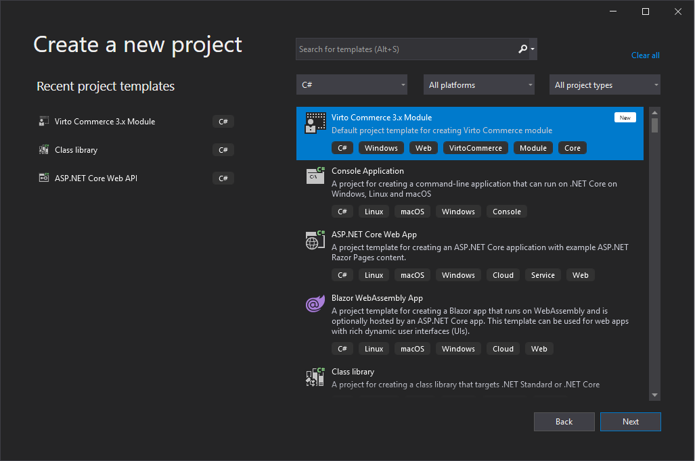
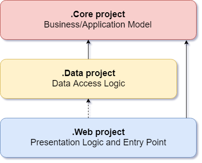

## Summary

Use this guide to create a custom module for Virto Commerce Platform. There will be an API created for product reviews management: create, update, delete, search. Hereinafter, this module will be called as "Customer Reviews" module.

After completing this lesson, a new module will be created, including:

* module API for create, delete, update and search customer reviews;
* test project for testing module API.

Platform Manager UI for the Virto Commerce "Customer Reviews" module will be created in [Lesson 4](https://virtocommerce.com/docs/latest/getting-started/lessons/lesson4/)

### Prerequisites

* Installed Virto Commerce Platform;
* Basic C# knowledge;
* Visual Studio 2019 or higher.

### Glossary

* VC - Virto Commerce;
* Platform - Virto Commerce Platform;
* Platform Manager - Virto Commerce Platform Manager, UI for Platform managing;
* JS - JavaScript;
* VS - Visual Studio.

## Create new module

New module should be created from a special VC module template in Visual Studio. The template is available as a Visual Studio extension online.

## Virto Commerce template

Open Visual Studio, go to **Extensions > Manage Extensions**. Search for **Virto Commerce 3.x Module Templates**.


Install it and restart Visual Studio.
Now, in Visual Studio click **Create a new project**, search for an existing **Virto Commerce 3.x Module**. Click **Next**.



Name it, according to the naming convention. For example:

* "Name": **CustomerReviewsModule**;
* "Solution name": **CustomerReviewsModule**.


After new module created fill in title, description and authors attributes in *module.manifest* file:

```xml
<module>
    ....

    <title>Sample Customer reviews module</title>
    <description>Sample module demonstrating best practices in a real life example.</description>
    <authors>
        <author>If you read this text, replace it with your name</author>
    </authors>
    ....
<module>
```

*module.manifest* is entry point for a VC module. It entirely defines the module, so that Virto Commerce Platform can install and run the module.

## Connect new module with the platform

Now, need to tell the platform that a new module added. For that, connect newly created solution folder to the Platform ~/Modules via the symbolic link:

1. Run Command Prompt as an administrator;
1. Navigate to the physical location folder of Platform's ~/Modules directory;
1. Run the following command:

```cmd
mklink /d CustomerReviewsModule <full_path_to_CustomerReviewsModule_project>
```

Restart Platform Manager, and CustomerReviewsModule module should appear in Platform Manager. Click on **Modules**, **Installed** and choose **CustomerReviewsModule**.


Then, click on **Settings** and turn on the radio button **CustomerReviewsModule Enabled**. And click **Save**.


Now, you can see **CustomerReviewsModule** in the module list. 


Click on **CustomerReviewsModule** and you should see "Hello world" blade


## Debugging

### Debugging C# code

To debug C# code at run-time you have to attach debugger to IIS instance.
In Visual Studio:

1. Run Studio as an administrator;
1. Click "Debug" from the menu bar;
1. Click "Attach to Process";
1. Check the "Show processes from all users" checkbox in the bottom left corner;
1. Select dotnet.exe from the process list;
1. Click "Attach".

### Swagger UI

"REST API documentation" (Swagger) UI is automatically generated page. It enables to make requests to all the REST API endpoints exposed by Platform and installed modules as well. Browse **[localhost:5001/docs/]** URL:


#### Authorization

Call Authorize button on the top of the page, enter username and password, submit the form in order to be able to use the secured API methods.

#### Testing module Rest API Endpoints

Click on "Sample Customer reviews module" to see the available endpoints.
When the new module is generated from a template, there is only one endpoint **api/CustomerReviewsModule** included, returning "Hello, world!":


## The VC module solution structure

"Customer review" solution consists of 4 logically divided parts (projects):

* **CustomerReviewsModule.Core** with following folder structure:
  * Models;
  * Services.
* **CustomerReviewsModule.Data** with following folder structure:
  * Migrations;
  * Models;
  * Repositories;
  * Services.
* **CustomerReviewsModule.Web** with following folder structure:
  * Controllers:
    * API.
  * Scripts:
    * blades;
    * Resources.
  * Content.
* **CustomerReviewsModule.Tests**.

In the solution, each project has its own responsibilities. Thus, certain types belong to each project, and you can always find the folders corresponding to these types in the corresponding project.

The figure below shows a representation of the layers of architecture. Notice that the solid arrows correspond to the compile-time dependencies, and the dashed arrows to the dependencies that exist only at run time. As part of the current architecture, a Web project works with interfaces that are defined in the Core project at compile time, and ideally should not know anything about the implementation types defined in the Data project. But at run time, these types of implementations are necessary to run the application, so they must exist and be tied to the interfaces of the Core project through dependency injection.



### .Core Business/Application Model

The project must contain a business model, services and interfaces. These interfaces should include abstractions for operations that will be performed using infrastructure, such as data access, file system access, network calls, etc. In addition, services or interfaces defined at this level can work with non-object types. that are independent of the user. interface or infrastructure and are defined as simple data transfer objects (DTO).

### .Data Data Access Logic

The project includes the implementation of data access. Namely, the data access implementation classes (Repositories), any EF Migration objects that have been defined, and EF Entities models. In addition to the data access implementations, the project must contain service implementations that must interact with infrastructure problems. These services must implement the interfaces defined in Core, and therefore the project must have a reference to the Core project.

### .Web Presentation Logic and Entry Point

The user interface level in an ASP.NET MVC application is the entry point for the application. This project must refer to the Core project, and its types must interact with the data layer strictly through the interfaces defined in Core. Direct creation or static calls for user-level data types are not allowed at the user interface level.

The Startup class is responsible for setting up the application and connecting the implementation types to the interfaces, which allows you to correctly inject dependencies at runtime. And to enable dependency injection in ConfigureServices in the Startup.cs file of the user interface project, it refers to data projects.

### .Tests project

**.Tests project** uses for testing the service and repository layer methods with Unit test.

This structure sets up automatically when module solution created from Virto Commerce template.

## Core project

All the abstractions are defined in the **CustomerReviewsModule.Core** project.

Typical structure of **Core** project is:

* Models - contains domain models that you want to introduce to VirtoCommerce platform and Search Criteria for support search:
  * Entities;
  * Search Criteria.
* Services - declaration of CRUD and search services without implementations:
  * CRUD service interface;
  * Search interface.

### Preinstalled NuGet packages

After the project is created from the template, the following packages will be automatically installed:

* **VirtoCommerce.Platform.Core**;
* **VirtoCommerce.Domain**.

### Domain models

All domain models should be located in **CustomerReviewsModule.Core\Models** folder.

#### Entity

CustomerReviews entity defined as base domain class:

```c#
namespace CustomerReviews.Core.Models
{
    public class CustomerReview : AuditableEntity
    {
        public string AuthorNickname { get; set; }
        public string Content { get; set; }
        public bool IsActive { get; set; }
        public string ProductId { get; set; }
    }
}
```

It contains all the mandatory data related to customers review: The authors nickname, review content, the status(active/inactive) and product ID which user reviewed.

#### Search criteria

Define criteria to search for reviews such as **CustomerReviewSearchCriteria**:

```c#
public class CustomerReviewSearchCriteria : SearchCriteriaBase
{
    public string[] ProductIds { get; set; }
    public bool? IsActive { get; set; }
}
```

In this case, the client can search by products and review status.

### Services

In order to use created models, need to create services. In **CustomerReviewsModule.Core\Services** folder will define the abstractions for customers review services.

For example, the **ICustomerReviewService** interface:

```c#
public interface ICustomerReviewService
{
    CustomerReview[] GetByIds(string[] ids);
    void SaveCustomerReviews(CustomerReview[] items);
    void DeleteCustomerReviews(string[] ids);
}
```

Here define methods to get, save and delete customer reviews.
And a separate service is for the search. **ICustomerReviewSearchService**:

```c#
public interface ICustomerReviewSearchService
{
    GenericSearchResult<CustomerReview> SearchCustomerReviews(CustomerReviewSearchCriteria criteria);
}
```

### Permissions

In **ModuleConstants.cs** declared basic module permissions which describes particular right of action and has a string presentation which is used in permission checks. These permissions will be used below in the description API methods in **CustomerReviewsModule.Web** project.

```c#
public static class Security
{
   public static class Permissions
   {
      public const string Read = "CustomerReviewsModule:read";
      public const string Update = "CustomerReviewsModule:update";
      public const string Delete = "CustomerReviewsModule:delete";
   }
}
```

With them you control the API access allowing to read, update or perform delete operation. These permission checks are also used in frontend part as well.

## Data project (Persistence layer)

For the persistence or Data Access Layer (DAL) solution has a separate project called **Data**. Here implemented all the interfaces defined in **Core** project. Moreover, it contains all the persistence and data access abstractions, and mappings as well.

Typical structure of **Data** project is:

* Models - separate classes have each of the entities that you created previously in **Core** project, typically they have the conversion methods from domain model to persistency model
  * {Entity}.ToModel()
  * {Entity}.FromModel()
  * {Entity}.Patch()
* Repositories - contains classes for making requests to database
* Migrations - contains code to manage incremental changes and version control to database
* Services - implementation of services that were previously declared in **Core** project

### Preinstalled NuGet packages

After the project is created from the template, the following NuGet packages will be automatically installed:

* **VirtoCommerce.Platform.Core**;
* **VirtoCommerce.Platform.Data**;
* **VirtoCommerce.Domain**.

### Project references

**CustomerReviewsModule.Data** project has reference to **CustomerReviewsModule.Core** project.

### Entity and mapping

Now need to create data access layer models and map it to the base domain class. All data access layer models should be located in **CustomerReviewsModule.Data\Models** folder.

The example of the CustomerReview  data access layer model implementation you can find in sample the [repository](https://github.com/VirtoCommerce/vc-samples/tree/master/CustomerReviews).

### Repositories

As a new type of abstraction, Data project has repositories defined in it. For example, you can notice **ICustomerReviewRepository** used in **CustomerReviewService**.

```c#
public interface ICustomerReviewRepository : IRepository
{
    IQueryable<CustomerReviewEntity> CustomerReviews { get; }
 
    CustomerReviewEntity[] GetByIds(string[] ids);
    void DeleteCustomerReviews(string[] ids);
}
```

**ICustomerReviewRepository** interface contains only the declaration of the methods, properties. Implementation of the interface **ICustomerReviewRepository** uses Entity Framework under the hood. The Interface and the implementation can find in the sample [repository](https://github.com/VirtoCommerce/vc-samples/tree/master/CustomerReviews).
The interface and its implementation should be located in **CustomerReviewsModule.Data\Repositories** folder.

### Services

The implementations of the services that was defined early in **CustomerReviewsModule.Core** project should be located in **CustomerReviewsModule.Data\Services** folder. The example of the services implementation you can find in the sample [repository](https://github.com/VirtoCommerce/vc-samples/tree/master/CustomerReviews).

### Migrations

In order to define the data access layer based on Entity Framework use the package manager tools in Visual Studio. From the VS top menu chooses **Tools>Module Package Manager>Package Manager Console**.


There is a command to enable migrations:

```cmd
enable-migrations -MigrationsDirectory Migrations
```

In the dropdown menu choose the **CustomerReviewsModule.Data** project. The command run will create a new migration configuration.

Note, that by default the automatic migrations are switched off:

```c#
AutomaticMigrationsEnabled = false
```

#### Initial migration

For generate the initial migration use this script:

```cmd
Add-Migration Initial -ConnectionString "Data Source=(local);Initial Catalog=VirtoCommerce2;Persist Security Info=True;User ID=virto;Password=virto;MultipleActiveResultSets=True;Connect Timeout=420" -ConnectionProviderName "System.Data.SqlClient"
```

This will generate the **dbo.CustomerReview** migration script. Keep in mind, that in case "Down migration" developer should take care of removing the module with all its dependencies.
Now the Data Access Layer is ready.

## Web project

This is most important project in the solution.

Typical structure of **Web** project is:

* Controllers - API controllers, all methods defined here wil be available from platform instance;
* Scripts - entry point for Platform Manager user interface;
* Module.manifest - the main file containing new module definition;
* Module.cs - main entry point for module backend, containing database initialization, registration of new repositories, services, model types and overrides.

### Preinstalled NuGet packages

After the project is created from the template, the following NuGet packages will be automatically installed:

* **VirtoCommerce.Platform.Core.Web**;
* **VirtoCommerce.Platform.Data**;
* **VirtoCommerce.Domain**.

### Project references

**CustomerReviewsModule.Web** project has reference to **CustomerReviewsModule.Core** and **CustomerReviewsModule.Data** projects.

### Module.manifest

*module.manifest* contains various attributes describing the module and its contents which is necessary for the Platform to connect the module to the platform. The Platform searches for CustomerReviewModule *module.manifest* file, gets the entry point and connects the module to the platform.

Typical *module.manifest* structure is:

* Identifier - a new module identifier for Platform, each modules identifier should be unique:

```xml
<id>CustomerReviews.Web</id>
```

* Versioning - actual version of a new module and required Platform version:

```xml
<version>1.0.0</version>
<platformVersion>3.200.0</platformVersion>
```

* Dependencies - list of modules with versions whose functions will be used in a new module:

```xml
<dependencies>
    <dependenci id="VirtoCommerce.Core" version="3.200.0">
</dependencies>
```

* Title and description - name and description of a new module that will be displayed in the Platform Manager and Swagger:

```xml
<title>Sample Customer reviews module</title>
<description>Sample module demonstrating best practices in a real life example.</description>
```

* Authors - names of programmers who wrote a new module:

```xml
<authors>
    <author>Egidijus Mazeika</author>
</authors>
```

* AssemblyFile and ModuleType - auto generated data witch Platform use under the hood to connect a new module:

```xml
<assemblyFile>CustomerReviews.Web.dll</assemblyFile>
<moduleType>CustomerReviews.Web.Module, CustomerReviews.Web</moduleType>
```

* Styles - path for additional styles for a new module user interface:

```xml
<styles>
    <directory virtualPath="$/Content/css" searchPattern="*.css" searchSubdirectories="true" />
</styles>
```

* Scripts - path for a new module user interface scripts:

```xml
<scripts>
    <directory virtualPath="$/Scripts" searchPattern="*.js" searchSubdirectories="true" />
</scripts>
```

* Settings - define custom settings for a new module:

```xml
<settings>
    <group name="Store|General">
        <setting>
            <name>CustomerReviews.CustomerReviewsEnabled</name>
            <valueType>boolean</valueType>
            <defaultValue>false</defaultValue>
            <title>Customer Reviews enabled</title>
            <description>Flag to mark that customer reviews functionality is enabled</description>
        </setting>
    </group>
</settings>
```

* Permissions - define custom permissions for a new module:

```xml
<permissions>
    <group name="Customer Reviews">
        <permission id="customerReview:read" name="Read Customer Reviews" />
        <permission id="customerReview:update" name="Update Customer Review" />
        <permission id="customerReview:delete" name="Delete Customer Review" />
    </group>
</permissions>
```

### Module.cs and initialization flow

*Module.cs* is the main entry point of managed code, the base class for the entire module. In this case, its Customer Reviews module. Module initialization flow contains several steps:

* Setup Database;
* Initialization:
  * Services registration;
* Post initialization:
  * Override registrations;
  * Store dependent settings registration.

#### Setup Database

First step is to registry repositories defined in **Data** project (including migrations) and initialize database. The database is initialized in the **SetupDatabase()** method:

```c#
public override void SetupDatabase()
{
    using (var db = new CustomerReviewRepository(_connectionString, _container.Resolve<AuditableInterceptor>()))
    {
        var initializer = new SetupDatabaseInitializer<CustomerReviewRepository, Data.Migrations.Configuration>();
        initializer.InitializeDatabase(db);
    }
}
```

#### Initialization

Interfaces are using in services in CustomerReviews module. Thats because a dependency injection always used. Inside of **Initialize()** method in the Main class register the Service implementations of the module and link them with the interfaces:

```c#
public override void Initialize()
{
    base.Initialize();

    // This method is called for each installed module on the first stage of initialization.

    // Register implementations:
    _container.RegisterType<ICustomerReviewRepository>(new InjectionFactory(c => new CustomerReviewRepository(_connectionString, new EntityPrimaryKeyGeneratorInterceptor(), _container.Resolve<AuditableInterceptor>())));
    _container.RegisterType<ICustomerReviewSearchService, CustomerReviewSearchService>();
    _container.RegisterType<ICustomerReviewService, CustomerReviewService>();
}
```

The method registers a specific signature for the type that will be injected for the ICustomerReviewRepository interface with a predefined connection string with the database, Id generator and interceptors (for uniformity of work with the database). By calling this line only a factory method registered to be executed during the DI.

This is called a loose coupling mechanism.

#### Post initialization

If you need to override existing registrations or register new store dependent settings you can do this in **PostInitialize()** method.

### Module settings

Platform settings are collected and delivered to Settings module by all platform modules. Each module can add settings to a standard UI by declaring them in the module manifest.

In VC3 settings are declared in ModuleConstants.cs

Example

```cs
        public static class Settings
        {
            public static class General
            {
                public static SettingDescriptor CustomerReviewsEnabled = new SettingDescriptor
                {
                    Name = "CustomerReviews.CustomerReviewsEnabled",
                    GroupName = "Store|CustomerReviews",
                    ValueType = SettingValueType.Boolean,
                    DefaultValue = false
                };
            }
        }
```

### WEB API layer

For access and use CustomerReviews module services a WEB API layer defined. Search, CRUD and module specific operations are exposed there.

For example, look at searching endpoint:

```c#
[HttpPost]
[Route("search")]
[ResponseType(typeof(GenericSearchResult<CustomerReview>))]
[CheckPermission(Permission = Permissions.Read)]
public IHttpActionResult SearchCustomerReviews(CustomerReviewSearchCriteria criteria)
{
    GenericSearchResult<CustomerReviews> result = _customerReviewSearchService.SearchCustomerReviews(criteria);
     return Ok(result);
}
```

There isnt much code in the method. The customer reviews search Service calling directly. Of course, here as well, will use the **ICustomerReviewRepository** abstraction and not the service implementation itself.

The API endpoints are all accessed from the JavaScript code written in the **CustomerReviewsModule**.

### WEB API endpoints protection

Protecting API controller methods with CheckPermission attribute:

```c#
[CheckPermission(Permission = Permissions.Read)]
```

### Testing Rest API Endpoints in Swagger

Besides the JavaScript, you can test module API endpoints, with the Swagger. Compile solution and restart IIS (use iisreset.exe command). Open the Swagger interface URL: **[localhost:5001/docs/]** and click on "Customer reviews module" to see the available endpoints.
You can test the search functionality for instance. Under the **api/CustomerReviewsModule/search** endpoint you can create simple or nested, compound criteria. It accepts the criteria as a simple object. After providing the criteria hit the "Try it out" button.


## Tests project

xUnit testing framework used for test project in module solution.

### Preinstalled NuGet packages

After the project is created from the template, the following NuGet packages will be automatically installed:

* **xUnit.Net**;
* **xunit.runner.visualstudio**;
* Virto Commerce packages referenced in **Core** and **Data** projects.

### Project references

**CustomerReviewsModule.Tests** project has reference to **CustomerReviewsModule.Core** and **CustomerReviewsModule.Data** projects.

### Tests implementation

We recommend to use ["Unit testing best practices with .NET Core and .NET Standard"](https://docs.microsoft.com/en-us/dotnet/core/testing/unit-testing-best-practices) in tests development.

Actual code for CustomerReviewsModule.Tests project you can find in the sample [repository](https://github.com/VirtoCommerce/vc-module-customer-review/blob/dev/tests/VirtoCommerce.CustomerReviews.Test/CustomerReviewsTests.cs).

## Pack and release/deployment

To deploy CustomerReviews module to other platforms use the package manager tool. The command for that is:

```cmd
compress-module
```

After execution, the command will create the .zip module package. You can deploy it to the other environment. Go to **Modules>Advanced>Install/update module from file**. Upload the .zip file that created with package manager. After checking, the upload details hit the **Install** button. **Restart** the application.

Under the hood, the application will unzip the file, check the structure, and copy all the required classes to the Modules folder of the current application.
