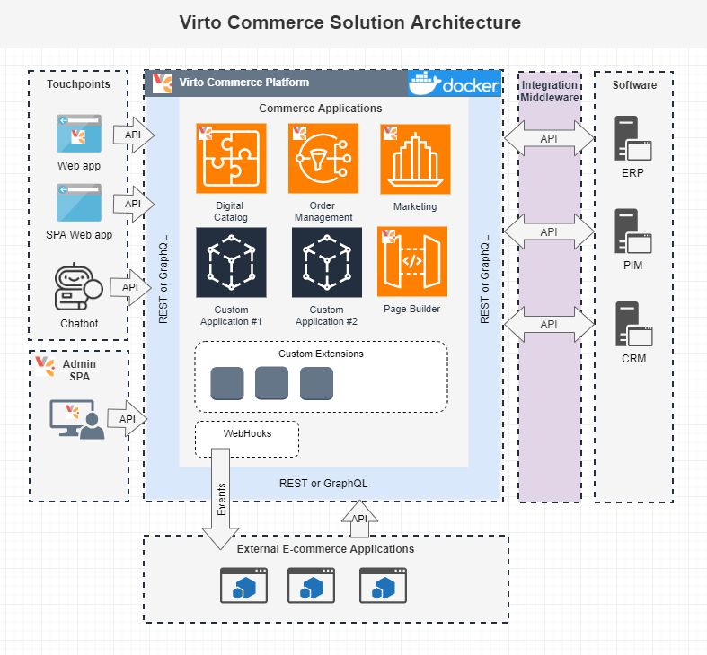
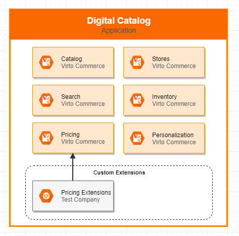
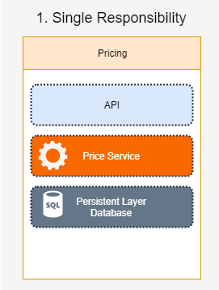
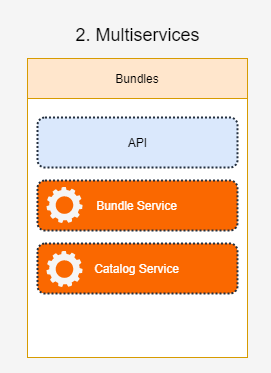
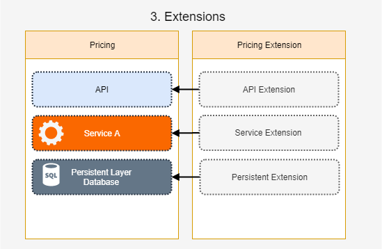
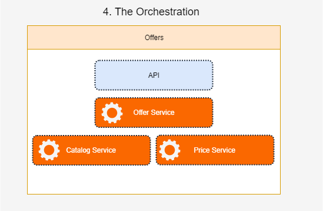
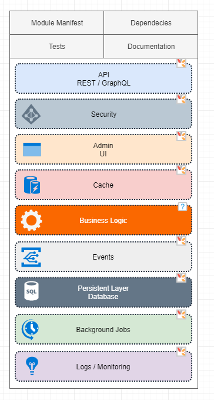

# Overview

Virto Commerce is an open-source platform for an extensible e-commerce applications.

Complex digital commerce solutions for B2B, B2C or B2B2C businesses, marketplaces and derived SaaS commerce platforms.

Virto Commerce architecture was designed on principles: Microservices, API-first, Cloud-native, Headless, and Advanced Extensibility.

## News Digests
!!! done "18 February"
    * Blue-green Indexing for Elasticsearch
    * Index partial update
    * XAPI support for server culture and time zone
    * Resolving all backlinks from Virtual Catalogs

    [Continue reading on Virto Commerce community ...](https://www.virtocommerce.org/t/news-digest-18-february-2022/427)

!!! done "24 January"
    * Virto Commerce on .NET 6 released
    * Branding and Color Coding in Admin UI
    * Use different catalog prices for different stores
    * Anonymize personal data (GDPR)

    [Continue reading on Virto Commerce community ...](https://www.virtocommerce.org/t/news-digest-24-january-2022/416)

!!! done "13 December"
    * High-Performance Order Module
    * GDPR Module - Find and download personal data for the specific customer.
    * Whitelist for File Extensions
    * Azure Single Sign-in
    
    [Continue reading on Virto Commerce community ...](https://www.virtocommerce.org/t/news-digest-13-december-2021/396)
   
View more details about releases in [Virto Commerce Community](https://www.virtocommerce.org/c/news-digest/15), Subscribe on [YouTube](https://www.youtube.com/c/Virtocommerce/videos) and Star on [GitHub](https://github.com/VirtoCommerce).

## Principles
The main principle is to help the development team to focus on the implementation of business features and don’t worry about **CLEAN ARCHITECTURE**.

* **MICROSERVICES** – Every application is built from headless microservices (modules). Applications and microservices are not limited to the composite applications, they can be used for building any other application and hence are functionally independent. 
* **API-FIRST** – E-commerce service with the right API design. All business logic is accessible via API: Rest or GraphQL. 
* **CLOUD NATIVE** – E-commerce service is delivered in the SaaS model. Get significant benefits for the business from: 
    1. *On-demand* - Use e-commerce service as a whole or its separate components as needed; 
    1. *Scalability* - In the cloud, it can be easily scaled to support peak demand and long-term business growth; 
    1. *Reliability* - Can leverage a solution deployed across multiple data centers and availability zones to maximize up-time and reduce potential revenue losses.
* **HEADLESS** – Allows an enterprise to support omnichannel journeys across traditional and digital touchpoints as well as new business models.
* **EXTENSIBILITY** – The API model, persistence model, business logic can be extended as needed without deploying and re-deploying solution. This provides superior business agility and keeps up to date.

## Architecture Overview
The following diagram illustrates the high-level architecture and main areas of Virto Commerce solutions:

**Virto Commerce Platform** - Launcher of e-commerce applications in the public, hybrid and private cloud. 

**Commerce Applications** - API-based, Modular and Extensible logical set of one or several headless microservices (modules) with focus on the implementation of the business feature, like Digital Catalog, Order Management, Content Management, Marketing, etc.

**Custom Extensions** - Virto Commerce Module which allows extending API-model, Persistent model, Business logic and Admin UI in Commerce Applications.

**External Commerce Applications** - 3rd-party e-commerce applications and services. 

**Touchpoints** - Sell in your products on the website, mobile application, chatbot or any through 3rd party services: Marketplace, Dropshipping, or whatever you create. Virto Commerce Storefront Kit allows managing different brands and store under the same environment and with same features.

**Admin SPA** - Virto Commerce has an extensible and intuitive admin user interface. It lets you manage data in Commerce Applications for all channels.

**Integration middleware** - Asynchronous integration middleware for declarative integration with Non-Real-time and legacy services.

### Platform
**Virto Commerce Platform** - is launcher of e-commerce applications in the cloud. It brings system functionality, modularity, dependency resolving, role-based security, API, etc.  

### Applications
**Commerce Application** - is API-based, Modular and Extensible logical set of one or several headless microservices (modules) with focus on the implementation of the business feature, like Digital Catalog, Order Management, Content Management, Marketing, etc.

The following diagram illustrates the high-level architecture of Digital Catalog application, which by default consist of Catalog, Search, Pricing, Inventory, Personalization and Store modules:

Each of the applications is complete by itself and not dependent on the functioning of other applications. The constituent apps have their own consumers and interaction points. Selecting Commerce Application, you can configure the ecosystem based on your requirements. 

The different applications can be deployed / launched in different isolated environments. The application can be scaled and run on multiple instances.

The applications can be extended with custom modules. You can extend API model, persistence model, business logic and admin UI. For example, architecture reference includes Pricing Extensions which extend API model, Persistence model and Admin UI with the Recommended price field.

### Modules
**Virto Commerce Headless Microservice (Module)** - is a development unit. Can consist of one or several microservice. A module must fulfill a single purpose that is narrowly defined and easy to understand.

The module is built on few principles:

* **SINGLE RESPONSIBILITY** – Every module should be as simple as possible, so a new developer can support and improve it.
* **SECURITY** – Role-based security as the core functionality.
* **FLEXIABILITY** – Configure data and relations based on organization structure, contracts and dynamic conditions.

The following diagram illustrates the different type of modules:

**Single Responsibility** - allows to implement an isolated business feature. For example: Pricing.
 

**Multiservices** - host of several microservices, for example Bundle microservice uses Catalog as primary data-storage.

**Extensions** - The API model, persistence model, business logic can be extended as needed without deploying and re-deploying solution. 

**The orchestration** - aggregate information from multiple microservices and provide one API, for-example provide access to Personalized Offers.

### Inner Structure of the Module

The module can use a lot out-of-the box additional services from Virto Commerce Platform. The following diagram illustrates the inner structure and services which are accessible for developers:

1. **Module Manifest** - gives the information about the module, such as the most important files, dependencies and the capabilities the extension might use.
1. **Tests and Documentation** - an important part of any module, which helps a new developer to learn and improve it.
1. **API** - All business logic accessible via API: Rest or GraphQL.
1. **Security** - access to API is limited by permissions.
1. **Admin UI (optional)** - the module provides the intuitive admin user interface. It lets you manage data in Admin SPA. 
1. **Cache (optional)** - From the business logic, you can use distributed cache to improve performance. 
1. **Business Logic** - The module solution structure is constructed using N-Tier and DDD principle and it is a business unit that is able to fully provide a set of desired features.
1. **Events (optional)** - From the business logic, you can send internal and external events (Webhooks).
1. **Database** - The module has a repository and doesn't have a connection with other modules on the database layer. The module can have custom connection string and store data in the custom database. 
1. **Background Jobs (optional)** - The module can run long-running operations as Background Jobs.
1. **Log/Monitoring** - The module has native integration with Azure Application Insights service, as Native monitoring tool for .NET Core applications.

## Scalability
In the cloud, the Virto Commerce Applications can be easily scaled to support peak demand and long-term business growth.
With auto-scale, you no longer have to worry about scaling services manually.

## Extensibility

Unlimited extensibility is an indisputable advantage of Virto Commerce. This means end-user solution developers can adapt or replace Virto Commerce modules with their own functionality. This adaptation can be done in an elegant and simple way without workarounds.

Three types of vendor-made extensions guarantee “seamless delivery”.  Virto Commerce guarantees that these ways of extensibility are sufficient to build an ecommerce solution of any complexity on top of it.  
 
1. No-code extensions. Virto Commerce supports declarative extensions through the Admin interface and API to extend the data model, UI, and workflow processing.  
 
2. API-based extensions. These are traditional cloud based extensions based on API calls and Events (Hooks). Developers can use any language and framework for integration and reactive programming. 
 
3. Native extensions. This is an advanced mode of modular extensions. It is called native because it is the way how Virto Commerce is built internally. Virto Commerce creates a unique extension framework based on .NET extension and dependency injection. It allows benefits from the first two approaches and extends default implementation for the unique needs of each business. Plus, it simplifies DevOps procedures and provides performance. 
Source-code is only available for the purpose of transparency.  Virto Commerce doesn't recommend extending the platform through source-code. This will breach the continuous delivery functionality.   

## Monitoring
Virto Commerce Applications has native integrations with [Azure Application Insights](https://azure.microsoft.com/en-us/services/monitor/).

Azure Application Insights is an extensible Application Performance Management (APM) service for developers and DevOps professionals.
You use it to monitor live applications. It will automatically detect performance anomalies, and includes powerful analytics tools to help you diagnose issues and to understand what users actually do with your app.
It's designed to help you continuously improve performance and usability.
It works for apps on a wide variety of platforms including .NET, Node.js, Java, and Python hosted on-premises, hybrid, or any public cloud.
It integrates with DevOps process, and has connection points to a variety of development tools.

## Technology Stack

In our work, we always try to use advanced technologies. Our decision to choose technologies described below was the result of our extensive experience working with Microsoft products.

Virto Commerce uses following stack of technologies:

* ASP.NET Core
* EF Core as primary ORM
* ASP.NET Core Identity for authentication and authorization
* OpenIddict for OAuth authorization
* WebPack as primary design/runtime bundler and minifier
* Swashbuckle.AspNetCore.SwaggerGen for Swagger docs and UI
* SignalR Core for push notifications
* AngularJS  primary framework for SPA
* HangFire for run background tasks
