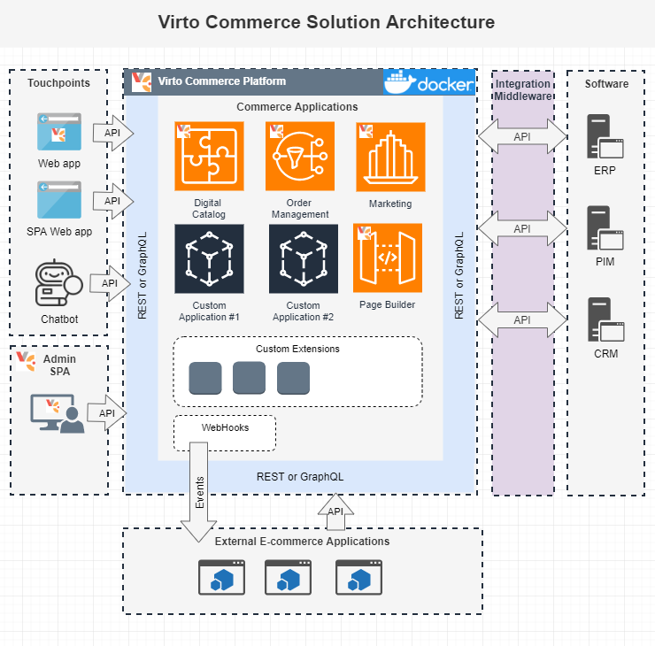

# Overview

## Virto Commerce - Extensible E-commerce Applications

Virto Commerce is Extensible e-commerce applications. Open-Source, .NET Core, API-first, Headless, Cloud Native. 
Designed to build complex digital commerce solutions for B2B, B2C or B2B2C business, marketplaces and derived SaaS commerce platforms.

## Architecture Overview
The following diagram illustrates the high-level architecture and main areas of Virto Commerce solutions.

1. **Commerce Applications** - Extensible e-commerce applications. Each of the apps is complete by itself and not dependent on the functioning of the application. 
The constituent apps have their own consumers and interaction points.
1. **Custom Extensions** - Allow to extend API models, Persistent models and business logic in Commerce Applications. 
1. **External Commerce Applications** - 3rd party e-commerce applications and services. 
1. **Touchpoints** - Sell in your products on website, mobile application, chatbot or any through 3rd party services: Marketplace, Dropshipping, or whatever you create.
  Virto Commerce Storefront allows managing different brands and stores. Under the same environment and with same features.
1. **Admin SPA** - Extensible and intuitive user interface lets you manage data in Commerce Applications for all channels.
1. **Integration middleware** - Asynchronous integration middleware for declarative integration with Non-Real-time and legacy services.
1. **Legacy Software** - Legacy and Non-Real-time services and software. 

### Principles
Main principle is help development team to focus on implementation of business features and don’t worry about the common tasks, like:

* **CLEAN ARCHITECTURE** - Allows to create, customize, scale and maintain e-commerce applications.
* **CLOUD NATIVE** - Deploy custom solution to Azure, AWS, Google cloud and native integration with cloud services.
* **MODULARITY** – Every application is built from modules. Applications and modules are not limited to the composite applications, they can be used for building any other application and hence are functionally independent. 
* **SINGLE RESPONSIBILITY** – Every module should be as simple as possible, so a new developer can support and improve it.
* **HEADLESS** – All business logic are accessible via API: Rest and GraphQL.
* **EXTENSIBILITY** – The API and Persistent models can be extended. Business logic can be customized. 
* **SCALABILITY** – The solution should grow up with the business.
* **SECURITY** – Role-based security as core functionality of the Virto Commerce.
* **PERSONALIZATION** – Configure personalized Catalogs, Prices, Promotions, etc. based on organization structure, contracts and dynamic conditions.

## Technology Stack Used

In our work, we always try to use advanced technologies. Our decision to choose technologies described below was the result of our extensive experience working with Microsoft products.

We decided to use the following stack of technologies:

* ASP.NET Core 3.1.0
* EF Core 3.1.0 as primary ORM
* ASP.NET Core Identity 3.1.0 for authentication and authorization
* OpenIddict 2.0.1 for OAuth authorization
* WebPack as primary design/runtime bundler and minifier
* Swashbuckle.AspNetCore.SwaggerGen for Swagger docs and UI
* SignalR Core for push notifications
* AngularJS 1.4 as primary framework for SPA
* HangFire 1.7.8 for run background tasks

## Comparison with Platform 2.x

In the new version, we change primary technology stack to .NET Core for the platform application and all key modules. Eliminate known technical and architecture design issues of 2.x version (Caching, Overloaded core module, Asynchronous code, Platform Complexity, Extensibility, Performance, Authentication and Authorization)
Improve the extensibility and unification of the application. Unified architecture and good architecture practices usage reduce the training time for developers who just start to work with Virto Commerce.

Virto Commerce Platform 3 helps you increase development speed and significantly reduce time to market.

## Introduction to Virto Commerce

These Virto Commerce docs help you learn and use the Virto Commerce platform, from your local solution to optimizing complex enterprise solutions. 

* [What’s new](release-information/whats-new.md)
* [Deploy on Windows](getting-started/deploy-from-precompiled-binaries-windows.md)
* [Deploy on Linux](getting-started/deploy-from-precompiled-binaries-linux.md)
* [Deploy to Azure](getting-started/deploy-from-precompiled-binaries-azure.md)
* [Deploy on MacOS](getting-started/deploy-from-precompiled-binaries-MacOS.md)
* [Connect Storefront to Platform](getting-started/connect-storefront-to-platform-v3)
* [Deploy Platform 3 from source code](developer-guide/deploy-from-source-code.md)
* [Getting Started](user-guide/getting-started.md)
* [Update to version 3](release-information/update-to-version-3/update-module-from-platform-2.0-to-version-3.md)
