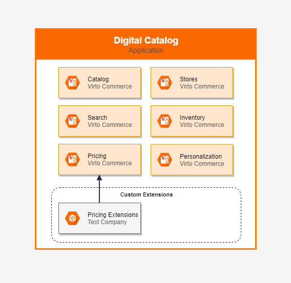

# Overview

## Virto Commerce Platform - Extensible Ecommerce Applications

Virto Commerce is a platform to build extensible e-commerce applications.

Open-Source, .NET Core, API-first, Headless, Cloud Native.

Our modular architecture was designed to build complex digital commerce solutions for B2B, B2C or B2B2C business, marketplaces and derived SaaS commerce platforms.

Iterate quickly, and run new business models at a global scale.

## Principles
The main principle is to help the development team to focus on the implementation of business features and don’t worry about the common tasks, like:

* **CLEAN ARCHITECTURE** - Allows to create, customize, scale and maintain e-commerce applications.
* **CLOUD NATIVE** - Deploy the custom solution to Azure, AWS, Google cloud and native integration with cloud services.
* **MODULARITY** – Every application is built from modules. Applications and modules are not limited to the composite applications, they can be used for building any other application and hence are functionally independent. 
* **SINGLE RESPONSIBILITY** – Every module should be as simple as possible, so a new developer can support and improve it.
* **HEADLESS** – All business logic is accessible via API: Rest or GraphQL.
* **EXTENSIBILITY** – The API and Persistent models can be extended. Business logic can be customized. 
* **SCALABILITY** – The solution should grow up with the business.
* **SECURITY** – Role-based security as the core functionality of the Virto Commerce.
* **PERSONALIZATION** – Configure personalized Catalogs, Prices, Promotions, etc. based on organization structure, contracts and dynamic conditions.

## Architecture Overview
The following diagram illustrates the high-level architecture and main areas of Virto Commerce solutions:

1. **Virto Commerce Platform** - Cloud and On-premise launcher of e-commerce applications. 
1. **Commerce Applications** - API-based, Modular and Extensible logical set of one or several `Virto Commerce Modules` with focus on the implementation of the business feature, like Digital Catalog, Order Management, Content Management, Marketing, etc.
1. **Custom Extensions** - Virto Commerce Module which allows extending API-model, Persistent model, Business logic and Admin UI in Commerce Applications.
1. **External Commerce Applications** - 3rd-party e-commerce applications and services. 
1. **Touchpoints** - Sell in your products on the website, mobile application, chatbot or any through 3rd party services: Marketplace, Dropshipping, or whatever you create.
  Virto Commerce Storefront allows managing different brands and stores. Under the same environment and with same features.
1. **Admin SPA** - Virto Commerce has an extensible and intuitive admin user interface. It lets you manage data in Commerce Applications for all channels.
1. **Integration middleware** - Asynchronous integration middleware for declarative integration with Non-Real-time and legacy services.
1. **Legacy Software** - Legacy and Non-Real-time services and software. 

### Virto Commerce Platform
**Virto Commerce Platform** - is Launcher of e-commerce applications. Can be deployed to Cloud and run On-premise. It brings system functionality, modularity, dependency resolving, role-based security, API, etc.  

### Commerce Application
**Commerce Application** - is API-based, Modular and Extensible logical set of one or several `Virto Commerce Modules` with focus on the implementation of the business feature, like Digital Catalog, Order Management, Content Management, Marketing, etc.

The following diagram illustrates the high-level architecture of Digital Catalog application, which by default consist of Catalog, Search, Pricing, Inventory, Personalization and Store modules. 

Each of the application is complete by itself and not dependent on the functioning of the application. The constituent apps have their own consumers and interaction points. Selecting Commerce Application, you can configure the ecosystem based on your requirements. 

The different applications can be deployed launched in different isolated environments. The application can be scaled and run on multiple instances.

The applications can be extended with a custom module. You can extend API model, persistent model, business logic and admin UI. For example, architecture reference includes Pricing Extensions which extend API model, Persistent model and Admin UI with the Recommended price.

### Virto Commerce Module
**Virto Commerce Module** - is development unit. A module must fulfill a single purpose that is narrowly defined and easy to understand. 

The following diagram illustrates the high-level architecture of Virto Commerce Module. Virto Commerce provides out-of-the-box implementations and utilities for all block and the developer can focus on the implementation of business requirements.

Virto Commerce Module consists of several layers:
1. **Module Manifest** - gives the information about the module, such as the most important files, dependencies and the capabilities the extension might use.
1. **Tests and Documentation** - an important part of any module, which helps a new developer learn and improve it.
1. **API** - All business logic accessible via API: Rest or GraphQL.
1. **Security** - access to API is limited by permissions.
1. **Admin UI** - the module provides the intuitive admin user interface. It lets you manage data in Admin SPA. 
1. **Cache** - From the business logic, you can use distributed cache to improve performance. 
1. **Business Logic** - The module solution structure is constructed using N-Tier and DDD principle and it is a business unit that is able to fully provide a set of desired features.
1. **Events** - From the business logic, you can send internal and external events (Webhooks).
1. **Database** - The module has a repository and doesn't have a connection with other modules on the database layer. The module can have connection string and store data in the database. 
1. **Background Jobs** - The module can run long-running operation as Background Jobs.
1. **Log/Monitoring** - The module has native integration with Azure Application Insights service, as Native monitoring tool for .NET Core applications.

## Technology Stack Used

In our work, we always try to use advanced technologies. Our decision to choose technologies described below was the result of our extensive experience working with Microsoft products.

Virto Commerce uses following stack of technologies:

* ASP.NET Core 3.1.0
* EF Core 3.1.0 as primary ORM
* ASP.NET Core Identity 3.1.0 for authentication and authorization
* OpenIddict 2.0.1 for OAuth authorization
* WebPack as primary design/runtime bundler and minifier
* Swashbuckle.AspNetCore.SwaggerGen for Swagger docs and UI
* SignalR Core for push notifications
* AngularJS 1.4 as primary framework for SPA
* HangFire 1.7.8 for run background tasks

## Comparison with Platform 2.x

In the new version, we change primary technology stack to .NET Core for the platform application and all key modules. Eliminate known technical and architecture design issues of 2.x version (Caching, Overloaded core module, Asynchronous code, Platform Complexity, Extensibility, Performance, Authentication and Authorization)
Improve the extensibility and unification of the application. Unified architecture and good architecture practices usage reduce the training time for developers who just start to work with Virto Commerce.

Virto Commerce Platform 3 helps you increase development speed and significantly reduce time to market.

## Introduction to Virto Commerce

These Virto Commerce docs help you learn and use the Virto Commerce platform, from your local solution to optimizing complex enterprise solutions. 

* [What’s new](release-information/whats-new.md)
* [Deploy on Windows](getting-started/deploy-from-precompiled-binaries-windows.md)
* [Deploy on Linux](getting-started/deploy-from-precompiled-binaries-linux.md)
* [Deploy to Azure](getting-started/deploy-from-precompiled-binaries-azure.md)
* [Deploy on MacOS](getting-started/deploy-from-precompiled-binaries-MacOS.md)
* [Connect Storefront to Platform](getting-started/connect-storefront-to-platform-v3)
* [Deploy Platform 3 from source code](developer-guide/deploy-from-source-code.md)
* [Getting Started](user-guide/getting-started.md)
* [Update to version 3](release-information/update-to-version-3/update-module-from-platform-2.0-to-version-3.md)
