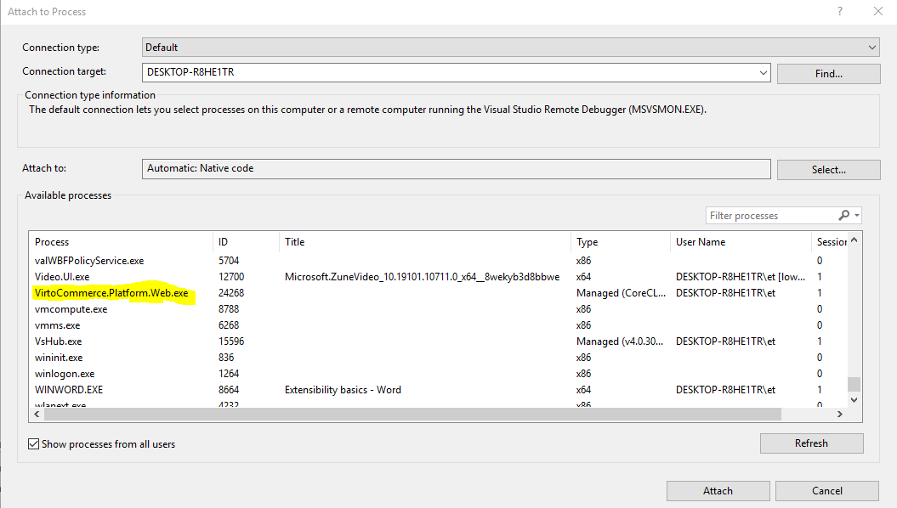

# Deploy from source code

## Installation

To get started locally, follow these instructions:

1. Make sure that you have all [Prerequisites](../getting-started/deploy-from-precompiled-binaries-windows.md#prerequisites) installed
1. Make fork from the latest platform source code from [master branch](https://github.com/VirtoCommerce/vc-platform/tree/master)
1. Clone to your local computer using `git`

```console
git clone https://github.com/VirtoCommerce/vc-platform.git
```

## Building Platform

### Build Backend

To make a local build

1. Open console
    ```console
    cd src/VirtoCommerce.Platform.Web
    ```
1. Build 
    ```console
    dotnet build -c Development
    ```

Or use Visual Studio

* Open VirtoCommerce.Platform.sln in Visual Studio
* Build Solution

### Build Frontend 

!!! note
    While building the solution the first time from the Visual Studio, npm references should be installed and webpack should be built automatically. This would be done if Web project have this nuget package added - [VirtoCommerce.BuildWebpack](https://www.nuget.org/packages/VirtoCommerce.BuildWebpack/). It adds webpack build target to the project, which create frontend bundles on initial build._
    In case of changing frontend part, explicit local build would be required to pack style/script bundles._


#### To make a local build:
1. Open console
    ```console
    cd src\VirtoCommerce.Platform.Web
    ```
2. Install the dependencies
    ```console
    npm ci
    ```
3. Build frontend application
    ```console
    npm run webpack:build
    ```
4. Watch changes
    ```console
    npm run webpack:watch
    ```

## Initial Configuration 

1. Open the **appsettings.json** file in a text editor
2. In the **ConnectionStrings** section change **VirtoCommerce** node (provided user should have permission to create new database):
    ```json
        "ConnectionStrings": {
            "VirtoCommerce" : "Data Source={SQL Server URL};Initial Catalog={Database name};Persist Security Info=True;User ID={User name};Password={User password};MultipleActiveResultSets=True;Connect Timeout=30"
        },
    ```
3. In the **Assets** section set public url for assets `Assets:FileSystem:PublicUrl` with url of your application, this step is needed in order for display images
    ```json
    "Assets": {
            "Provider": "FileSystem",
            "FileSystem": {
                "RootPath": "~/assets",
                "PublicUrl": "http://localhost:10645/assets/" <-- Set your platform application url with port localhost:10645
            },
        },
    ```
4. In the **Content** section set public url for content `Content:FileSystem:PublicUrl` with url of your application, this step is needed in order for configure CMS content storage
    ```json
    "Content*": {
            "Provider": "FileSystem",
            "FileSystem": {
                "RootPath": "~/cms-content",
                "PublicUrl": "http://localhost:10645/cms-content/" <-- Set your platform application url with port localhost:10645
            },
        },
    ```

## Running

To run platform by dotnet CLI:

1. Open console
    ```console
    cd src\VirtoCommerce.Platform.Web
    ```
2. Run
    ```console
    dotnet run -c Development --no-launch-profile
    ```

!!! note
    you can add `--no-build` flag to speed the start, if you have compiled the solution already.

Or run from Visual Studio

* Open `VirtoCommerce.Platform.sln` 
* Set VirtoCommerce.Platform.Web as Startup Project
* Go to Debug > Start Debugging (or Press F5)

## Usage
* Open `http://localhost:10645` in the browser
* On the first request the application will create and initialize database. After that you should see the sign in page. Use the following credentials: `admin/store` to sign in

**Note:** Don't forget to change them after the first sign in.

## Backend Debugging

* Install and run platform as described in steps above
* Open the module solution in Visual Studio and attach the debugger to the `VirtoCommerce.Platform.Web.exe` process



## Frontend Debugging

* Frontend supports debugging in Chrome.
* Open Chrome Developer Tools (Press F12)
* Open Sources tab
* Navigate to `{module-name}/./Script/`
* Debug code


## Testing 
There is `tests` folder with suites which can be run locally.

## IDE Specific Usage

Some additional tips for developing in specific IDEs.

### Visual Studio

!!! note
    If you have node-sass issues, run this command
    ```console
    npm rebuild node-sass
    ```

Run to trust the .NET Core SDK HTTPS development certificate:

```console
dotnet.exe dev-certs https --trust
```

Read more about [enforcing HTTPS in ASP.NET Core](https://docs.microsoft.com/en-us/aspnet/core/security/enforcing-ssl?view=aspnetcore-3.0&tabs=visual-studio#trust).

Restart the Platform to load the new module assemblies into the Platform's application process
Recommend to install [WebPack Task Runner](https://marketplace.visualstudio.com/items?itemName=MadsKristensen.WebPackTaskRunner) and run webpack tasks from Visual Studio. 

## Troubleshooting

* ['Could not load file or assembly GitVersionTask.MsBuild' when starting the platform through 'dotnet run' command](https://community.virtocommerce.com/t/could-not-load-file-or-assembly-gitversiontask-msbuild-when-starting-the-platform-through-dotnet-run-command/203)
