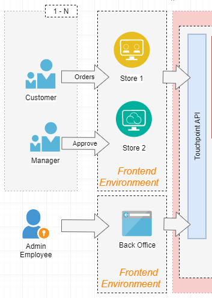
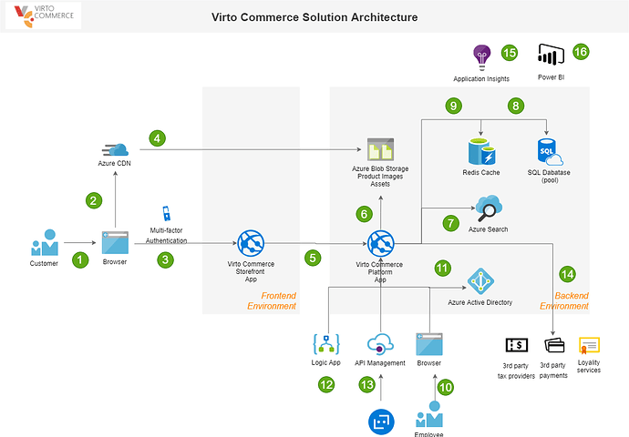

# Architecture reference

## Overview 

Virto Commerce is a scalable e-commerce solution and designed to build large and complex digital commerce solutions for B2B, B2C or B2B2C business, marketplaces and derived SaaS commerce platforms.

The content presentation layer (front-end) is separated from the business logic and functional layer.

All the functionality that the platform has is exposed as various Restful API’s that fully satisfy the main principles of SOA (Service-oriented architecture). You can increase the number of channels to search for and purchase products while having a unified presentation across devices and touchpoints.

Using Virto Commerce platform developers can focus on building personalized experiences and let Azure take care of the infrastructure.

Virto Commerce can be integrated into business ecosystem via Integration Middleware.

## Multi-Storefront, Multi-Channel​
Multi-Channel - sell in your own website, mobile app, chatbot or through 3rd party. Marketplace, drop shipping, or whatever you create.​

Multi-Storefront - manage different brands and different stores. Under the same environment and with same features. ​

## Integration with Payment, Shipment and Tax Providers
Virto Commerce supports Integration with Payment, Shipment and Tax Providers.​

Virto Commerce has predefined providers but if you want to create a new it can be implemented easily. Just need to create a new module. Few lines of the code, test and go to live, that’s all.​

You can choose best payment vendors. Test, optimize and run with the best performance.

## Virto Commerce as part of E-Commerce Ecosystem​
​
Virto Commerce offers to use integration middleware approach.​

Integration middleware is a layer between two systems that makes it easy for the two to communicate.​

The Integration Middleware and API first architecture allows to easily integrate the platform with external systems (ERP, WMS, CRM), social media, marketplaces, etc. ​

## E-Commerce Ecosystem​
So, the complete schema of the solution can looks likes this. ​

We used this schema to describe architecture references, critical paths and dependencies between master and reference data.

## Architecture Reference in Azure

Virto Commerce can be deployed on different hosting: Azure, Google, Amazon or On-Premise. Here example of architecture reference in Azure.

1. A customer accesses the public website in the browser
2. Browser pulls static resources and product images from Azure Content Delivery Network
3. A customer browses the catalogue, add a product to cart, place the order, etc.
4. Content Delivery Network pulls product images from blob storage
5. Storefront App calls Rest API methods to communicates with different VC modules
6. The Content module loads product images from Azure Blob Storage
7. The Catalog module loads products from the full-text search engine (Azure Search)
8. The Order module pulls customer from the customer database
9. The result from DB is cached in the Redis Cache
10. An employee accesses the admin website in the browser
11. Employee authenticates against Azure Active Directory (Azure AD)
12. Logic App loads new orders to sync with ERP (integration)
13. The external client search products and creates an order data via API Management
14. Access to 3rd party payment, tax, loyalty, etc. services
15. App Insights as Primary Application Performance Management
16. Power BI as Primary reporting service
