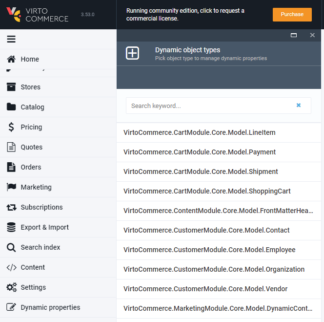
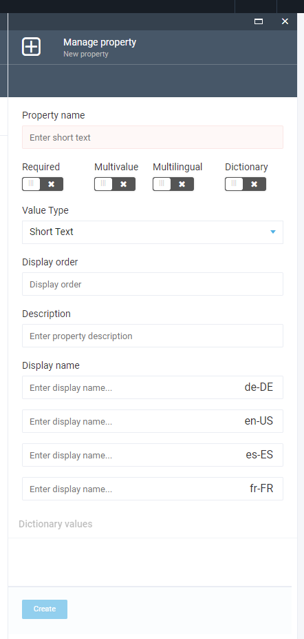
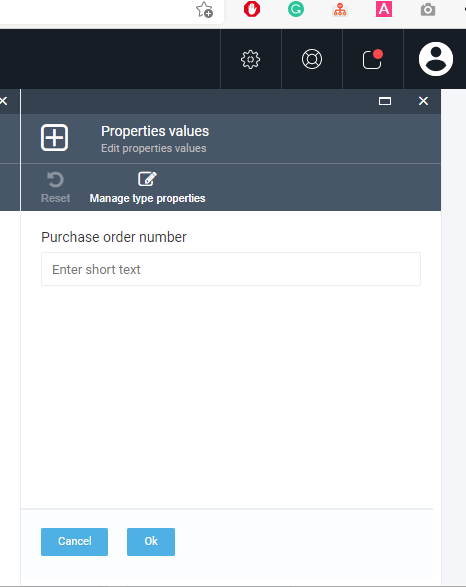

VirtoCommerce Platform allows for the addition of new properties to entities at runtime. 

## Add new dynamic property for existing type from UI

In the left toolbar menu click More then Dynamic Properties button and select one of the available objects.

Select the required object:

Select the Add button:

Enter new property name, select value type and other options.

Also you can define the property name for each of the registered languages:

* **Required.** Does not allow empty property value when editing object values.
* **Multivalue.** Allows to enter more than one value for the property when editing object values.
* **Multilingual.** Allows to define different values for each registered language when editing object values.
* **Dictionary.** Allows to select one of the predefined values when editing object values. The value type for dictionaries can be short text only. You can add dictionary items after creating the property.

## Editing object values

Open the object details and click the Dynamic properties widget:

In the new blade you will see the list of available properties with input controls for entering values:

