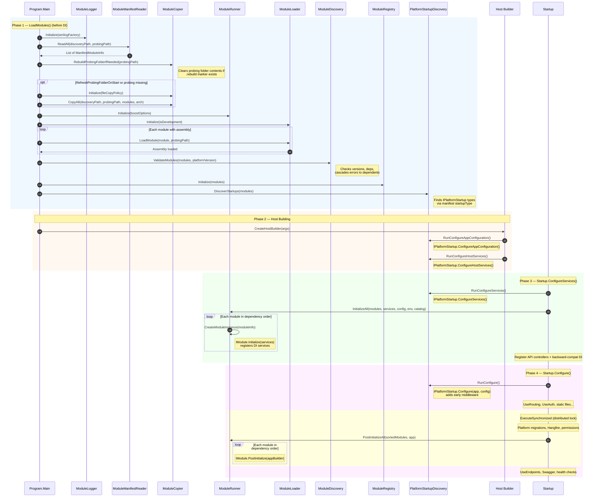
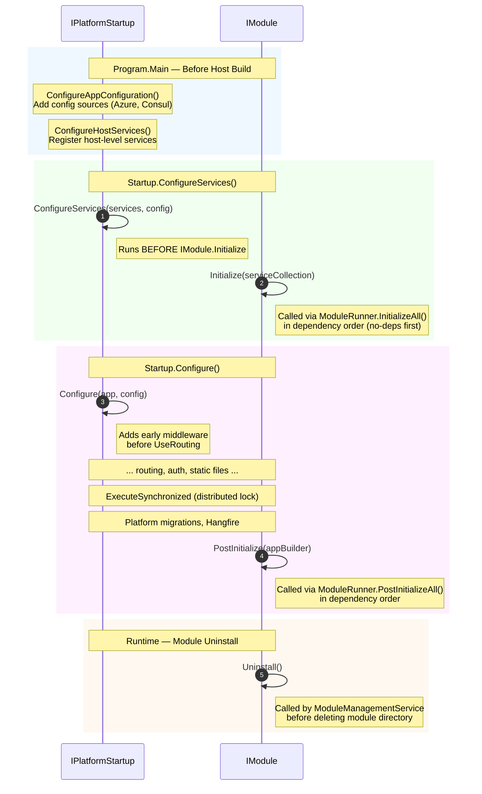
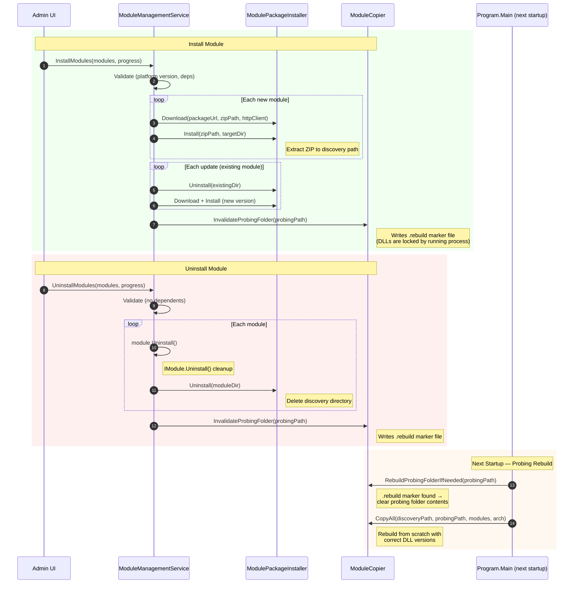

# Virto Commerce Platform Modularity Architecture

This document describes the platform's module loading architecture, the static module system classes, the `IPlatformStartup` extension point, and deployment scenarios for Docker and CI/CD pipelines.

## Overview

The platform uses a **static, DI-free module loading pipeline** that runs in `Program.Main()` before the ASP.NET Core host is built. This design enables modules to participate in the earliest startup phases&mdash;including adding configuration sources and host-level services&mdash;before `Startup.ConfigureServices()` executes.

### Design Principles

- **No DI during discovery and loading.** Module manifests are read, assemblies are copied and loaded using plain static methods. This eliminates the legacy `services.BuildServiceProvider()` anti-pattern.
- **Separation of concerns.** Each phase (discovery, copying, loading, initialization) is handled by a dedicated static class with a single responsibility.
- **Graceful degradation.** A module that fails to load does not block platform startup. Errors are accumulated in `ManifestModuleInfo.Errors` and reported after startup completes.
- **Backward compatibility.** The `LocalModuleCatalogAdapter` bridges the static system to DI-dependent code that resolves `ILocalModuleCatalog` or `IModuleCatalog`.

## Startup Flow

```
Program.Main()
 |
 |  1. Build bootstrap IConfiguration (appsettings.json + env vars)
 |  2. ModuleLogger.Initialize()                      -- set up logging for static classes
 |  3. ModuleManifestReader.ReadAll()                 -- scan module.manifest files
 |  4. ModuleCopier.RebuildProbingFolderIfNeeded()    -- clear probing if .rebuild marker exists
 |     ModuleCopier.CopyAll()                         -- copy DLLs to probing path (if needed)
 |  5. ModuleRunner.Initialize()                      -- store boost options for dependency sorting
 |  6. ModuleLoader.Initialize()                      -- register native library resolver
 |     ModuleLoader.LoadModule()                      -- load each module assembly + deps
 |  7. ModuleDiscovery.ValidateModules()              -- platform version + dependency validation
 |  8. ModuleRegistry.Initialize()                    -- populate global module index
 |  9. PlatformStartupDiscovery.DiscoverStartups()   -- find IPlatformStartup types
 |
 +--Host.CreateDefaultBuilder(args)
     |
     +--ConfigureAppConfiguration
     |   RunConfigureAppConfiguration()      -- modules add config sources
     |
     +--ConfigureServices (host-level)
     |   RunConfigureHostServices()          -- modules register host services
     |   AddHangfireServer()                 -- Hangfire (platform, kept for now)
     |
     +--Startup.ConfigureServices()
     |   RunConfigureServices()              -- IPlatformStartup app-level services
     |   ModuleRunner.InitializeAll()        -- IModule.Initialize() for each module
     |   mvcBuilder.AddApplicationPart()     -- register API controllers
     |   Register ILocalModuleCatalog in DI  -- backward-compat adapter
     |
     +--Startup.Configure()
         RunConfigure()                      -- IPlatformStartup middleware (before routing)
         UseRouting / UseAuth / ...
         ExecuteSynchronized:
           Platform migrations
           UseHangfire
           ModuleRunner.PostInitializeAll()  -- IModule.PostInitialize()
         UseEndpoints / Swagger
```

## Sequence Diagrams

### Platform Startup — Full Module Loading Pipeline

This diagram shows the complete startup sequence from `Program.Main()` through `Startup.Configure()`, including every static module class invocation and when `IPlatformStartup` and `IModule` lifecycle methods execute.



### IPlatformStartup vs IModule — Execution Order

This diagram focuses on the relative ordering of `IPlatformStartup` and `IModule` lifecycle methods. `IPlatformStartup` methods always execute first at each stage.



### Runtime Module Install / Uninstall

This diagram shows the runtime flow when a module is installed or uninstalled via the Admin UI, including the `.rebuild` marker mechanism that triggers a probing folder rebuild on next startup.



## Static Module Classes

All classes are in the `VirtoCommerce.Platform.Modules` namespace.

### ModuleLogger

Static logger factory for the module loading pipeline. Must be initialized before any other module class is used. Falls back to `NullLoggerFactory` if not initialized.

| Method | Description |
|--------|-------------|
| `Initialize(loggerFactory)` | Set the `ILoggerFactory`. Call once from `Program.Main` before module loading. |
| `CreateLogger(type)` | Create a logger for the given type. Used internally by all static module classes. |
| `Reset()` | Reset to `NullLoggerFactory` (for unit tests). |

### ModuleManifestReader

Scans a directory tree for `module.manifest` XML files and returns a list of `ManifestModuleInfo` objects. Pure filesystem reads with no side effects.

| Method | Description |
|--------|-------------|
| `ReadAll(discoveryPath, probingPath?)` | Recursively finds all `module.manifest` files, excluding `artifacts/` subdirectories. When `probingPath` is provided, sets each module's `Ref` to a `file://` URI pointing to the assembly in the probing folder. |
| `Read(manifestFilePath, probingPath?)` | Reads a single manifest. Returns `null` on error (logged to console). |

Modules without an `<assemblyFile>` element (manifest-only modules) are immediately set to `ModuleState.Initialized`.

### ModuleCopier

Copies module assemblies from discovery directories to the probing path. Handles version comparison, CPU architecture filtering, and file-locking conflicts. Delegates filtering decisions to an `IFileCopyPolicy`.

| Method | Description |
|--------|-------------|
| `Initialize(fileCopyPolicy)` | Set the `IFileCopyPolicy` used for file comparison decisions. Must be called before `CopyAll`. |
| `InvalidateProbingFolder(probingPath)` | Write a `.rebuild` marker file inside the probing folder. Called at runtime after install/uninstall when loaded assemblies are locked by the running process. On next startup, `RebuildProbingFolderIfNeeded` will detect this marker. |
| `RebuildProbingFolderIfNeeded(probingPath)` | Check for the `.rebuild` marker and clear all probing folder contents if found. Preserves the directory itself (may be a symlink or have custom ACLs). Must be called on startup before any assemblies are loaded. Returns `true` if the folder was cleaned and needs rebuilding. |
| `CopyAll(discoveryPath, probingPath, modules, environmentArchitecture)` | Copies each module's `bin/` folder contents to the probing path. The `environmentArchitecture` parameter (`Architecture` enum) controls which native binaries to select. |
| `CopyModule(sourceDirectoryPath, targetDirectoryPath, environmentArchitecture)` | Copies a single module's binaries with smart filtering. |
| `GetTargetRelativePath(sourceRelativeFilePath)` | Map a source-relative path to its target-relative path in the probing folder. Returns `null` if the file should be skipped (TPA, reference assemblies). |
| `IsCopyRequired(sourceFilePath, targetFilePath, environmentArchitecture, out result)` | Check whether a file should be copied based on version, architecture, and date comparison. |

**Copy rules:**

- Skips Trusted Platform Assemblies (TPA) already provided by the .NET runtime.
- Skips reference assemblies (`ref/` folders) and design-time assemblies.
- Preserves `runtimes/` directory structure for native libraries.
- Preserves language subdirectory structure for `*.resources.dll`.
- Flattens all other assemblies (`.dll`, `.exe`, `.pdb`, `.deps.json`, etc.) into the probing root.
- Compares source and target by **version**, **CPU architecture**, and **file date** before copying. A file is only overwritten when the source is newer or has a better architecture match.

### ModuleLoader

Loads module assemblies and their dependencies into the default `AssemblyLoadContext`.

| Method | Description |
|--------|-------------|
| `Initialize(isDevelopmentEnvironment)` | Call once before loading any modules. Registers the native library resolver on `AssemblyLoadContext.Default`. |
| `LoadModule(module, probingPath)` | Loads the module's main assembly and all dependencies declared in its `.deps.json` file. Sets `module.Assembly` and `module.State` on success, or appends to `module.Errors` on failure. |

**Dependency resolution order:**

1. Read the module's `.deps.json` for the full dependency graph.
2. For each dependency, probe in the module's `bin/` directory, then in additional probing paths from `.runtimeconfig.json`.
3. Native libraries are tracked in a concurrent dictionary and resolved via the `ResolvingUnmanagedDll` callback.
4. Assemblies already present in the default load context (TPA) are reused, not reloaded.

An internal cache prevents loading the same assembly twice when multiple modules share a dependency.

### ModuleRunner

Creates `IModule` instances via reflection and calls `Initialize` / `PostInitialize` in dependency order. Boost options for dependency sorting are stored as a static property via `Initialize()`, called once from `Program.Main`.

| Method | Description |
|--------|-------------|
| `Initialize(boostOptions)` | Store `ModuleSequenceBoostOptions` for dependency sorting. Called once from `Program.Main` before any sort or initialization. |
| `SortByDependency(modules)` | Topological sort using `ModuleDependencySolver`. Handles duplicate module entries from merged catalogs via `GroupBy` + dedup. Optional dependencies and dependencies on modules not in the list are excluded from the graph. |
| `CreateModuleInstance(moduleInfo)` | Finds the `IModule` implementation in the loaded assembly. If multiple candidates exist, matches by `ModuleType` from the manifest. |
| `InitializeAll(modules, services, config?, env?, catalog?)` | For each module (sorted): creates instance, sets `IHasConfiguration`, `IHasHostEnvironment`, `IHasModuleCatalog` properties, then calls `IModule.Initialize(services)`. Skips modules with errors. |
| `PostInitializeAll(modules, appBuilder)` | Calls `IModule.PostInitialize(app)` on every initialized module. |

Errors are captured in `moduleInfo.Errors`; the method does not throw.

### ModuleRegistry

Thread-safe global registry populated once and queried from any code path without DI. Used by controllers, health checks, tag helpers, Swagger, and static file serving instead of `ILocalModuleCatalog`.

| Method | Description |
|--------|-------------|
| `Initialize(modules)` | Stores the module list and builds a case-insensitive dictionary index. Logs module and error counts. |
| `GetAllModules()` | Returns all modules (installed + failed). |
| `GetInstalledModules()` | Modules with `IsInstalled = true` and no errors. |
| `GetFailedModules()` | Modules with errors. |
| `IsInstalled(moduleId)` | O(1) lookup. |
| `IsInstalled(moduleId, minVersion)` | Version-aware check. |
| `GetModule(moduleId)` | Returns `ManifestModuleInfo` or `null`. |
| `Reset()` | Clears the registry (for unit tests). |

### ModuleDiscovery

Static logic for external module manifest parsing, version merging, and validation. No HTTP — works on already-downloaded data.

| Method | Description |
|--------|-------------|
| `ParseExternalManifest(json, platformVersion, includePrerelease?)` | Parse external module manifest JSON into a list of `ManifestModuleInfo`. Selects the latest compatible stable (and optionally prerelease) version per module. |
| `MergeWithInstalled(externalModules, installedModules)` | Merge external modules with locally installed modules. Installed modules keep their state; external modules show as available for install/update. |
| `ValidateModules(modules, platformVersion)` | Validate all loaded modules at startup. Checks platform version, dependency versions, and incompatibilities. Populates `ManifestModuleInfo.Errors`. Cascades errors to dependents (if module A fails, all modules depending on A also fail). Optional dependencies do not cascade. |
| `ValidateInstall(module, installedModules, platformVersion)` | Validate that a module can be installed. Returns list of error messages (empty if valid). Checks platform version, incompatibilities, and major version changes. |
| `ValidateUninstall(moduleId, installedModules, excludeModuleIds?)` | Validate that a module can be uninstalled. Returns errors if other installed modules depend on it. `excludeModuleIds` allows batch uninstall (their dependencies are ignored). |
| `GetDependencies(selectedModules, allAvailableModules)` | Returns the given modules plus all their transitive dependencies (prerequisites), sorted in dependency order. Walks DOWN the dependency graph. For each dependency, prefers installed version, then latest compatible. |

**Validation cascade:** When `ValidateModules` finds a failed module (e.g., incompatible platform version), it propagates errors to all modules that depend on it. This prevents cryptic DI errors at runtime — the error is surfaced at startup.

### ModulePackageInstaller

Static operations for module installation, uninstallation, downloading, and external manifest loading. No DI.

| Method | Description |
|--------|-------------|
| `Install(zipPath, targetModulePath)` | Extract a module ZIP file to the target directory. |
| `Uninstall(modulePath)` | Delete a module directory. If deletion fails due to locked files (e.g., `FileSystemWatcher`), logs a warning and continues. |
| `Download(packageUrl, targetZipPath, httpClient, options?)` | Download a module package from a URL. Supports authorization headers via `ExternalModuleCatalogOptions`. |
| `LoadExternalModules(httpClient, options)` | Download and parse external module manifests from all configured URLs (main + extra). Returns deduplicated module list. |
| `LoadModulesManifest(httpClient, options, manifestUrl)` | Download and parse a single external module manifest URL. |

### PlatformStartupDiscovery

Discovers `IPlatformStartup` implementations from loaded module assemblies and orchestrates their lifecycle methods.

| Method | Description |
|--------|-------------|
| `DiscoverStartups(modules)` | For each module with a `StartupType` and a loaded assembly, resolves the type, validates it implements `IPlatformStartup`, creates an instance, and stores it. |
| `GetStartups()` | Returns previously discovered startups. |
| `RunConfigureAppConfiguration(startups, builder, env)` | Calls `ConfigureAppConfiguration` on each startup. |
| `RunConfigureHostServices(startups, services, config)` | Calls `ConfigureHostServices` on each startup. |
| `RunConfigureServices(startups, services, config)` | Calls `ConfigureServices` on each startup. |
| `RunConfigure(startups, app, config)` | Calls `Configure` on each startup. |
| `Reset()` | Clears state (for unit tests). |

### LocalModuleCatalogAdapter

A thin adapter that extends `ModuleCatalog` and implements `ILocalModuleCatalog`. It wraps the pre-loaded module list so that DI-dependent code in external modules resolving `ILocalModuleCatalog` or `IModuleCatalog` continues to work unchanged. Platform code itself uses `ModuleRegistry` directly.

```csharp
public class LocalModuleCatalogAdapter : ModuleCatalog, ILocalModuleCatalog
{
    public LocalModuleCatalogAdapter(IEnumerable<ManifestModuleInfo> modules)
        : base(modules.Cast<ModuleInfo>(), Options.Create(new ModuleSequenceBoostOptions())) { }

    protected override void InnerLoad() { /* no-op */ }
}
```

## Module Management Service

`IModuleManagementService` is a DI-registered singleton for module catalog management from the Admin UI. It merges external (from manifest URLs) and locally installed modules, caches the result, and orchestrates install/uninstall operations.

Registered in DI via `services.AddSingleton<IModuleManagementService, ModuleManagementService>()`.

### IModuleManagementService

```csharp
public interface IModuleManagementService
{
    IList<ManifestModuleInfo> GetModules();
    void ReloadModules();
    IList<ManifestModuleInfo> GetDependencies(IList<ManifestModuleInfo> selectedModules);
    IList<ManifestModuleInfo> GetDependents(IList<ManifestModuleInfo> modules);
    ManifestModuleInfo AddUploadedModule(ManifestModuleInfo module);
    void InstallModules(IList<ManifestModuleInfo> modules, IProgress<ProgressMessage> progress);
    void UninstallModules(IList<ManifestModuleInfo> modules, IProgress<ProgressMessage> progress);
    IList<ManifestModuleInfo> GetAutoInstallModules(string[] moduleBundles);
}
```

| Method | Description |
|--------|-------------|
| `GetModules()` | Returns merged list of external + installed modules. Lazy-loaded on first access via `ModulePackageInstaller.LoadExternalModules()` + `ModuleDiscovery.MergeWithInstalled()`. |
| `ReloadModules()` | Clears cached modules and re-fetches from external manifest URLs. |
| `GetDependencies(selectedModules)` | Returns selected modules + all transitive prerequisites, sorted in dependency order. Walks DOWN the graph. |
| `GetDependents(modules)` | Returns installed modules that depend ON the given modules (reverse dependencies). Walks UP the graph. |
| `AddUploadedModule(module)` | Add an uploaded module to the merged catalog. Validates dependencies before adding. |
| `InstallModules(modules, progress)` | Install or update modules with `TransactionScope` rollback. Validates platform version and dependencies. Downloads ZIP, extracts to discovery path. |
| `UninstallModules(modules, progress)` | Uninstall modules. Validates no other modules depend on them. Calls `module.Uninstall()`, deletes directory. |
| `GetAutoInstallModules(moduleBundles)` | Get modules to auto-install from bundles, including their dependencies. Returns only modules not yet installed. |

### How It Works

1. **First call to `GetModules()`**: Downloads external manifests, merges with `ModuleRegistry.GetAllModules()`, caches result.
2. **Install**: Validates → downloads ZIP → extracts via `ModulePackageInstaller.Install()` → updates `IsInstalled` flag → calls `ModuleCopier.InvalidateProbingFolder()` to write `.rebuild` marker. Rollback on failure.
3. **Uninstall**: Validates dependents → calls `IModule.Uninstall()` → deletes directory via `ModulePackageInstaller.Uninstall()` → calls `ModuleCopier.InvalidateProbingFolder()`. Rollback on failure.
4. **Next startup**: `ModuleCopier.RebuildProbingFolderIfNeeded()` detects the `.rebuild` marker, clears all probing folder contents (preserving the directory itself for symlinks/ACLs), and forces a clean rebuild with correct DLL versions.

## IPlatformStartup Interface

Allows modules to hook into platform startup phases that occur **before** the standard `IModule` lifecycle. Implementations are discovered via the `<startupType>` element in `module.manifest`.

```csharp
public interface IPlatformStartup
{
    void ConfigureAppConfiguration(IConfigurationBuilder builder, IHostEnvironment env);
    void ConfigureHostServices(IServiceCollection services, IConfiguration config);
    void ConfigureServices(IServiceCollection services, IConfiguration config);
    void Configure(IApplicationBuilder app, IConfiguration config);
}
```

### Lifecycle Methods

| Method | When It Runs | Use Case |
|--------|-------------|----------|
| `ConfigureAppConfiguration` | `Program.CreateHostBuilder()`, inside `ConfigureAppConfiguration` callback | Add configuration sources: Azure App Configuration, Consul, Vault |
| `ConfigureHostServices` | `Program.CreateHostBuilder()`, inside host-level `ConfigureServices` callback | Register hosted services, background job servers |
| `ConfigureServices` | `Startup.ConfigureServices()`, **before** `ModuleRunner.InitializeAll()` | Application-level DI registrations that need to run before modules |
| `Configure` | `Startup.Configure()`, at the very start before routing middleware | Add early middleware to the HTTP pipeline |

## Module Manifest

The `module.manifest` XML file declares a module's metadata, dependencies, and optional startup type.

```xml
<?xml version="1.0" encoding="utf-8"?>
<module>
  <id>VirtoCommerce.AzureAppConfiguration</id>
  <version>1.0.0</version>
  <platformVersion>3.800.0</platformVersion>

  <title>Azure App Configuration</title>
  <description>Provides Azure App Configuration integration as a module</description>
  <authors>
    <author>Virto Commerce</author>
  </authors>

  <assemblyFile>VirtoCommerce.AzureAppConfiguration.dll</assemblyFile>
  <moduleType>VirtoCommerce.AzureAppConfiguration.Module</moduleType>
  <startupType>VirtoCommerce.AzureAppConfiguration.AzureAppConfigStartup</startupType>

  <dependencies>
    <dependency id="VirtoCommerce.Core" version="3.800.0" />
  </dependencies>
</module>
```

**Key elements:**

| Element | Required | Description |
|---------|----------|-------------|
| `id` | Yes | Unique module identifier |
| `version` | Yes | Semantic version (may include `-tag`) |
| `platformVersion` | Yes | Minimum platform version required |
| `assemblyFile` | No | DLL filename. If omitted, the module is manifest-only (no code). |
| `moduleType` | No | Fully-qualified `IModule` implementation class name |
| `startupType` | No | Fully-qualified `IPlatformStartup` implementation class name |
| `dependencies` | No | Other modules this module depends on |

## Configuration

Module paths are configured in `appsettings.json` under the `VirtoCommerce` section:

```json
{
  "VirtoCommerce": {
    "DiscoveryPath": "modules",
    "ProbingPath": "app_data/modules",
    "RefreshProbingFolderOnStart": true,
    "TargetArchitecture": null
  }
}
```

| Setting | Default | Description |
|---------|---------|-------------|
| `DiscoveryPath` | `modules` | Directory where installed modules are stored (each in its own subdirectory with a `module.manifest` file) |
| `ProbingPath` | `app_data/modules` | Flat directory where all module assemblies are copied for loading. Created automatically if missing. |
| `RefreshProbingFolderOnStart` | `true` | When `true`, copies assemblies from discovery to probing at every startup. Set to `false` to skip the copy phase (requires a pre-populated probing folder). |
| `TargetArchitecture` | auto-detect | Target CPU architecture for assembly copying. Values: `X86`, `X64`, `Arm`, `Arm64`. When omitted, detected from the running process via `RuntimeInformation.ProcessArchitecture`. Set explicitly for cross-compilation (e.g., preparing an ARM64 probing folder on an X64 build machine). |

## Example: Implementing IPlatformStartup

This example shows a module that adds Azure App Configuration as a configuration source:

```csharp
using Microsoft.Extensions.Configuration;
using Microsoft.Extensions.Configuration.AzureAppConfiguration;
using Microsoft.Extensions.DependencyInjection;
using Microsoft.Extensions.Hosting;
using VirtoCommerce.Platform.Core.Modularity;

namespace VirtoCommerce.AzureAppConfiguration;

public class AzureAppConfigStartup : IPlatformStartup
{
    public void ConfigureAppConfiguration(IConfigurationBuilder builder, IHostEnvironment env)
    {
        // Build current config to check for connection string
        var config = builder.Build();
        var connectionString = config.GetConnectionString("AzureAppConfigurationConnectionString");

        if (!string.IsNullOrWhiteSpace(connectionString))
        {
            builder.AddAzureAppConfiguration(options =>
            {
                options.Connect(connectionString)
                    .Select(KeyFilter.Any)
                    .Select(KeyFilter.Any, env.EnvironmentName)
                    .ConfigureRefresh(refresh =>
                    {
                        refresh.Register("Sentinel", refreshAll: true);
                    });
            });
        }
    }

    public void ConfigureServices(IServiceCollection services, IConfiguration config)
    {
        var connectionString = config.GetConnectionString("AzureAppConfigurationConnectionString");
        if (!string.IsNullOrWhiteSpace(connectionString))
        {
            services.AddAzureAppConfiguration();
        }
    }

    public void Configure(IApplicationBuilder app, IConfiguration config)
    {
        var connectionString = config.GetConnectionString("AzureAppConfigurationConnectionString");
        if (!string.IsNullOrWhiteSpace(connectionString))
        {
            app.UseAzureAppConfiguration();
        }
    }
}
```

## Deployment Scenarios

### Standard Development (RefreshProbingFolderOnStart = true)

The default mode. Each startup copies assemblies from `DiscoveryPath` to `ProbingPath`:

```
modules/
  VirtoCommerce.Catalog/
    module.manifest
    bin/
      VirtoCommerce.CatalogModule.dll
      VirtoCommerce.CatalogModule.deps.json
      ...
  VirtoCommerce.Orders/
    module.manifest
    bin/
      ...

app_data/modules/            <-- populated at startup
  VirtoCommerce.CatalogModule.dll
  VirtoCommerce.CatalogModule.deps.json
  VirtoCommerce.OrdersModule.dll
  ...
```

### Docker Image Build (RefreshProbingFolderOnStart = false)

In containerized deployments the probing folder should be pre-populated at image build time. This avoids the copy overhead at every container start and prevents write operations on read-only filesystems.

**Dockerfile pattern:**

```dockerfile
FROM mcr.microsoft.com/dotnet/aspnet:10.0 AS base
WORKDIR /app

FROM mcr.microsoft.com/dotnet/sdk:10.0 AS build
WORKDIR /src

# Copy and build platform
COPY src/ src/
RUN dotnet publish src/VirtoCommerce.Platform.Web/VirtoCommerce.Platform.Web.csproj \
    -c Release -o /app/publish

# Install modules using vc-build or direct copy
FROM build AS modules
WORKDIR /modules

# Option A: Use vc-build CLI to install modules
RUN dotnet tool install -g VirtoCommerce.GlobalTool && \
    vc-build install -modules VirtoCommerce.Catalog VirtoCommerce.Orders \
    -DiscoveryPath /modules/discovery

# Option B: Copy pre-built module packages
# COPY modules/ /modules/discovery/

# Pre-populate probing folder at build time
# This flattens all module DLLs into a single directory
RUN mkdir -p /modules/probing && \
    for dir in /modules/discovery/*/bin; do \
      cp -n "$dir"/*.dll "$dir"/*.deps.json "$dir"/*.pdb /modules/probing/ 2>/dev/null || true; \
    done

FROM base AS final
WORKDIR /app
COPY --from=build /app/publish .
COPY --from=modules /modules/discovery ./modules
COPY --from=modules /modules/probing ./app_data/modules

# Disable copy phase since probing is pre-populated
ENV VirtoCommerce__RefreshProbingFolderOnStart=false
```

**Key points:**

1. The probing folder (`app_data/modules`) is populated during the Docker build, not at runtime.
2. `RefreshProbingFolderOnStart=false` tells the platform to skip `ModuleCopier.CopyAll()`.
3. If the probing folder does not exist at startup, the platform forces a refresh regardless of the setting.
4. Module manifests must still be present under `DiscoveryPath` (the platform reads metadata from them).

### Cross-Architecture Docker Build (TargetArchitecture)

When building a Docker image for a different CPU architecture than the build machine (e.g., building an ARM64 image on an X64 CI server), use `TargetArchitecture` to tell `ModuleCopier` which native binaries to select:

```dockerfile
FROM mcr.microsoft.com/dotnet/sdk:10.0 AS build
# ... build platform and install modules as above ...

# Pre-populate probing folder for ARM64 target, running on X64 build machine
FROM build AS probing
WORKDIR /app
COPY --from=build /app/publish .
COPY --from=modules /modules/discovery ./modules

# Run the platform's copier with architecture override
ENV VirtoCommerce__TargetArchitecture=Arm64
ENV VirtoCommerce__RefreshProbingFolderOnStart=true
RUN dotnet VirtoCommerce.Platform.Web.dll --copy-modules-only 2>/dev/null || true
# OR use vc-build with the architecture flag:
# RUN vc-build copy-modules -DiscoveryPath ./modules -ProbingPath ./app_data/modules -TargetArchitecture Arm64

FROM mcr.microsoft.com/dotnet/aspnet:10.0-arm64v8 AS final
WORKDIR /app
COPY --from=probing /app .
ENV VirtoCommerce__RefreshProbingFolderOnStart=false
```

The `TargetArchitecture` setting can also be passed as an environment variable or command-line argument:

```bash
# Environment variable (double-underscore for nested keys)
VirtoCommerce__TargetArchitecture=Arm64 dotnet run

# Command-line argument
dotnet run -- --VirtoCommerce:TargetArchitecture=Arm64
```

**How architecture filtering works:**

`ModuleCopier` reads the PE header of each `.dll`/`.exe` to determine its compiled architecture (X86, X64, ARM, ARM64). A file is copied only if it is compatible with the target:

- Exact architecture match is always accepted.
- X86 binaries are accepted on X64 targets (WoW64 backward compatibility).
- Architecture-neutral files (non-PE files like `.deps.json`, `.pdb`) are always copied.
- When the target already has a file, the copier prefers the source if it has a newer version, a better architecture match, or a newer file date.

### vc-build Integration

The `vc-build` CLI tool installs modules into the discovery path. The platform's static module system is compatible with vc-build's output layout:

```
vc-build install
  -modules VirtoCommerce.Catalog:3.800.0
  -DiscoveryPath ./modules
  -ProbingPath ./app_data/modules
  -SkipDependencyInstallation false
```

**After `vc-build install`**, the discovery path contains:

```
modules/
  VirtoCommerce.Catalog/
    module.manifest
    bin/
      VirtoCommerce.CatalogModule.dll
      VirtoCommerce.CatalogModule.deps.json
      ...native and managed dependencies...
```

**For Docker builds**, add a probing preparation step:

```bash
# After vc-build installs modules, pre-populate probing folder
vc-build compress -ProbingPath ./app_data/modules
```

Or use the platform's own copier as a standalone step (the static classes can be called from a build script or a small console app):

```csharp
// Build-time helper to pre-populate probing folder
var modules = ModuleManifestReader.ReadAll(discoveryPath, probingPath);
ModuleCopier.Initialize(new DefaultFileCopyPolicy());
ModuleCopier.CopyAll(discoveryPath, probingPath, modules, RuntimeInformation.ProcessArchitecture);
```

### Kubernetes with Shared Volume

When running multiple replicas, the probing folder can be shared via a persistent volume. Disable refresh so only one process populates it:

```yaml
apiVersion: apps/v1
kind: Deployment
spec:
  template:
    spec:
      containers:
        - name: platform
          env:
            - name: VirtoCommerce__RefreshProbingFolderOnStart
              value: "false"
          volumeMounts:
            - name: modules
              mountPath: /app/app_data/modules
      volumes:
        - name: modules
          persistentVolumeClaim:
            claimName: modules-pvc
```

Populate the volume once using an init container or a separate job.

### CI/CD Pipeline Example

```yaml
# Azure DevOps / GitHub Actions
steps:
  - name: Install modules
    run: |
      dotnet tool install -g VirtoCommerce.GlobalTool
      vc-build install -modules VirtoCommerce.Catalog VirtoCommerce.Orders

  - name: Prepare probing folder
    run: |
      mkdir -p app_data/modules
      # Copy all module DLLs to probing (same logic as ModuleCopier)
      find modules -path '*/bin/*.dll' -exec cp -n {} app_data/modules/ \;
      find modules -path '*/bin/*.deps.json' -exec cp -n {} app_data/modules/ \;

  - name: Build Docker image
    run: |
      docker build -t myregistry/vc-platform:latest .
```

## Diagnostics

### Logging

All static module classes use `ModuleLogger` (backed by `ILoggerFactory`, typically Serilog). Log output includes structured properties:

```
[INF] ModuleManifestReader: Found 12 module manifests in /app/modules
[DBG] ModuleCopier: Copying assemblies from /app/modules/VirtoCommerce.Catalog/bin
[DBG] ModuleCopier: Updating VirtoCommerce.CatalogModule.dll: NewVersion=True
[WRN] ModuleCopier: File 'SomeLib.dll' was not updated (file in use by another process)
[DBG] ModuleLoader: Loaded VirtoCommerce.Catalog 3.800.0
[WRN] ModuleDiscovery: Module VirtoCommerce.Broken has errors: Module platform version 3.1111.0 is incompatible...
[WRN] ModuleDiscovery: 2 modules failed validation (including cascaded dependents)
[INF] ModuleRegistry: Loaded modules: 12, with errors: 2
[DBG] ModuleRunner: Initializing VirtoCommerce.Catalog 3.800.0
[DBG] ModuleRunner: Post-initializing VirtoCommerce.Catalog
```

### Failed Modules

After startup, failed modules are logged at Warning/Error level. Modules that fail validation also cascade errors to their dependents:

Query failed modules programmatically:

```csharp
var failed = ModuleRegistry.GetFailedModules();
```

### Health Checks

The `ModulesHealthChecker` reports module health at `/health`:

```json
{
  "Modules health": {
    "status": "Unhealthy",
    "description": "Module VirtoCommerce.Broken has errors"
  }
}
```
