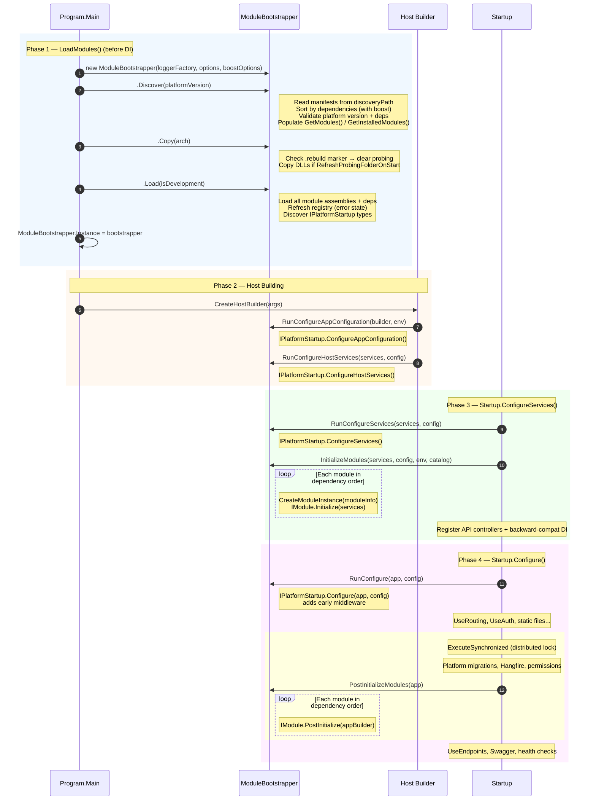
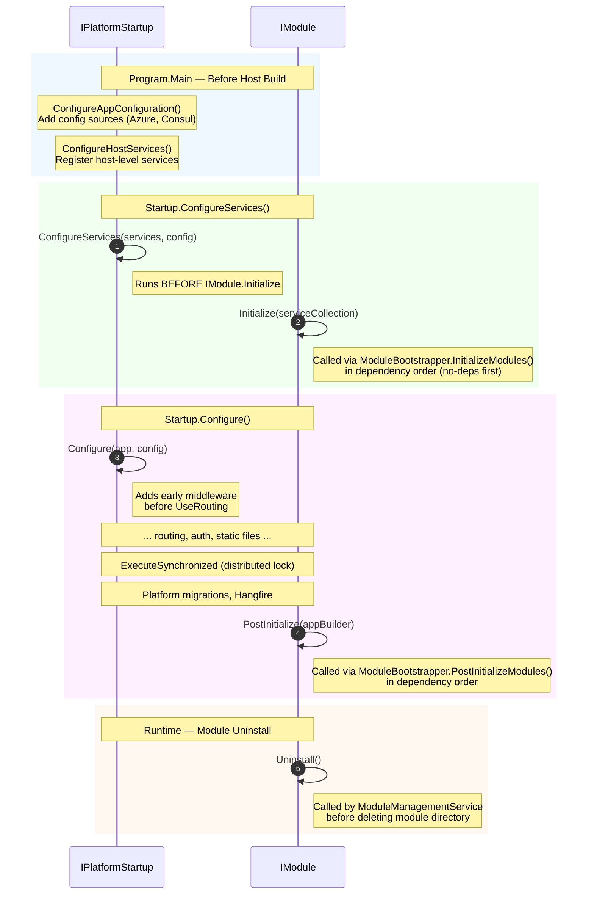
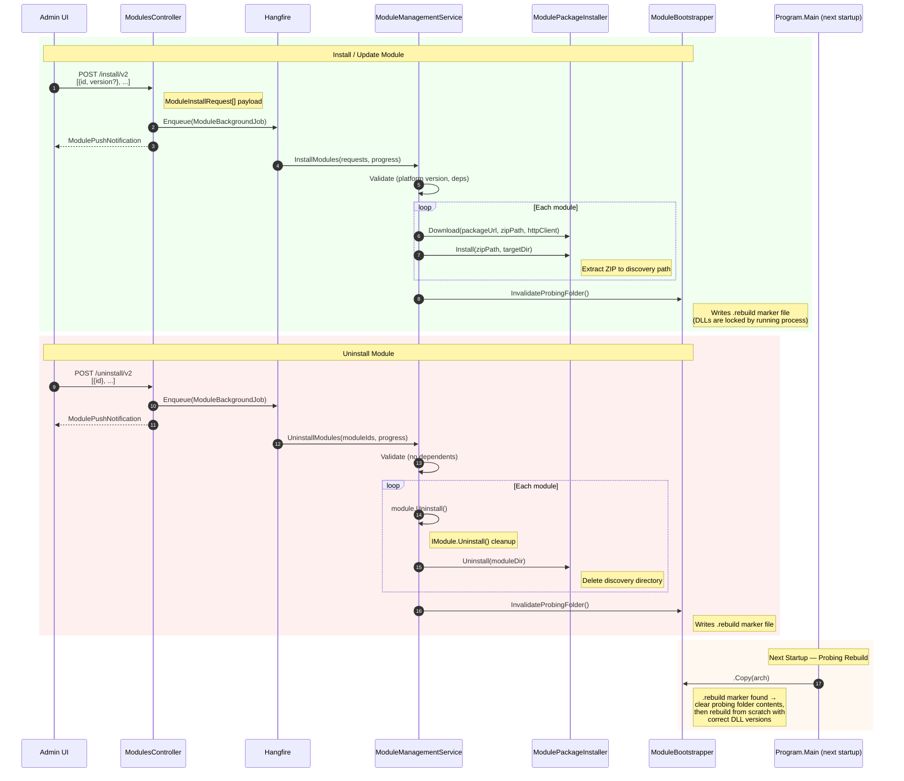

# Virto Commerce Platform Modularity Architecture

This document describes the platform's module loading architecture, the `ModuleBootstrapper` class, the `IPlatformStartup` extension point, and deployment scenarios for Docker and CI/CD pipelines.

## Overview

The platform uses a **single `ModuleBootstrapper` class** that runs a fluent pipeline in `Program.Main()` before the ASP.NET Core host is built. This design enables modules to participate in the earliest startup phases&mdash;including adding configuration sources and host-level services&mdash;before `Startup.ConfigureServices()` executes.

### Design Principles

- **No DI during discovery and loading.** Module manifests are read, assemblies are copied and loaded by the bootstrapper before the DI container is built.
- **Single entry point.** All module operations flow through `ModuleBootstrapper`&mdash;no scattered static classes.
- **Fluent pipeline.** `Discover()` &rarr; `Copy()` &rarr; `Load()` makes the startup sequence explicit and composable (vc-build can call only `Discover()` for design-time scenarios).
- **Constructor-based initialization.** All dependencies (`ILoggerFactory`, options) are passed via the constructor&mdash;no hidden `Initialize()` calls.
- **Graceful degradation.** A module that fails to load does not block platform startup. Errors are accumulated in `ManifestModuleInfo.Errors` and reported after startup completes.
- **DI integration.** `ModuleBootstrapper` implements `IModuleService` and is registered in DI for controllers, health checks, and services.
- **Backward compatibility.** The `LocalModuleCatalogAdapter` bridges the bootstrapper to DI-dependent code that resolves `ILocalModuleCatalog` or `IModuleCatalog`.

## Startup Flow

```
Program.Main()
 |
 |  1. Build bootstrap IConfiguration (appsettings.json + env vars)
 |  2. Create ModuleBootstrapper(loggerFactory, options, boostOptions)
 |  3. .Discover(platformVersion)                -- read manifests, sort by deps, validate
 |  4. .Copy(arch)                               -- rebuild probing if .rebuild marker,
 |                                                  then copy DLLs to probing path
 |  5. .Load(isDevelopment)                      -- load assemblies, discover IPlatformStartup
 |  6. Store as ModuleBootstrapper.Instance
 |
 +--Host.CreateDefaultBuilder(args)
     |
     +--ConfigureAppConfiguration
     |   Instance.RunConfigureAppConfiguration() -- modules add config sources
     |
     +--ConfigureServices (host-level)
     |   Instance.RunConfigureHostServices()     -- modules register host services
     |   AddHangfireServer()                     -- Hangfire (platform, kept for now)
     |
     +--Startup.ConfigureServices()
     |   Instance.RunConfigureServices()         -- IPlatformStartup app-level services
     |   Instance.InitializeModules()            -- IModule.Initialize() for each module
     |   mvcBuilder.AddApplicationPart()         -- register API controllers
     |   Register ILocalModuleCatalog in DI      -- backward-compat adapter
     |
     +--Startup.Configure()
         Instance.RunConfigure()                 -- IPlatformStartup middleware (before routing)
         UseRouting / UseAuth / ...
         ExecuteSynchronized:
           Platform migrations
           UseHangfire
           Instance.PostInitializeModules()      -- IModule.PostInitialize()
         UseEndpoints / Swagger
```

## Sequence Diagrams

### Platform Startup &mdash; Full Module Loading Pipeline



### IPlatformStartup vs IModule &mdash; Execution Order



### Runtime Module Install / Uninstall



## ModuleBootstrapper

The single class responsible for the entire module loading pipeline. Located in `VirtoCommerce.Platform.Modules` namespace.

### Constructor

```csharp
var bootstrapper = new ModuleBootstrapper(loggerFactory, options, boostOptions);
```

| Parameter | Type | Description |
|-----------|------|-------------|
| `loggerFactory` | `ILoggerFactory` | Logger factory for all module operations |
| `options` | `LocalStorageModuleCatalogOptions` | Discovery path, probing path, copy settings |
| `boostOptions` | `ModuleSequenceBoostOptions` | Optional. Module IDs to prioritize in dependency sorting |

### Pipeline (Fluent API)

Called in `Program.Main()` before DI is available. Each method returns `this` for chaining.

| Method | Description |
|--------|-------------|
| `Discover(platformVersion)` | Read manifests from discovery path, sort by dependencies, validate against platform version, populate the module registry. After this call, `GetModules()`, `GetInstalledModules()`, `GetFailedModules()` are available. |
| `Copy(arch)` | Copy module assemblies to the probing path. Checks for `.rebuild` marker and clears probing folder if found. Platform-only&mdash;vc-build skips this. |
| `Load(isDevelopment)` | Load module assemblies into the AppDomain, refresh the registry, and discover `IPlatformStartup` implementations. After this call, `Startups` is populated. |

### IModuleService (DI interface)

`ModuleBootstrapper` implements `IModuleService` and is registered in DI as a singleton:

```csharp
services.AddSingleton<IModuleService>(ModuleBootstrapper.Instance);
```

| Method | Description |
|--------|-------------|
| `GetModules()` | All modules, sorted in dependency order. |
| `GetInstalledModules()` | Installed modules with no errors. |
| `GetFailedModules()` | Modules with errors. |
| `IsInstalled(moduleId)` | O(1) check if a module is installed. |
| `IsInstalled(moduleId, minVersion)` | Version-aware check. |
| `GetModule(moduleId)` | Returns `ManifestModuleInfo` or `null`. |

### Validation & External Manifest (public, not on interface)

Used by `ModuleManagementService` and vc-build directly via `ModuleBootstrapper.Instance`.

| Method | Description |
|--------|-------------|
| `ValidateInstall(module, installed, platformVersion)` | Validate that a module can be installed. Returns list of error messages. |
| `ValidateUninstall(moduleId, installed, excludeIds?)` | Validate that a module can be uninstalled (no dependents). |
| `GetDependencies(selected, available)` | Returns selected modules plus all transitive prerequisites, sorted in dependency order. |
| `ParseExternalManifest(json, platformVersion, prerelease?)` | Parse external module manifest JSON. |
| `MergeWithInstalled(external, installed)` | Merge external modules with locally installed modules. |
| `InvalidateProbingFolder()` | Write `.rebuild` marker for next startup. |

### Module Initialization (called from Startup)

| Method | Description |
|--------|-------------|
| `InitializeModules(services, config?, env?, catalog?)` | Create `IModule` instances and call `Initialize(services)` in dependency order. Sets `IHasConfiguration`, `IHasHostEnvironment`, `IHasModuleCatalog` properties. |
| `PostInitializeModules(appBuilder)` | Call `IModule.PostInitialize(app)` on all initialized modules. |

### Startup Discovery

| Member | Description |
|--------|-------------|
| `Startups` | `IReadOnlyList<IPlatformStartup>` discovered from loaded modules. |
| `RunConfigureAppConfiguration(builder, env)` | Call `ConfigureAppConfiguration` on each startup. |
| `RunConfigureHostServices(services, config)` | Call `ConfigureHostServices` on each startup. |
| `RunConfigureServices(services, config)` | Call `ConfigureServices` on each startup. |
| `RunConfigure(app, config)` | Call `Configure` on each startup. |

### Usage Examples

**Platform (Program.cs):**

```csharp
ModuleBootstrapper.Instance = new ModuleBootstrapper(loggerFactory, options, boostOptions)
    .Discover(PlatformVersion.CurrentVersion)
    .Copy(RuntimeInformation.ProcessArchitecture)
    .Load(isDevelopment);
```

**vc-build (design-time, no assembly loading):**

```csharp
var bootstrapper = new ModuleBootstrapper(loggerFactory, options)
    .Discover(platformVersion);

var modules = bootstrapper.GetModules();
var deps = bootstrapper.GetDependencies(selected, modules);
var errors = bootstrapper.ValidateInstall(module, modules, platformVersion);
```

**Controller (via DI):**

```csharp
public class DiagnosticsController(IModuleService moduleService) : ControllerBase
{
    var installed = moduleService.GetInstalledModules();
}
```

## ModulePackageInstaller

Static operations for module ZIP installation, uninstallation, and downloading. Separate from `ModuleBootstrapper` because it handles runtime package management (download, extract, delete), not the startup pipeline.

| Method | Description |
|--------|-------------|
| `Install(zipPath, targetModulePath)` | Extract a module ZIP file to the target directory. |
| `Uninstall(modulePath)` | Delete a module directory. Swallows `IOException` if files are locked. |
| `Download(packageUrl, targetZipPath, httpClient, options?)` | Download a module package. Supports authorization headers. |
| `LoadExternalModules(httpClient, options)` | Download and parse external module manifests from all configured URLs. |
| `LoadModulesManifest(httpClient, options, manifestUrl)` | Download and parse a single manifest URL. |

## LocalModuleCatalogAdapter

A thin adapter that wraps the pre-loaded module list for backward compatibility with code resolving `ILocalModuleCatalog` or `IModuleCatalog`.

```csharp
[Obsolete("Use ModuleBootstrapper / IModuleService instead.")]
public class LocalModuleCatalogAdapter : ModuleCatalog, ILocalModuleCatalog { ... }
```

## Module Management Service

`IModuleManagementService` is a DI-registered singleton for module catalog management from the Admin UI. It merges external (from manifest URLs) and locally installed modules, caches the result, and orchestrates install/uninstall operations using `ModuleBootstrapper.Instance` for validation/merge and `ModulePackageInstaller` for package operations.

### IModuleManagementService

| Method | Description |
|--------|-------------|
| `GetModules()` | Returns merged list of external + installed modules. Lazy-loaded on first access. |
| `ReloadModules()` | Clears cached modules and re-fetches from external manifest URLs. |
| `GetDependencies(moduleIds)` | Selected modules + transitive prerequisites, sorted by dependency order. |
| `GetDependents(moduleIds)` | Installed modules that depend ON the given modules (reverse dependencies). |
| `AddUploadedModule(module)` | Add an uploaded module to the merged catalog. |
| `InstallModules(requests, progress)` | Install or update modules. Validates, downloads, extracts, marks probing for rebuild. |
| `UninstallModules(moduleIds, progress)` | Uninstall modules. Validates dependents, calls `Uninstall()`, deletes directory. |
| `GetNotInstalledModulesFromGroups(groups)` | Modules from requested groups not yet installed, including dependencies. |
| `ValidateModuleVersionAsync(moduleId, version)` | Check if a module version package exists at the download URL. |
| `RegisterCustomModuleVersionAsync(moduleId, version)` | Validate and register a custom module version for installation. |

### How It Works

1. **First call to `GetModules()`**: Downloads external manifests via `ModulePackageInstaller.LoadExternalModules()`, merges with `ModuleBootstrapper.Instance.GetModules()` via `ModuleBootstrapper.Instance.MergeWithInstalled()`, caches result.
2. **Install**: Validates via `ModuleBootstrapper.Instance.ValidateInstall()` &rarr; downloads ZIP &rarr; extracts via `ModulePackageInstaller.Install()` &rarr; calls `ModuleBootstrapper.Instance.InvalidateProbingFolder()` to write `.rebuild` marker.
3. **Uninstall**: Validates via `ModuleBootstrapper.Instance.ValidateUninstall()` &rarr; calls `IModule.Uninstall()` &rarr; deletes directory &rarr; calls `InvalidateProbingFolder()`.
4. **Next startup**: `ModuleBootstrapper.Copy()` detects the `.rebuild` marker and forces a clean probing rebuild.

## Module Management REST API

The `ModulesController` exposes REST endpoints for module operations.

### Batch Endpoints

| Method | Route | Request Body | Description |
|--------|-------|-------------|-------------|
| `POST` | `/api/platform/modules/install` | `ModuleDescriptor[]` | Install modules (legacy). |
| `POST` | `/api/platform/modules/install/v2` | `ModuleInstallRequest[]` | Install modules (lightweight). |
| `POST` | `/api/platform/modules/update` | `ModuleDescriptor[]` | Update modules (legacy). |
| `POST` | `/api/platform/modules/update/v2` | `ModuleInstallRequest[]` | Update modules (lightweight). |
| `POST` | `/api/platform/modules/uninstall` | `ModuleDescriptor[]` | Uninstall modules (legacy). |
| `POST` | `/api/platform/modules/uninstall/v2` | `ModuleInstallRequest[]` | Uninstall modules (lightweight). |

### Single-Module Endpoints

| Method | Route | Description |
|--------|-------|-------------|
| `POST` | `/api/platform/modules/{moduleId}/install` | Install latest version. |
| `POST` | `/api/platform/modules/{moduleId}/versions/{version}/install` | Install specific version. |
| `POST` | `/api/platform/modules/{moduleId}/uninstall` | Uninstall a module. |
| `GET`  | `/api/platform/modules/{moduleId}/versions/{version}/validate` | Check if version package exists. |

### Other Endpoints

| Method | Route | Description |
|--------|-------|-------------|
| `GET`  | `/api/platform/modules` | List all modules. |
| `POST` | `/api/platform/modules/reload` | Re-fetch external manifests. |
| `POST` | `/api/platform/modules/getmissingdependencies` | Get uninstalled transitive dependencies. |
| `POST` | `/api/platform/modules/getdependents` | Get reverse dependencies. |
| `POST` | `/api/platform/modules/localstorage` | Upload a module ZIP. |
| `POST` | `/api/platform/modules/restart` | Restart the application. |
| `POST` | `/api/platform/modules/autoinstall` | Trigger auto-install for configured bundles. |
| `GET`  | `/api/platform/modules/autoinstall/state` | Get auto-install state. |
| `GET`  | `/api/platform/modules/loading-order` | Get dependency-sorted loading order. |

## IPlatformStartup Interface

Allows modules to hook into platform startup phases that occur **before** the standard `IModule` lifecycle. Implementations are discovered via the `<startupType>` element in `module.manifest`.

```csharp
public interface IPlatformStartup
{
    void ConfigureAppConfiguration(IConfigurationBuilder builder, IHostEnvironment env);
    void ConfigureHostServices(IServiceCollection services, IConfiguration config);
    void ConfigureServices(IServiceCollection services, IConfiguration config);
    void Configure(IApplicationBuilder app, IConfiguration config);
}
```

| Method | When It Runs | Use Case |
|--------|-------------|----------|
| `ConfigureAppConfiguration` | `Program.CreateHostBuilder()`, inside `ConfigureAppConfiguration` callback | Add configuration sources: Azure App Configuration, Consul, Vault |
| `ConfigureHostServices` | `Program.CreateHostBuilder()`, inside host-level `ConfigureServices` callback | Register hosted services, background job servers |
| `ConfigureServices` | `Startup.ConfigureServices()`, **before** `InitializeModules()` | Application-level DI registrations that need to run before modules |
| `Configure` | `Startup.Configure()`, at the very start before routing middleware | Add early middleware to the HTTP pipeline |

## Module Manifest

The `module.manifest` XML file declares a module's metadata, dependencies, and optional startup type.

```xml
<?xml version="1.0" encoding="utf-8"?>
<module>
  <id>VirtoCommerce.AzureAppConfiguration</id>
  <version>1.0.0</version>
  <platformVersion>3.800.0</platformVersion>

  <title>Azure App Configuration</title>
  <description>Provides Azure App Configuration integration as a module</description>
  <authors>
    <author>Virto Commerce</author>
  </authors>

  <assemblyFile>VirtoCommerce.AzureAppConfiguration.dll</assemblyFile>
  <moduleType>VirtoCommerce.AzureAppConfiguration.Module</moduleType>
  <startupType>VirtoCommerce.AzureAppConfiguration.AzureAppConfigStartup</startupType>

  <dependencies>
    <dependency id="VirtoCommerce.Core" version="3.800.0" />
  </dependencies>
</module>
```

| Element | Required | Description |
|---------|----------|-------------|
| `id` | Yes | Unique module identifier |
| `version` | Yes | Semantic version (may include `-tag`) |
| `platformVersion` | Yes | Minimum platform version required |
| `assemblyFile` | No | DLL filename. If omitted, the module is manifest-only (no code). |
| `moduleType` | No | Fully-qualified `IModule` implementation class name |
| `startupType` | No | Fully-qualified `IPlatformStartup` implementation class name |
| `dependencies` | No | Other modules this module depends on |

## Configuration

Module paths are configured in `appsettings.json` under the `VirtoCommerce` section:

```json
{
  "VirtoCommerce": {
    "DiscoveryPath": "modules",
    "ProbingPath": "app_data/modules",
    "RefreshProbingFolderOnStart": true
  }
}
```

| Setting | Default | Description |
|---------|---------|-------------|
| `DiscoveryPath` | `modules` | Directory where installed modules are stored |
| `ProbingPath` | `app_data/modules` | Flat directory where all module assemblies are copied for loading |
| `RefreshProbingFolderOnStart` | `true` | When `true`, copies assemblies from discovery to probing at every startup |

## Diagnostics

### Logging

All module operations are logged through `ILoggerFactory` (typically Serilog):

```
[INF] ModuleBootstrapper: Discovered modules: 12, with errors: 2
[DBG] ModuleBootstrapper: Copying assemblies from /app/modules/VirtoCommerce.Catalog/bin
[DBG] ModuleBootstrapper: Loading module VirtoCommerce.Catalog 3.800.0
[WRN] ModuleBootstrapper: Module VirtoCommerce.Broken has errors: incompatible platform version
[INF] ModuleBootstrapper: Loaded modules: 12, with errors: 2
```

### Failed Modules

Query failed modules programmatically:

```csharp
var failed = ModuleBootstrapper.Instance.GetFailedModules();
// or via DI:
var failed = moduleService.GetFailedModules();
```

### Health Checks

The `ModulesHealthChecker` reports module health at `/health`:

```json
{
  "Modules health": {
    "status": "Unhealthy",
    "description": "Some modules have errors"
  }
}
```
