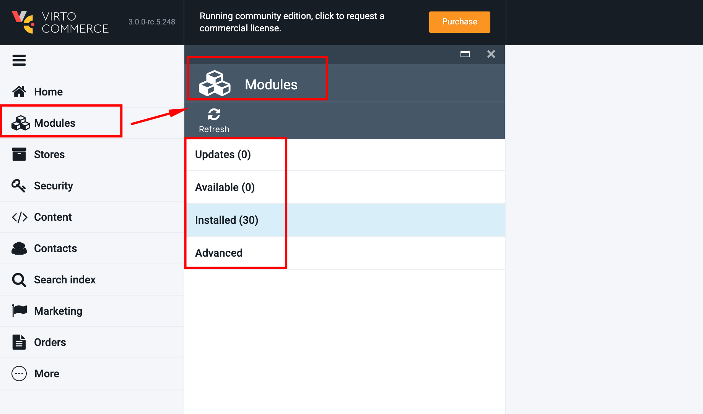
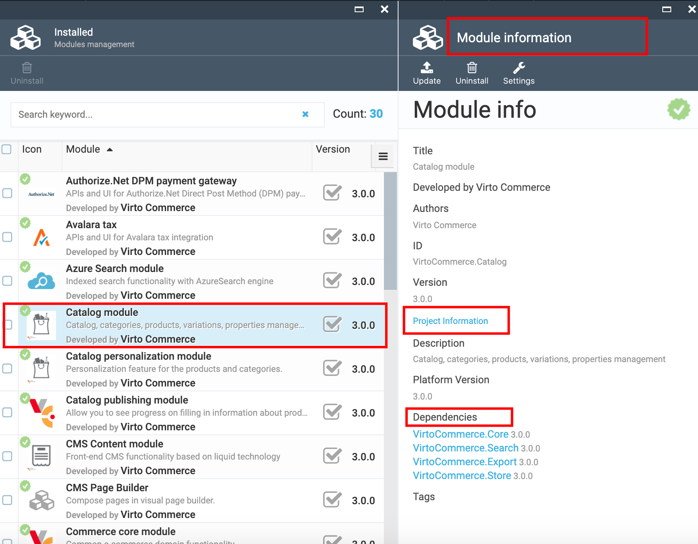

# Modules

The Modules can be accessed only by admin user who can view view the installed modules, new updates, install new modules or remove the installed ones.

## View Modules

1. Go to More->Modules;
1. The system opens the 'Modules' blade that consists of the following blocks:

     1. Updates
     1. Available
     1. Installed
     1. Advanced
  
1. The 'Updates' block displays the available updates;
1. The 'Available' block contains the list of available modules in VC that can be installed;
1. The 'Installed' block displays the already installed modules in VC;
1. The 'Advanced' block provides the possibility to upload a module from outside the Modules repository.

## Install Modules

1. Open the 'Available' blade and select the Module you want to install;
1. The system will display the Module info with an enabled 'Install' button;
1. Click 'Install'; 
1. Confirm the module installation by clicking the 'Confirm' button on the 'Install confirmation' pop-up;
1. The new module will be installed;
1. The installed module will appear in the list of installed modules.

## View Installed Modules

1. Open the 'Installed' blade;
1. The list of installed modules in VC will be displayed;
1. All VC modules are checked with the green check sign. External modules have no such sign;
1. The 'Uninstall' button is disabled by default, unless a module is selected;
1. To view the Module info, simply click on the module and the system will open the 'Module info' blade.

## Module Info

1. The Module info blade displays the following information:

    1. Title;
    1. Developed by;
    1. Authors;
    1. ID;
    1. Version;
    1. Project information- link;
    1. Description;
    1. Platform version;
    1. Dependencies.
    1. Tags
1. To view the project information, simply click on the corresponding link.

## Install/Update Module From File

1. Open the 'Advanced' blade;
1. Click the 'Upload' icon;
1. Select the zip file on your local disk to upload;
1. The system will upload the file and install the module (or update it).