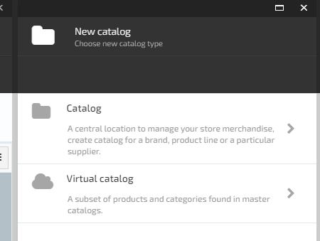
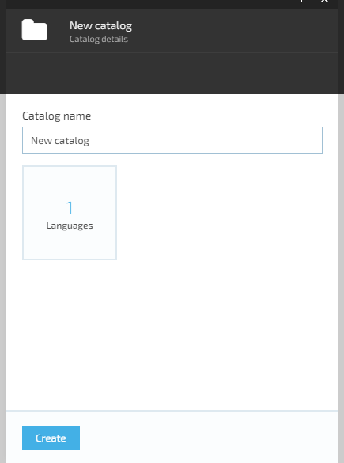
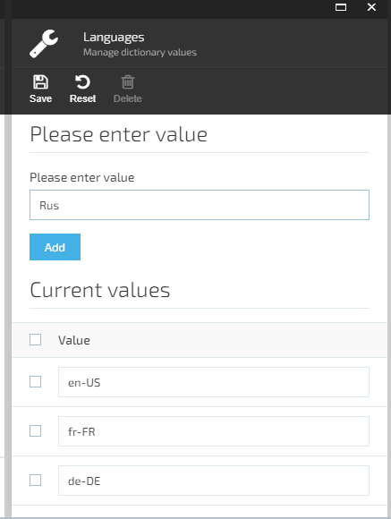
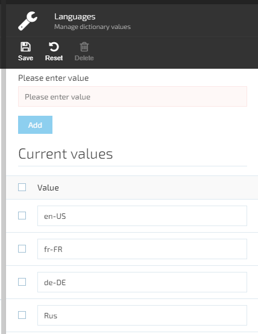
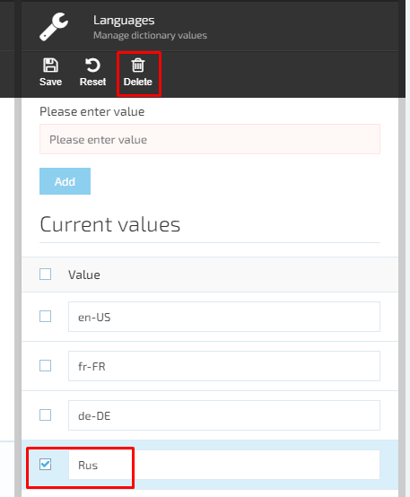

# Add New Catalog

In order to add a new catalog, the user should pass through the following steps:

1. Navigate to the Catalog Module and click the ‘Add’ button;  
1. The system will display the ‘New catalog’ blade and prompt the user to choose new catalog type;

1. The user selects the ‘Catalog’ button;
1. The system will display the next blade ‘Catalog details’ and the user will be prompted to enter the Catalog name and specify the languages;

1. The user enters the catalog name into the input filed and specifies the catalog languages by navigating to ‘Manage languages’ blade:

     1. The user selects the default language from the drop-down box;
     1. The user selects additional languages from the drop- down box;
1. The user confirms selection by clicking the ‘OK’ button OR cancel the operation using the ‘Cancel’ button.
1. The default and additional languages will be added to the new catalog.

## Edit default language  

1. The user clicks the ‘Edit’ button located next to the ‘Default language’ value;  

1. The system will display the ‘Manage dictionary values’ screen;
1. The user enters the new value, ex. Rus, into the ‘Enter value’ input text field and clicks the ‘Add’ button;

1. The new value will be added to the list;  
1. The user clicks the ‘Save’ button;
1. The system will save the changes made by user.

## Delete language value  

1. The user selects the language and clicks the ‘Delete’ button;
1. The system will delete the selected value from the list.  

