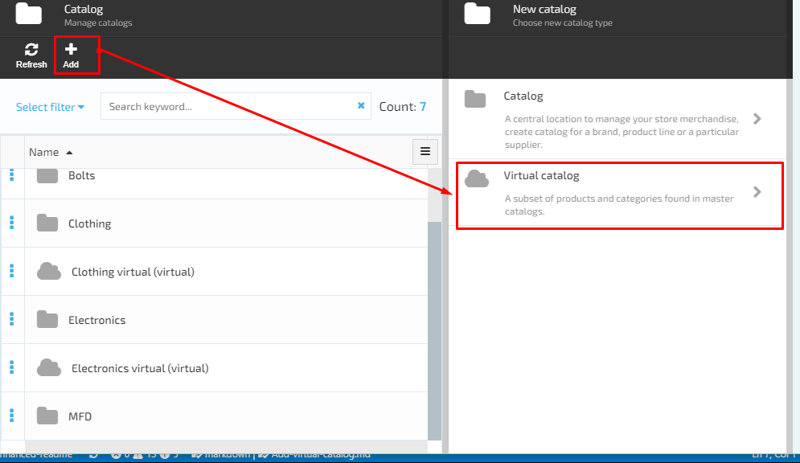
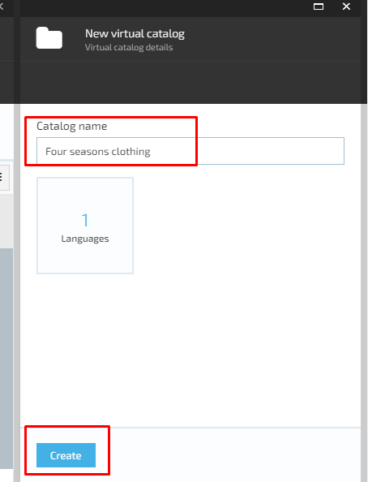

# Add Virtual Catalog

1. The user selects the ‘Virtual catalog’ button on ‘Choose new catalog type’ screen;
1. The system will display the ‘Virtual catalog details’ screen and the user will be prompted to enter the virtual catalog name and specify the languages;
1. The user enters the virtual catalog name, specifies default and additional languages and clicks the ‘Create’ button;
1. The new virtual catalog will be created and displayed on the list of catalogs.

 