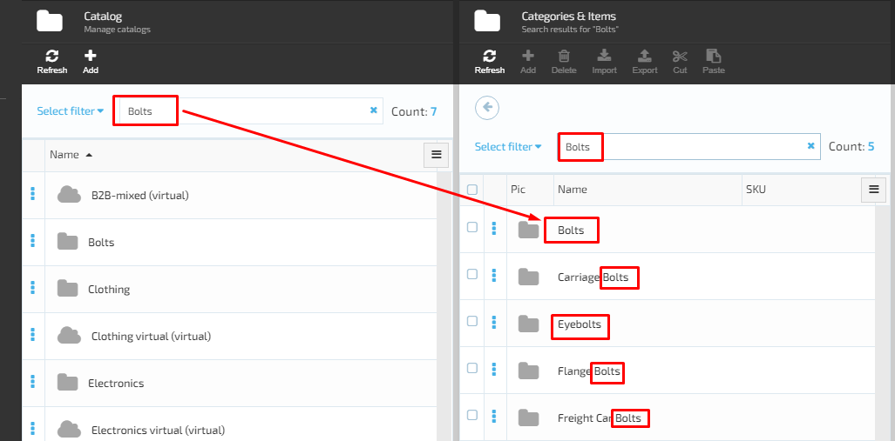
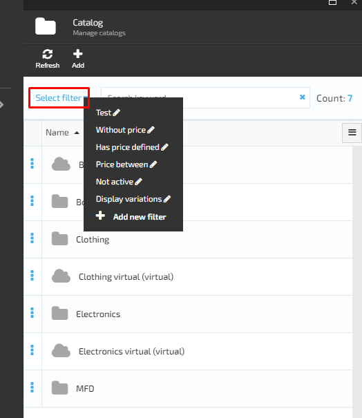
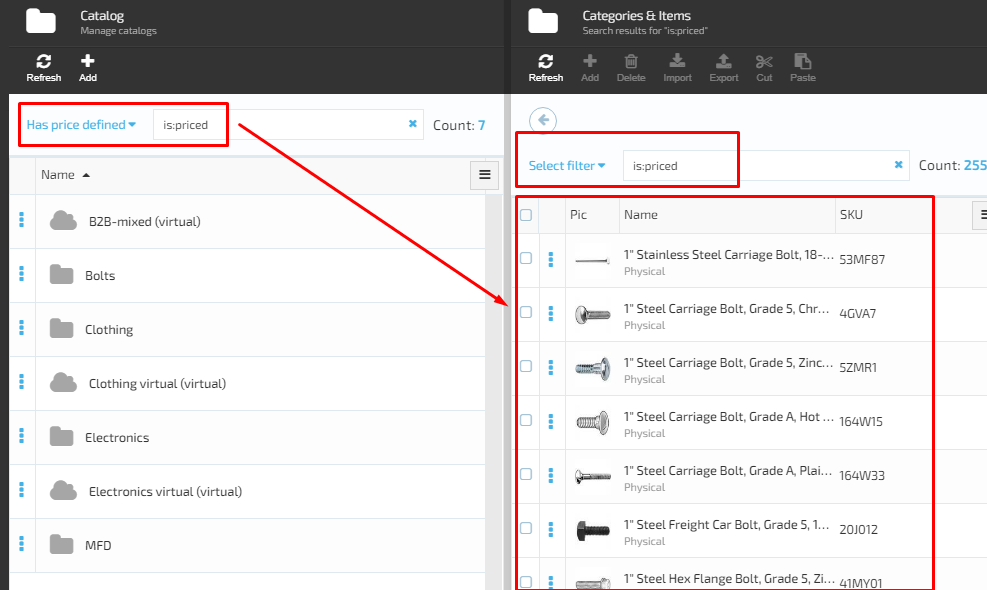
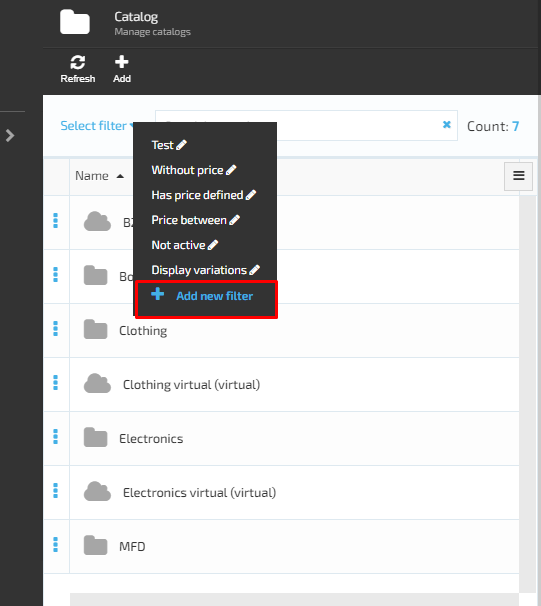
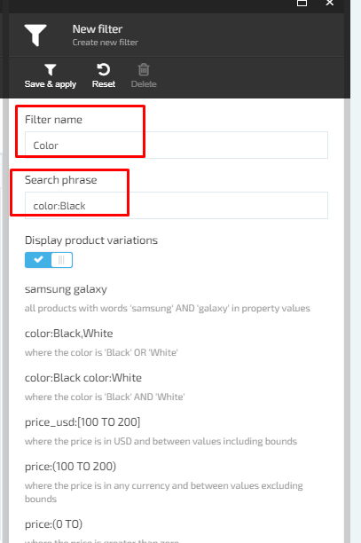
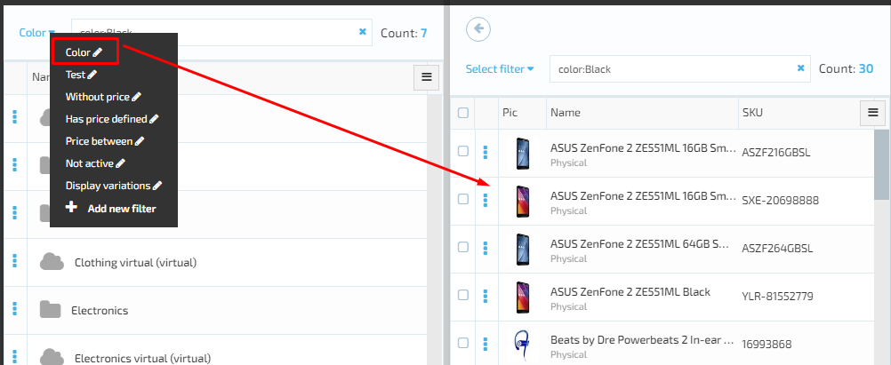

# Catalog Search

## Key Features

1. Full text search and text analysis​
     - Search by keyword.
1. Filter by​
     - Text;
     - Price range;
     - Category.
1. Aggregations​
     - With count of products for every value
1. Response Group​
     - To limit response content and size.
1. Linguistic analysis​
     - Token filter: custom_edge_ngram with minimum number of characters in a gram and​
     minimum number of characters in a gram.
1. Geo-search​
     - Store by distance;
     - Filter by radius.
1. Sorting & Paging​
1. Aggregation properties manager​
     - Pick Catalog properties eligible for filtering in this Store.

## Catalog Search Advantages

Customization - Override or Extend Document or Search Request with custom properties.

## Catalog Search Limitations

1. By default rebuild index every 5 minutes​
1. Performance​-
     - If Response Group Set to Full, we can loose time on serialization & deserialization.
1. Save full product in index​-
     - MS SQL DB Vs Index Size.
1. Rebuild and delete index​.
1. Elastic​-
     - Recommended Provider.
1. Lucene-​
     - For local environment only.

​
### Scenarios

VirtoCommerce Catalog Module provides two types of search :

1. Search by keyword.
1. Search by filter.

### Search by keyword

1. In order to start the search by keyword, the user should browse the catalog Module 
1. The system will display the list of catalogs and the 'Search' pane on the top of the screen 
1. The user starts entering the keyword
1. The system starts the search by the first letter and display the search results on the screen. The search results will display all the data that contain the keyword entered by user.
     1. Example, the user enters 'Bolts'
     1. The system will display the search results as follows:
         1. Bolts;
         1. Carriage Bolts;
         1. Eyebolts;
         1. Flange BoltsFreight Car Bolts.

This type of search is available throughout the whole VC Catalog Module.

### Select Filter

The user can search for products using the 'Select filter' search. by selecting the filter, the system will return the search results based on the specified filter.

1. The user browses the Catalog Module
1. The system will display the list of catalogs and the 'Search' pane on the top of the screen
1. The user opens the 'Select filter' drop down and selects the filter he needs from the list of filters
1. The system will return the results based on the specified filter.

### Add Filter

1. The user opens the 'Select filter' drop down and selects 'Add new filter';
1. the system will display the 'New filter (Create New Filter)' screen;
1. The user enters the 'Filter Name', 'Search phrase' and can also select either to display variations or not by switching on/off the correspondent button and clicks the 'Save & apply' button;
1. The system will create and apply the new filter;
1. The filtering results will be displayed on the screen.

