# Manage Categories

## Add New Category

In order to add a new category to the Catalog, the user should go through the following steps:

1. The user opens the catalog module and selects a catalog;
1. The system will display the ‘Categories and items’ screen;
1. The user clicks the ‘Add’ button;
1. The system will display the ‘New category item’ screen and prompt the user to choose one of the three options:  

      1. Category;
      1. Physical product;
      1. Digital product.

     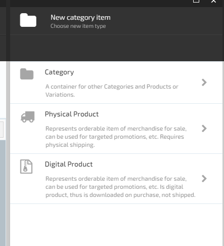

     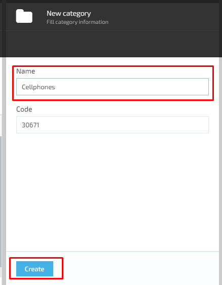
1. The user selects ‘Category’;
1. The system displays the ‘New category’ screen and prompt the user to enter full category information:

      1. Name- input text box;
      1. Code- generated automatically by the system;
      1. ‘Create’ button is disabled until the category name is entered;
1. The user enters the category name and clicks the ‘Create’ button;
1. The system will create a new category and display the ‘Category details’ screen:  

      1. ‘Is Active’ button- the user can switch or un-switch this button;
         1. If switched on- the category will be activated by the system;
         1. If switched off - the category will be de-activated in the system.
      1. ‘Priority’ text field;
      1. ‘Name’ text field;
      1. ‘Code’ text field;
      1. ‘Tax type’ drop down – the user can either select a tax type value or add a new one;
      1. ‘Images’ widget;
      1. ‘Properties’ widget;
      1. ‘SEO’ widget;  
      1. ‘Search index’ widget;
      1. ‘Tags’ widget;
      1. ‘Name’ input field, ‘Tax type’ drop down and widgets are editable. The ‘Code’ field is not editable;
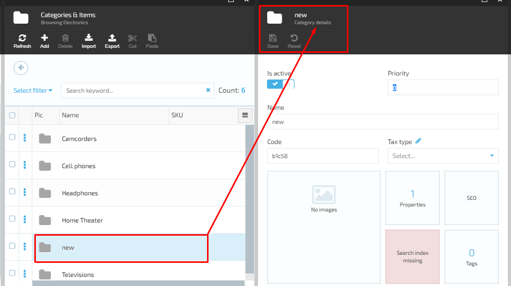

1. The user fills out the details , configures the widgets and clicks the ‘Save’ button;
1. The system will save the new category details;
1. The new category will appear on the ‘Categories’ list.

### Add tax type

1. In order to add a tax type value, the user clicks the ‘Edit’ button on ‘Category details’ screen;
1. The system will display the ‘Manage dictionary values’ (Tax types) screen and prompt the user to enter the value;
1. The user enters the value (tax type name) and clicks the ‘Add’ button;
1. The system will add the new value to the dictionary;  
1. The user selects the value from the list and clicks ‘Save’;
1. The system will save the new value and display it in the ‘Tax type’ drop down;
1. The user can add as many values for a tax type as necessary  

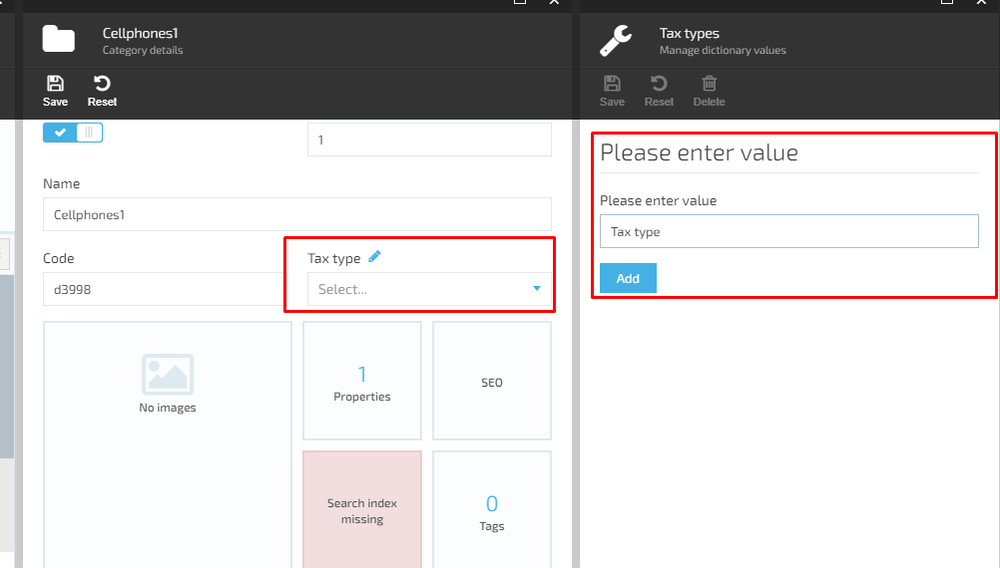

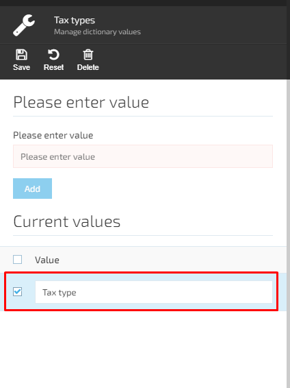

### 'Images' widget

1. To add images to a category, the user should select the ‘Images’ widget on ‘Category details’ screen;
1. The system displays the ‘Manage images’ screen with possibility to add images;
1. The user clicks the ‘Add’ button;
1. The system displays the ‘Upload Images’ screen: 

     1. ‘Image category’ drop down with possibility to add new categories;
     1. ‘Language’ drop -down;
     1. ‘Select images’ space: ‘drag and drop’ or ‘browse file’ options;
1. The user specifies the ‘Image category’, ‘Language, browse the image(s) and clicks ‘OK’;
1. The system will add the entered data and images to the category  

`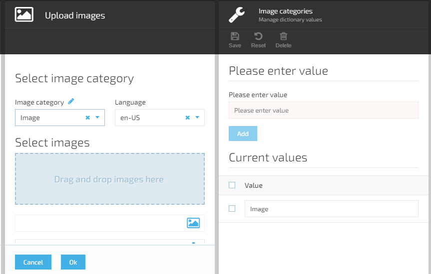

### 'Properties' widget

1. The user selects the ‘Properties’ widget on ‘Category details’ screen;
1. The system displays the ‘Properties list’ screen with possibility to add a new property;
1. The user clicks the ‘Add property’ button;
1. The system opens the ‘Manage property’ (Edit property information) screen:
     1. ‘Property name’ input text field;
     1. ‘Display name’ input text field;
     1. 'Buttons'- can be switched on or switched off:
         1. Dictionary;
         1. Multivalue;
         1. Multilanguage;
         1. Hidden.  
     1. ‘Applies to’ drop down:
         1. Category;
         1. Product;
         1. Variation.  
     1. ‘Value type’ drop down:
         1. Short text;
         1. Long text;
         1. Decimal number;
         1. Date time;
         1. Boolean;
         1. Integer;
         1. Geo Point.  
1. The user edits the property information based on the business needs and saves the changes;
1. The new property will be added to the Category.
  
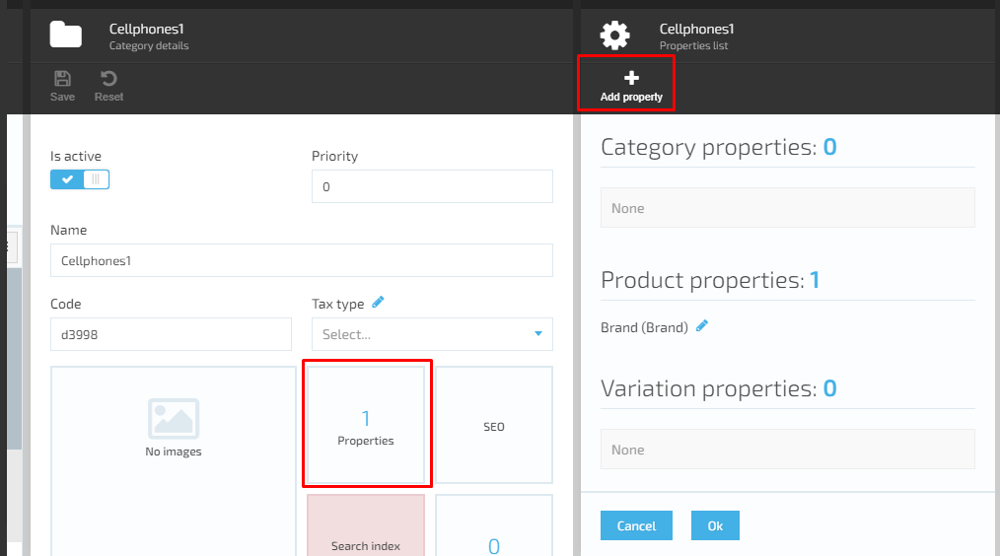
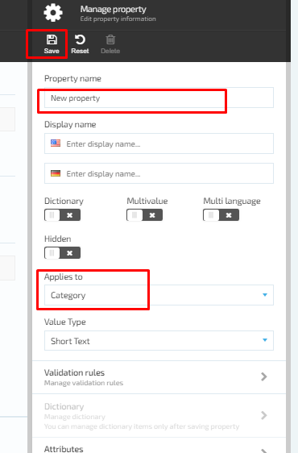

#### Manage validation rules

The user can manage the validation rules of all the category properties:

1. The user selects the ‘Validation rules’ on ‘Edit property information’ screen

1. The system will display the ‘Manage validation rules’ screen:

     1. Buttons that can be switched on or switched off by the user;
         1. Required;
         1. Limit character count;
         1. Match a specific pattern.

     1. Drop down under the ‘Limit character count’ button becomes active when the button is switched. The user selects one of the following options:  
         1. 'Between'- if this option is selected, both input fields ‘Min’ and ‘Max’ become active. The user specifies the minimum and maximum allowed number of characters  
         1. 'At least'- if this option is selected, only the ‘Min’ input field is active
         1. 'Not more than'- if this option is selected, only the ‘Max’ input field is active  
     1. Drop down under the ‘match a specific pattern’ button becomes active when the button is switched on. The user selects one of the following options:
         1. Custom;
         1. Email;
         1. URL;
         1. Date.

     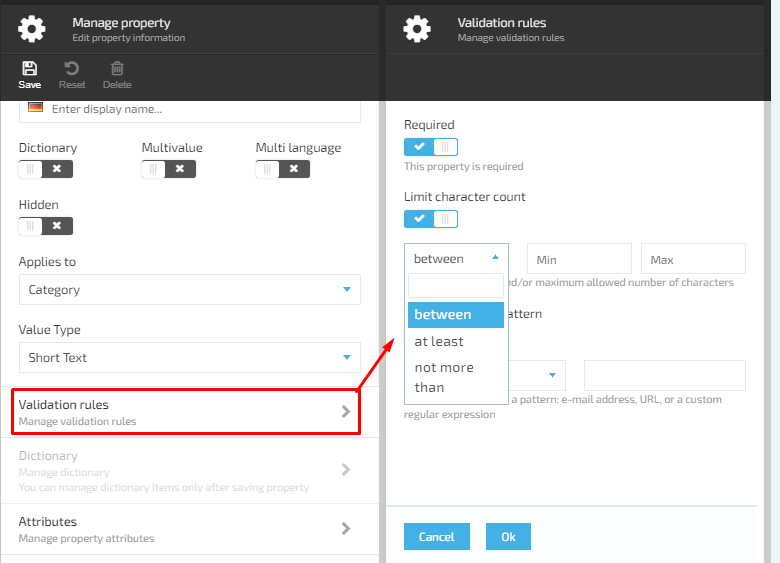

     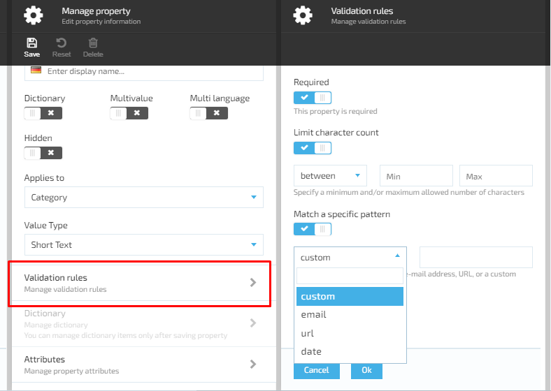

#### Manage property attributes

1. On ‘Manage property’ (Edit property information) screen the user selects ‘Attributes’
1. The system will display the ‘New property attributes’ screen with possibility to add a new property and specify values;
1. The user enters the new property name, specifies the value and clicks the ‘Add’ button;
1. The system will add the new attribute to the property attributes list  

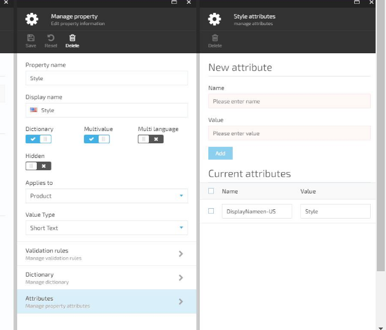

### Manage SEOs 

In order to add a new SEO, the user should pass through the following steps:

1. Select the ‘SEO’ widget on ‘Category details’ screen;
1. The system will display the ‘Manage SEOs’ screen with possibility to add a new SEO. The following will be displayed on the screen:  
     1. ‘Is active’ button:
         1. If switched on – the SEO will be active;
         1. If switched off – the SEO will be inactive.  
     1. ‘Store’ - drop down. The user can select the store for which the new SEO will be applied;
     1. ‘Language’ - drop down. The user can select the language for the new SEO;
     1. ‘URL keyword’- input text field (required);
     1. ‘Page title’ - input text field;  
     1. ‘Meta description’- text box;
     1. ‘Image alternative text’- input text field;
     1. Buttons:
         1. OK- becomes active when required fields are filled out;
         1. Cancel- always active.
1. The user fills out the information and clicks the ‘OK’ button;
1. The system will add the new SEO to the SEOs list  

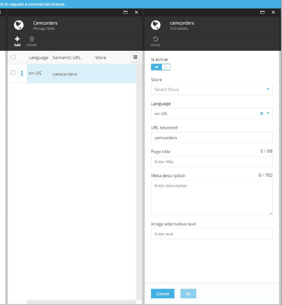

#### Assign tags

The user can assign tags to the selected category  

1. On ‘Category details’ screen the user should select the ‘Tags’ widget;
1. The system will display the next screen and the user will be prompted to assign tags. The following will be displayed on the screen:

     1. ‘Available tags’ -drop down with possibility to add a new tag;
     1. List of assigned tags.

1. The user selects the tag from the drop down and clicks the ‘Add’ button;
1. The tag will appear on the ‘Assigned tags’ list

#### Add new tag

1. In order to add a new tag, the user should click on the ‘Edit’ icon next to the ‘Available tags’ label;
1. The system will display the next blade and prompt the user to enter the value;
1. The user enters the value and clicks ‘Add’;
1. The new tag will be added to the tags list and displayed in the ‘Available tags’ drop down  

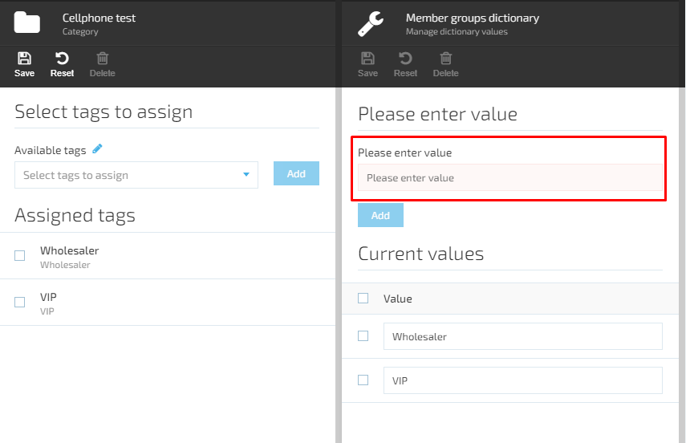