# Manage Products 

## Add physical product

1. In order to add a physical product to the Catalog, the user should navigate to ‘Categories and items’, select a Category and click the ‘Add’ button and then select ‘Physical Product’; 
1. The system will open the ‘New product’ blade and prompt the user to fill out the new product information:  

     1. ‘SKU’ generated automatically by the system and cannot be edited; see [Glossary](/docs/glossary.md)
     1. ‘Name’ text box is required;
     1. ‘Fill properties’ button;
     1. ‘Upload images’ button;
     1. ‘Add description’ button;
     1. ‘Define SEO information’ button.  

1. The user enters the Product name and clicks the ‘Create’ button;
1. The new product will be added to the selected Category.

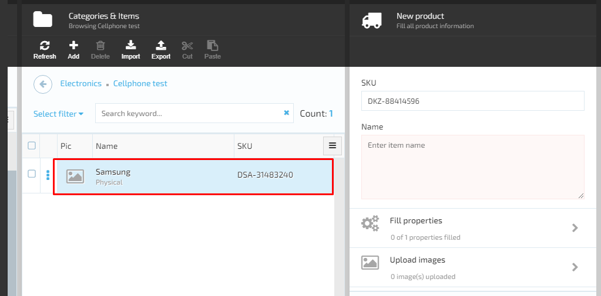

### Add property to the new product

The user can add as many properties to the new product as needed. In order to add a property to the product, the user should pass through the following steps:

1. Select product-> Fill Property->Add property;
1. The system will display the ‘Edit item property’ screen and prompt the user to specify Property name and select value as shown on the screenshot;
1. The user enters the property name, selects value and clicks ‘OK’;
1. The new property will be added to the product and displayed on the Properties list.

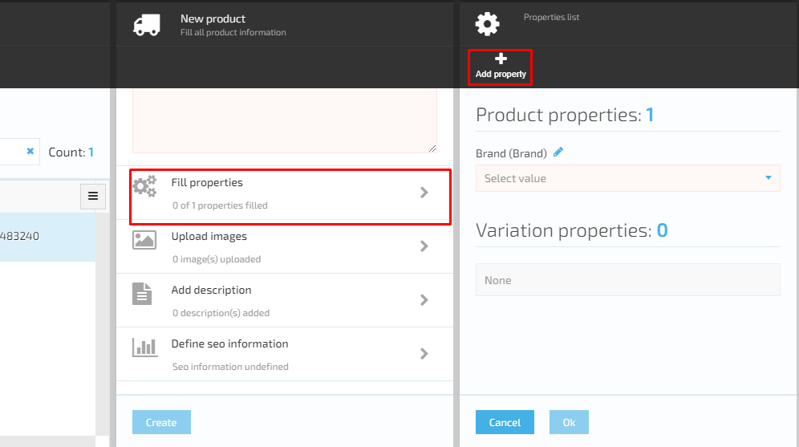

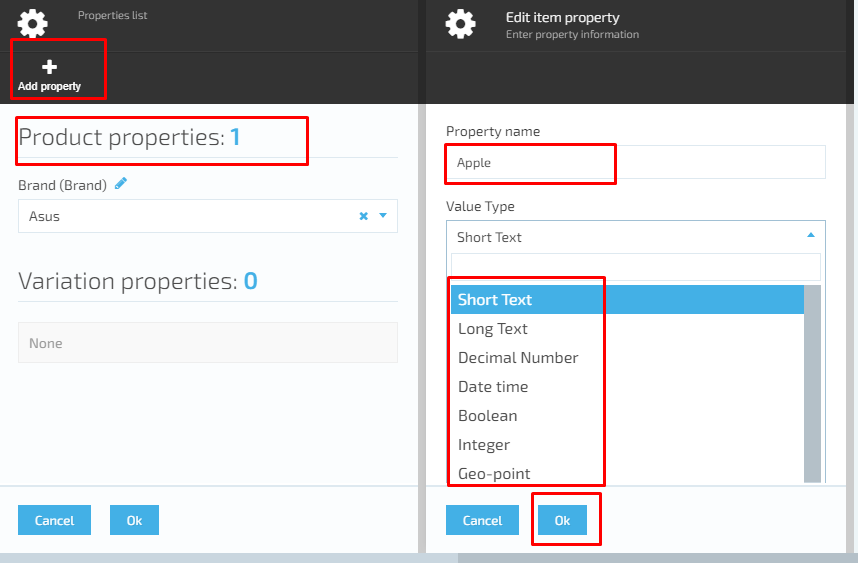

## View and manage physical item details

In order to view and manage the physical item details, the user should navigate to the Categories and items screen, select an item and click on it. The system will then display the ‘Physical item details’ screen. The system allows the user to edit and specify the following item details:  

1. ‘First listed’ input field with data picker enables the user to specify the start date, when the product should become active. If this parameter is not specified, then the product becomes active immediately after saving;
1. ‘Listing expires on’ input field with date picker enables the user to specify the expiration date. If this parameter is not specified, then the product will be active until deactivation;  

1. ‘Name’ input field is editable and requires entering the physical product name that will be displayed on client side;
1. Buttons:  
     1. Can be purchased: see [Glossary](/docs/glossary.md)
         1. If switched on, the product will be visible and available for purchase on client side;
         1. If switched off- the product will not be available for purchase.
     1. Store visible: see [Glossary](/docs/glossary.md)
         1. If switched on- the product will be visible on the store side;
         1. If switched off- the product will be visible only on admin side, not on store.
     1. Track inventory: see [Glossary](/docs/glossary.md)
         1. If switched on- inventory will be tracked;
         1. If switched off- inventory will not be tracked in the system.
1. GTIN input field - Global Trade Item Number; see [Glossary](/docs/glossary.md)
1. ‘Vendor’ drop down helps to select a Vendor and add new vendors;
1. ‘Tax type’ drop down allows the user to select an existing tax type or add new tax types to the list;
1. The following widgets, displayed on the screen, help the user to configure different physical item parameters:
     1. ‘Properties’ widget contains product properties. The user can add as many product properties as needed. Each property can be
     either edited or deleted.
     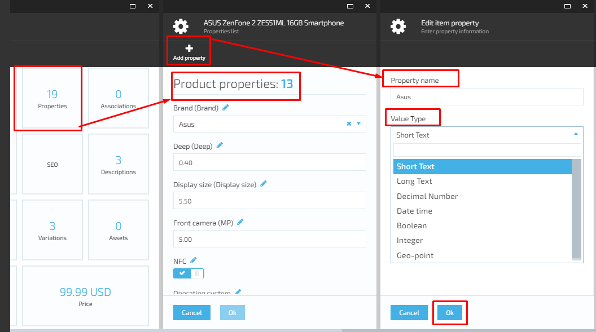
     1. ‘Associations’ widget:

         1. Used to add associated products to the selected physical product that will be visible on store together with the main product;
         1. The user can create as many groups of associations as needed and add tags, number and items to the selected group. 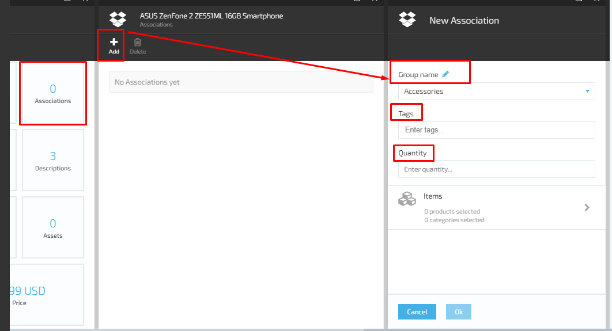
     1. ‘SEO’ widget; 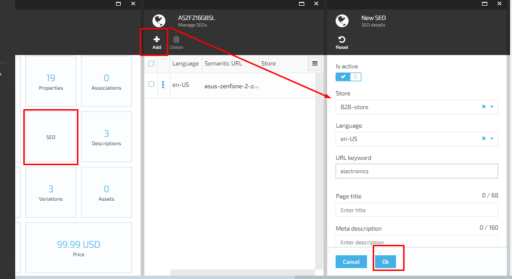
     1. ‘Descriptions’ widget contains:
          1. Description types;
          1. Description Languages;
          1. Product description that is visible on store;
          1. The user can add a new description or edit/delete the existing description(s) 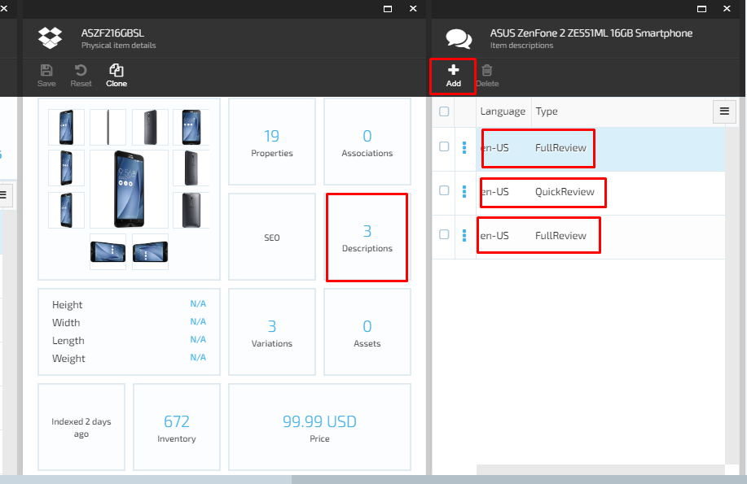
     1. ‘Variations’ widget includes the main product variation(s). The user can add new product variations and edit/delete the existing one; 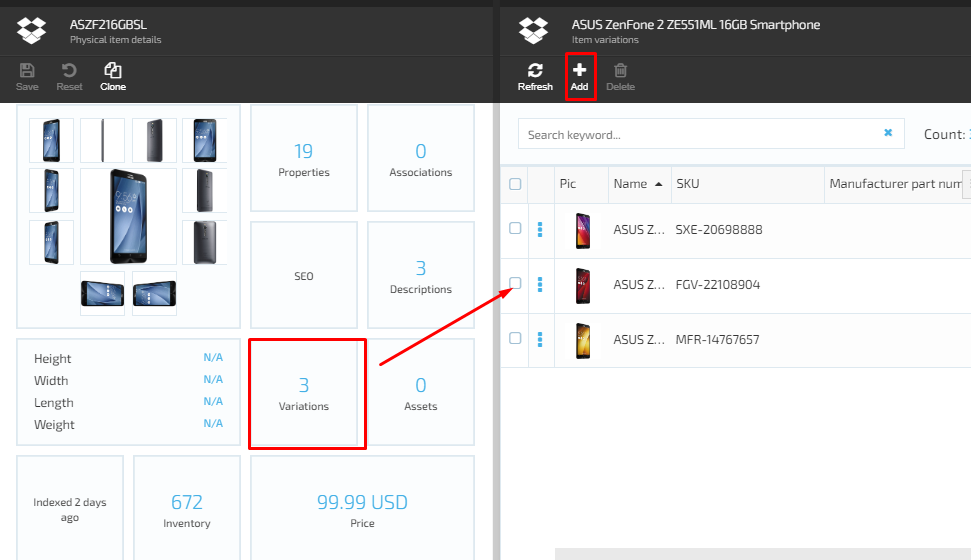
     1. ‘Assets’ widget:
         1. Contains assets in file format and links to different groups of images if the assets were previously added;  
         1. The user can add new assets or remove the existing one.  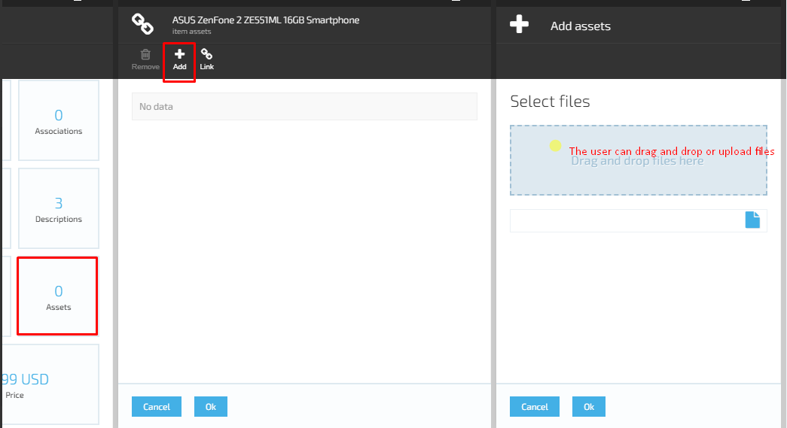
     1. ‘Inventory’ widget enables to:
          1. Add stocked products to the system;
          1. Add reserved products;
          1. Specify reorder min. Quantity;
          1. Allow or don’t allow reorder and back order. 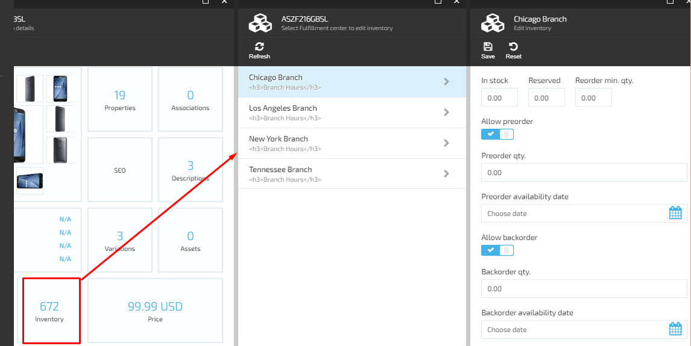
     1. ‘Price’ widget contains price lists. The user can add new price list(s) or edit/delete the existing ones. 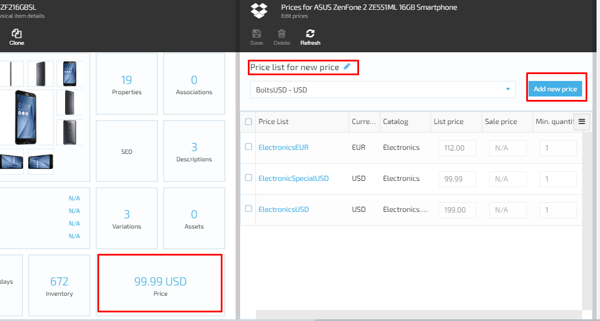

## Digital Products

The Catalog can contain not only physical, but also digital products. The digital products are downloaded on purchase, not shipped.  

In order to add a digital product, the user should navigate to Catalog->Categories and items and select ‘Digital product’  
The flow for adding/ editing and deleting a digital product is the same as for a physical product.  
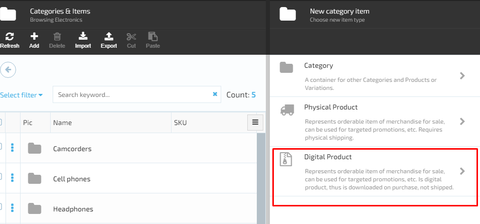
