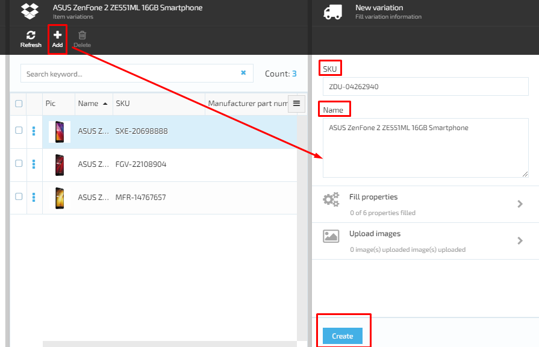
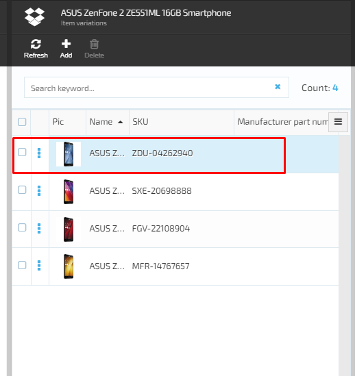

# Manage Product Variations

## Add Product Variation

1. In order to add a new variation to a product, the user should first open the 'Item variations' screen and click the 'Add' button;
1. The system will display the 'New variation' blade; 
1. The product variation SKU will be generated automatically by the system;
1. The user enters the name of the new variation and clicks the 'Create' button;
1. The new variation will be created by the system and displayed on the list of Product variations.

