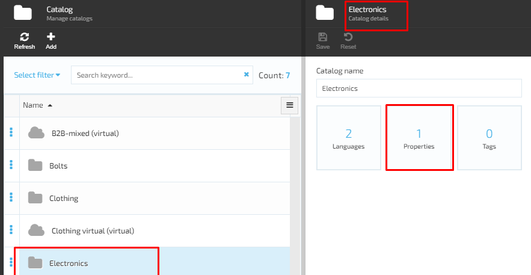
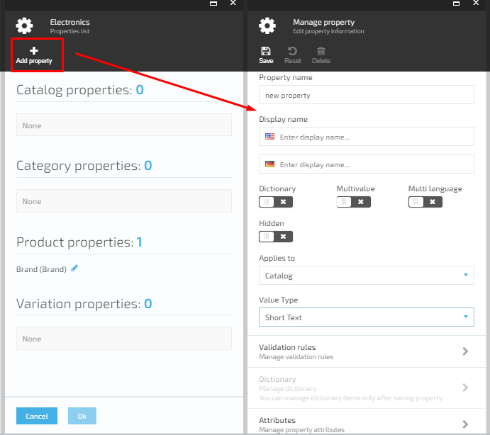
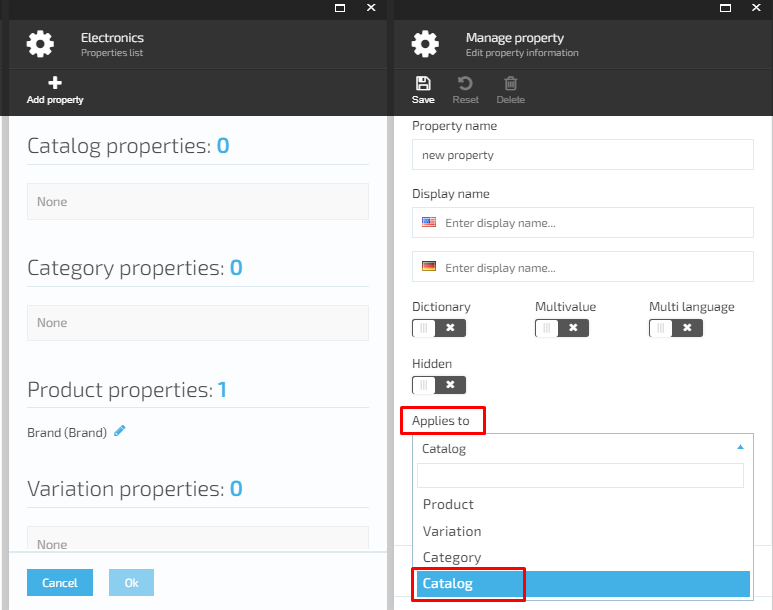
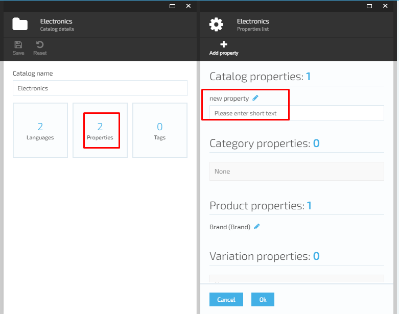
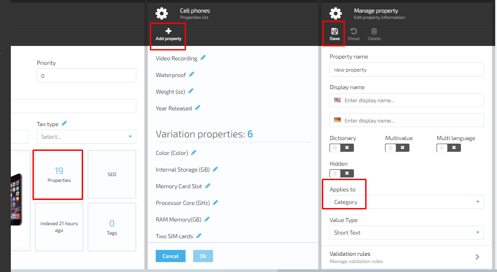
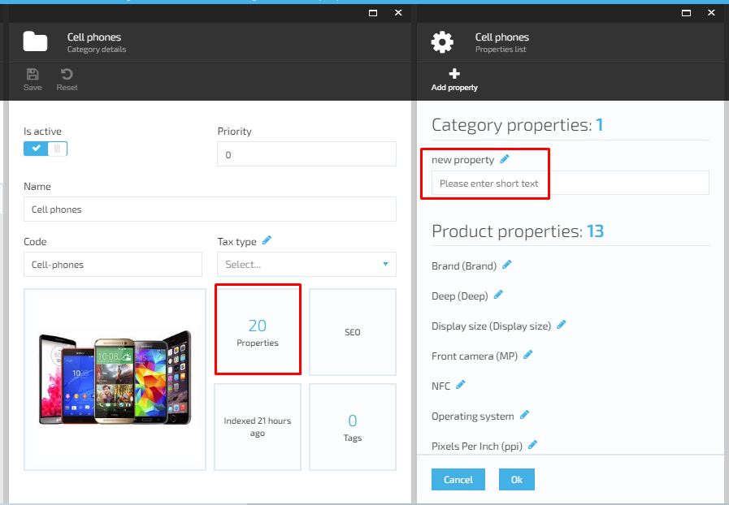
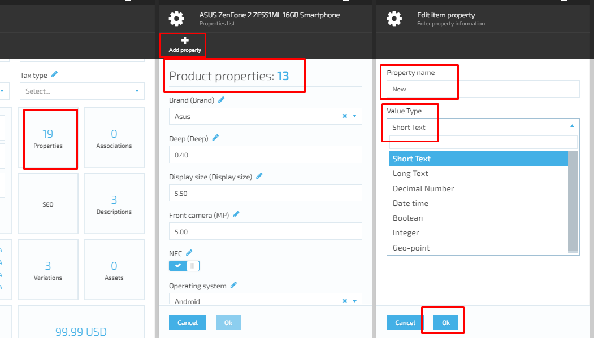

# Manage Properties

## Manage Catalog Properties

### Add Catalog Property

1. The user browses the Catalog Module, selects a catalog from the displayed list and clicks on the three dots located on the left side of the catalog name and selects 'Manage' option
1. The system will open the 'Catalog details' screen
1. The user selects the 'Properties' widget
1. The system will display the 'Properties list' containing the following property types:
     1. Catalog Properties;
     1. Category Properties;
     1. Product Properties;
     1. Variations Properties.
1. The user clicks the 'Add property' button
1. The system will display the 'Edit property information' screen;
1. The user enters the new property information, selects 'Apply to Catalog' and saves the changes;
1. The new catalog property will be added and displayed on the catalog properties list.

### Add Category Property

1. The user browses the Catalog Module, selects a catalog from the displayed list, than selects a Category and clicks on the three dots located on the left side of the category name and selects 'Manage' option
1. The system displays the 'Category details' screen
1. The selects the 'Properties' widget;
1. The system will display the Category Properties list with the following types of properties:
     1. Category properties;
     1. Product properties;
     1. Variation properties;
1. The user clicks the 'Add property' button
1. The system will open the 'Edit property information' screen;
1. The user enters the new property information, selects 'Apply to category' and saves the changes;
1. The system will create a new Category property, which will be displayed on the list of Category properties.

### Add Product Property

1. The user browses the Catalog Module, selects a catalog from the displayed list-> selects  Categories and Items-> selects a Product and clicks on the three dots located on the left side of the category name and selects 'Manage' option or simply clicks on the selected item;
1. The system will display the 'Physical item details' screen;
1. The user selects the 'Properties' widget;
1. The system will open the 'Properties list' screen with the following types of properties:
     1. Product properties;
     1. Variation properties.
1. The user click the 'Add property' button;
1. The system will display the 'Edit item property' screen;
1. The user should enter the new item property name and specify the 'Value type' (select from drop-down box). Once the property information is entered, the user saves the changes made;
1. The system will add the new item property and display it on the 'Properties list'.

