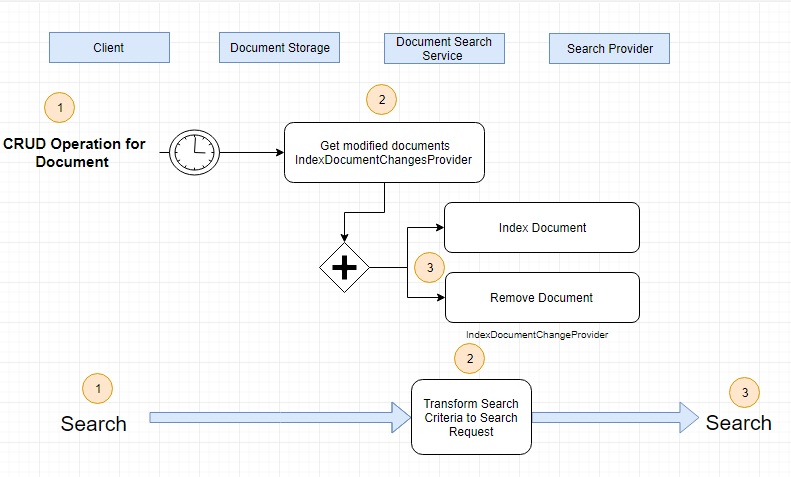

# Search Engine Architecture

## Async Processes

1. Indexations of new, updated and deleted documents;
1. Search documents.

## Abstract Search Service Module

Provides ability to add custom types of documents:

1. Class `IndexDocumentConfiguration`;
1. Interface `IndexDocumentChangesProvider`- to detect modified documents;
1. Interface `ISearchRequestBuilder`- to transform Search Criteria to Search Request.

## Abstract Search Provider Model

Provide the ability to use different search engines:

1. Class `IndexDocuments`;
1. Interface `ISearchProvider` with basic operations:
     1. IndexAsync;
     1. RemoveAsync;
     1. SearchAsync;
1. Class `SearchRequest`.

