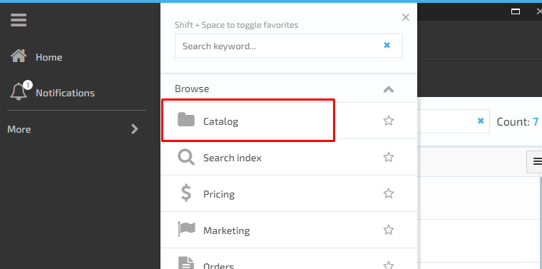
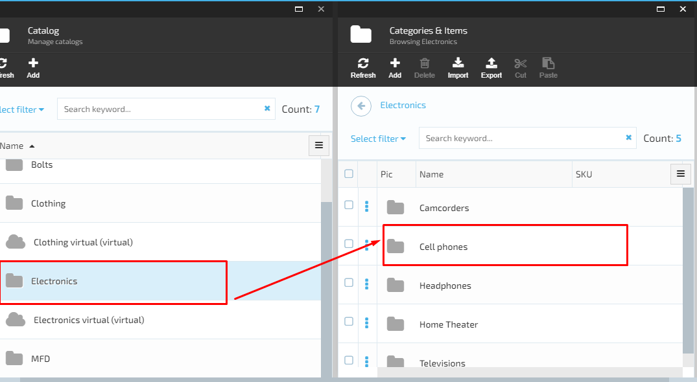
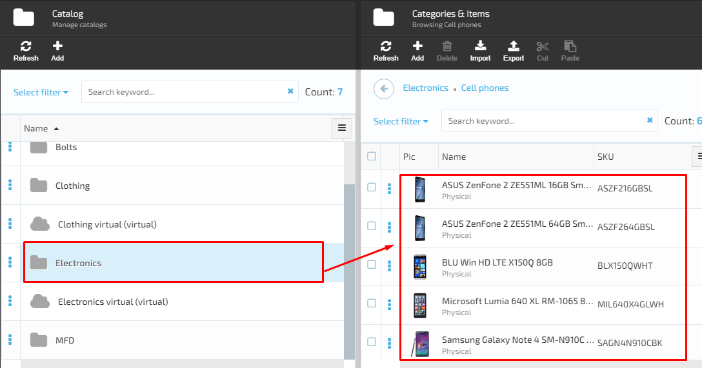
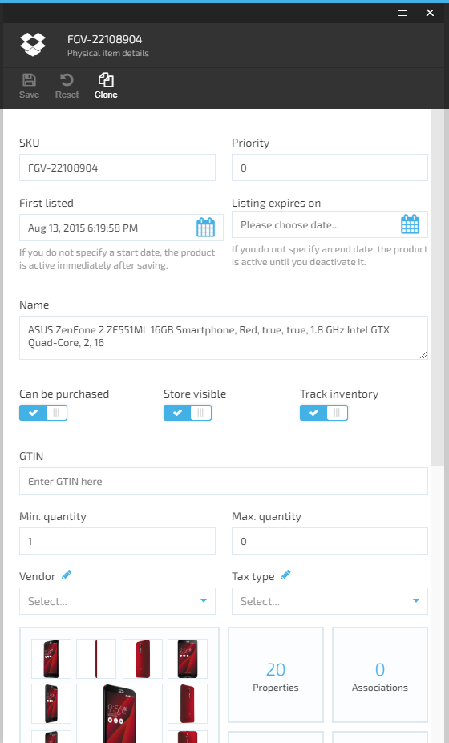
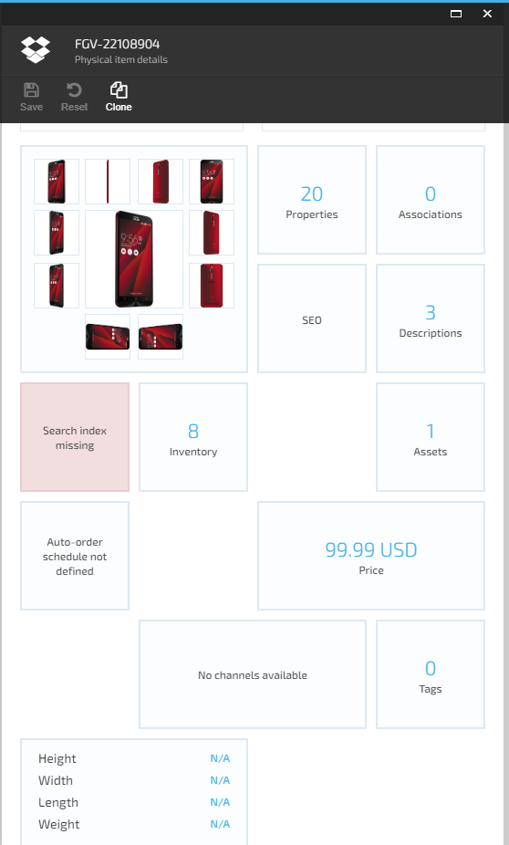

# View Catalogs and physical item details

In order to view the list of catalogs in VirtoCommerce platform, the admin should pass through the following steps:

1. Browse the Catalog module by navigating to the main menu and selecting ‘Catalog’;

1. The system will display the list of all catalogs (common and virtual);  

1. The user selects one of the catalogs from the list;

1. The system will display the categories included into the selected catalog;

1. Selecting a category will result in displaying the list of physical items of the selected category.  

In order to view the physical item details, the user should do the following:

1. Select an item and click on it

1. The system will display the following details:

   1. Input fields:

      1. SKU;
      1. Priority;
      1. Name;
      1. GTIN;
      1. Min quantity;
      1. Max quantity;
      1. Vendor;
      1. Tax type.

   1. Buttons with possibility to switch on and switch off:

       1. Can be purchased;
       1. Store visible;  
       1. Track inventory.  

   1. Widgets:

       1. Properties;
       1. Associations;
       1. SEO;
       1. Descriptions;
       1. Variations;
       1. Assets;
       1. Indexed (hours displayed);
       1. Inventory;
       1. Price;
       1. Auto order schedule;
       1. Channels;
       1. Tags.

