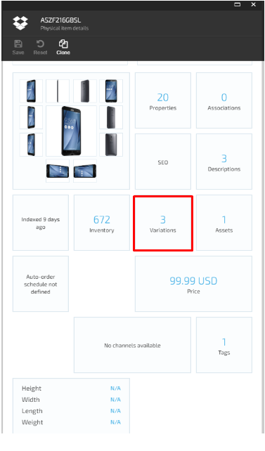
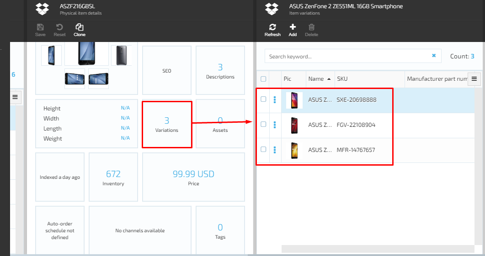

# View Product Variations

In order to view  product variations, the user should pass through the following steps:

1. Navigate to Catalog module ->select a Catalog-> than select a Category;
1. The system will display the items (products) included into the selected Category;
1. The user selects a product and when the system displays the 'Physical items details' blade, the user should select the 'Variations' widget;
1. The system will display the 'Variations' blade and display the product variations that were previously added to this particular product. 

