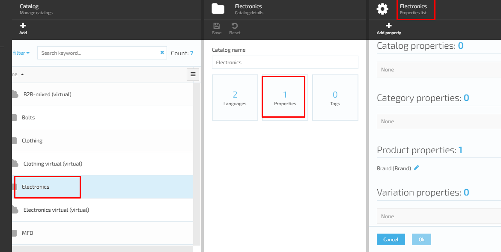

# View Properties

## View Catalog Properties

1. To view the Catalog properties, the user should select a Catalog, click on the three dots next to the Catalog name (on the left) and select 'Manage'
1. The system will display the 'Catalog details' blade
1. The user selects the 'Properties' widget and click on it
1. The system will display the Catalog list of properties

