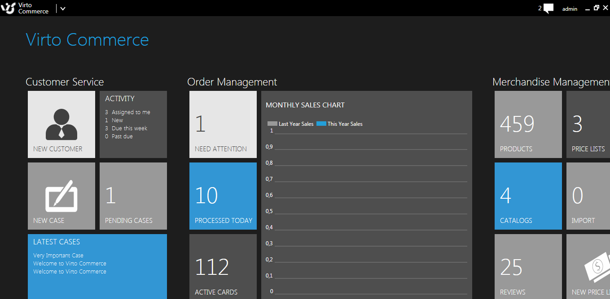
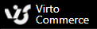

## ダッシュボード

Virto Commerce Managerのユーザーがログインしている時、ダッシュボードが画面に表示されます。これは、ログインされたユーザーが業務を行う為のCommerce Manager のホームページになります。

ダッシュボードには、ユーザーの関係する最新の情報が表示され、販売の動向など主要な指標とディメンションを追跡し、迅速な対応ができるように各機能へのリンクが含まれています。ダッシュボード右側には、顧客、広告・プロモーション作成など基本的な業務を行えることができるようになっています。

ダッシュボード上部に表示されているデータとボタンのブロックは、（ブロックが、ユーザーの権限によりカスタマイズされて表示されます。）以下の通りです。

### Customer Service

* New Customer – 新しく顧客を作成することができます。
* Activity – アクティビティ数を表示します。 (担当、新規など);
* New Case – 新しくケースを作成することができます。
* Pending Cases – 解決すべきケース数とケースリストを表示することができます。
* Latest Cases – システムの最新ケースのリストを表示することができます。

### Order Management

* Need Attention – 解決が必要な注文数と注文リストを表示することができます。
* Processed Today – 本日の注文処理数、注文リストを表示することができます。
* Active Cards – アクティブカード数、注文リストを表示することができます。
* Monthly Sales Chart – 注文処理の売上動向を表示することができます。

### Merchandise Management

* Products – 商品数、カタログを表示することができます。
* Price Lists – 価格リストを表示することができます。
* Catalogs – カタログリスト、全てのカタログを表示することができます。
* Import – 実行可能なインポートジョブ、インポートジョブリストを表示することができます。
* Reviews – レビュー数、全てのレビューリストを表示することができます。
* New Price List – 新しい価格リストを作成することができます。

### Marketing

* Active Promotions – 実行中プロモーション数、作成済プロモーションリストを表示することができます。
* Total Ads – 実行中広告数、ダイナミックコンテンツリストを表示することができます。
* New Promotion – 新しいプロモーションを作成できます。
* New Add – 新しいダイナミックコンテンツを作成できます。
* Active Ads – 実行中広告数を表示します。
* Publish Ad – 配信中のコンテンツを表示します。

### Settings

* Users – 登録済ユーザー数、ユーザーリストを表示することができます。
* Shipping Methods – 登録済配送方法数、配送方法のリストを表示することができます。
* Stores – システムのストア数、ストアリストを表示することができます。
* Payment Methods – 登録済支払方法数、支払方法リストを表示することができます。

Virto Commerce ダッシュボードに戻る場合は、左上の 

をクリックします。

## ダッシュボードのカスタマイズ

Vitro Commerce Managerは、アクセス権・ユーザー割り当てに基づいてカスタマイズされており、必要なブロックを配置することができます。たとえば、商品マネージャーは、商品管理ブロックが表示され、お客様サポート担当者は、カスタマーサービスブロックが表示されるようになります。
