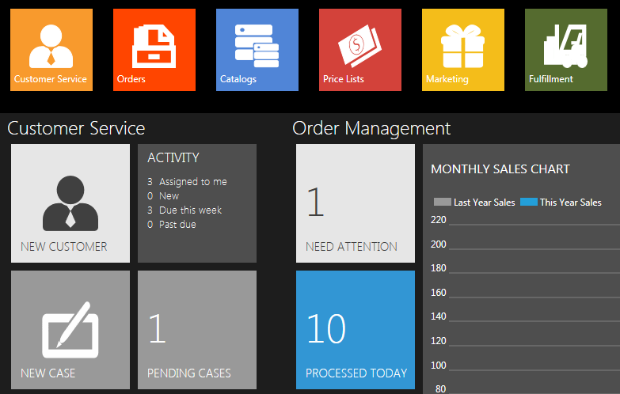
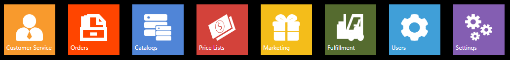

## Commerce Manager へのログオン

1. Commerce Manager を起動します。
2. ユーザー名・パスワードを入力・Commerce Manager Server のURLを入力します。(入力内容が不明な場合は、ストア管理者にお問合せください。)
3. ログインボタンをクリックします。

ログインユーザーにより、ダッシュボード上に利用可能な項目と機能が確定され、利用可能な項目・機能が表示されます。
アクセス権限一覧については、 [利用可能なアクセス権限一覧](docs/old-versions/vc111userguide-jp/users-management-roles-and-role-assignment/available-permissions).をご参照ください。

## 全般の操作手順

Virto Commerce クライアントにログオン後、最初に表示されるのが [ダッシュボード](docs/old-versions/vc111userguide-jp/dashboard)です。

ダッシュボードでは、注文・お問合せ・販売情報など、アクセス権に応じた機能・内容が表示され、その他に顧客情報についての概要を確認することができます。ダッシュボードに関する詳細情報は、ダッシュボード をご参照ください。

ダッシュボード上部（白い矢印部分）は、一般的なメニューが配置され、Virto Commerce モジュール全てにアクセスできます。
 ([顧客サービス](docs/old-versions/vc111userguide-jp/customer-service), [注文情報](docs/old-versions/vc111userguide-jp/order-management), [カタログ](docs/old-versions/vc111userguide-jp/merchandise-management), [価格リスト](docs/old-versions/vc111userguide-jp/price-lists), [マーケティング](docs/old-versions/vc111userguide-jp/marketing), [フルフィルメント](docs/old-versions/vc111userguide-jp/fulfillment), [ユーザー](docs/old-versions/vc111userguide-jp/users-management-roles-and-role-assignment) and [設定](docs/old-versions/vc111userguide-jp/settings). モジュールへのアクセスは、ダッシュボード上部の以下画像をクリックします。

また、ダッシュボード上のボタンを使用して、特定の Commerce モジュールに移動することができます。たとえば、マーケティングブロックを開き「Active Promotions」ブロックをクリックするなどです。

## ユーザーアクセスとロール

Virto Commerce では、ユーザーは、コマースマネージャーを利用し、Webサービスであるバックエンドサービスを利用します。ユーザーは、組織内の内部ユーザーであり、ストアフロントのお客様と混同しないようにしてください。ユーザーアカウントは、Virto Commerce クライアントを利用しストアフロントを管理することができます。

各 Commerce Manager クライアントユーザーは、ユーザーのロールが定義され、特定のアクセス権を持っています。これらの権限は、Commerce Manager クライアントモジュールへのアクセスを制限し、お客様の注文を表示・カタログに新製品を追加など、業務によりロールを定義することができます。また、これら機能は、商品管理のみできるユーザーなどの権限を与えるなど業務の割り当てを保障するのに役立ちます。

インストール時に提供されているユーザーの役割については、[Built-in Roles](docs/old-versions/vc111userguide-jp/users-management-roles-and-role-assignment) で確認することができます。

## 一般的なタスクとモジュール

Virto Commerce Manager クライアントアプリケーションは、以下の８つのモジュールに分割されています。 

### Customer Service

CSRは、顧客からのお問合せなどを管理することができます。

### Orders

ストアフロントで購入された注文を管理することができます。

### Catalogs

カタログ・商品情報を管理することができます。

### Price Lists

価格リストと価格条件割り当てなどを管理することができます。

### Marketing

販売ページ・プロモーション・割引・その他マーケティングツールを管理することができます。

### Fulfillment

受注・配送準備・配送情報を管理することができます。

### Users

ユーザーアカウン・ロール・権限を管理することができます。

### Settings

管理者や権限のある担当者が。システムとストアフロントの設定を行うことができます。具体的には、支払方法・出荷・税関連・プロフィールなどの管理を行うことができます。
