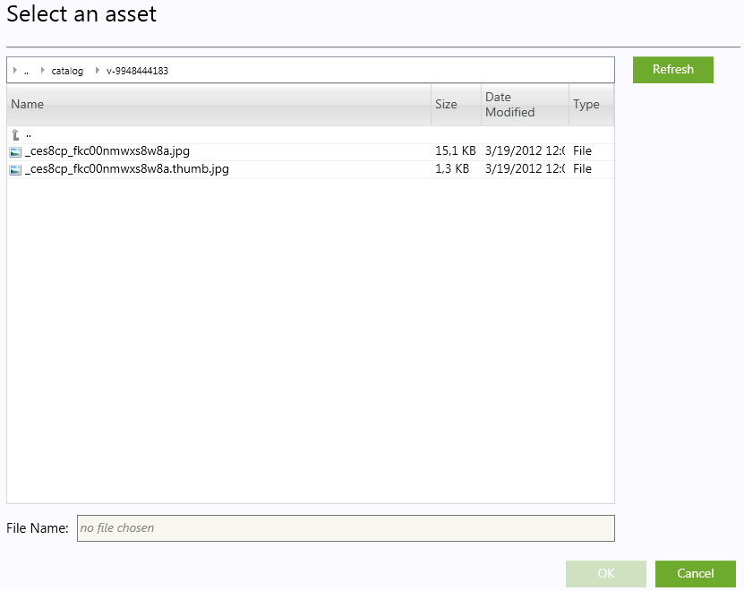

## はじめに

ダイナミックコンテンツの機能は、マーケティング担当者が個々の顧客のショッピング経験に合わせたパーソナライズを作成します。この機能を利用すると、条件・文脈の設定に基づいてショッピング経験を提供することができます。

ダイナミックコンテンツが、顧客に表示される条件を決めるには、以下の点を考慮する必要があります。

* 何のコンテンツ表示すべきか
* 誰にコンテンツを見せるべきか
* いつコンテンツを表示すべきか
* どこにコンテンツを表示すべきか

ダイナミックコンテンツの例として、検索エンジンで "USB memory" を検索しフロントエンドストアに訪れた顧客をターゲットにし、USB memory stick を表示する。この例では、ダイナミックコンテンツをカタログデータベースから価格と一緒に USB memory の画像を取り出し、ターゲット条件に該当する顧客のみ表示する。

ダイナミックコンテンツは、マーケティング担当者が開発者やサーバー管理者に頼ることなく、ダイナミックコンテンツを設定できるよう Virto Commerce 管理アプリケーションを利用し構成します。画像やFlash アニメーションのファイル作成とファイルアップロードにグラフィックデザイナーが必要になることがあるかも知れません。ただし、一回のみで、他の手助け無しにマーケット担当者が表示する為のルールを構成することができます。

## コンセプト

伝統的に、マーケティングは、ストアウェブサイトの各ページレイアウトを作成するのにはウェブデザイナーに依存していました。Web開発者は、フレーム、リンク、プロモーション、その他の視覚的なものをアレンジしながらレイアウトに配置します。ダイナミックコンテンツは、ページレイアウトの初期セットアップを超え、ウェブ開発者を介さずに、動的にレイアウト内のコンテンツを変更するマーケティングが行えます。最初に、ウェブ開発者がダイナミックコンテンツの為にページにコンテンツプレースという名前のプレースホルダーを設定します。

ダイナミックコンテンツには、４つの独立したコンポーネントがあります。

* ダイナミックコンテンツ
* コンテンツ配信
* コンテンツタイプ
* コンテンツプレース

最初の２つダイナミックコンテンツとコンテンツ配信は、マーケティング担当者が、Virto Commerce 管理ツールを利用し設定します。ダイナミックコンテンツは、表示するコンテンツの名前とコンテンツタイプの説明を提供する。コンテンツ配信は、どのような条件でダイナミックコンテンツをいつ表示すべきかということをシステムに指示します。

コンテンツプレースは、Virto Commerce 管理ツールでも作成されますが、開発者、ウェブデザイナ、システム管理者によっても作成されます。ウェブ開発者が、テンプレートにコンテンツプレースを追加した後、適切な権限を持つ開発者やユーザーが、Virto Commerce 管理アプリケーションに登録する必要があります。

## コンテンツタイプ

コンテンツタイプは、ダイナミックコンテンツタイプを定義する為に使用されるテンプレートです。それは、特定のコンテンツタイプが表示される方法と何の情報が、それを表示する為に必要とされるかを記載しています。Virto Commerce は、ダイナミックコンテンツの良く利用される共有タイプとしていくつかのコンテンツタイプを含まれています。例えば、リンク（バナー）を含んだイメージと製品データ（イメージと価格を含む製品）のコンテンツタイプがあります。

次のダイナミックコンテンツタイプは、すぐに利用できるよう Virto Commerceに付属しています。 どのような画像ファイルが表示されるか。クリックされたときにどのターゲットのWebページが表示されるべきかなどそれぞれに一つ以上のパラメーター値が必要になります。

|コンテンツタイプ|説明|Parameters|
|--------------|----|----------|
|CategoryWithImage|カタログ内のカテゴリーにリンクした画像を表示|CategoryId - カテゴリーID ImageUrl - 画像のリンク ExternalImageUrl - 外部画像のリンク Message - メッセージ|
|CategoryUrl|カテゴリタイトルテキストへのリンクを表示|Categoryid - カテゴリーID Title - カテゴリーのユーザーフレンドリタイトル|
|Flash|３つの画像をFlash ファイルアニメーションのように表示。Flash アニメーションは、お客様にクリック可能なリンクを持つ３つの画像をそれぞれ表示。各リンクのURLを指定が必要|FlashFilePath - Flash アニメーションファイルパス Link1Url, Link2Url, Link3Url - ターゲットページの完全なURLを入力(アイテム、プロモーションなど)|
|Html|HTMLコンテンツを表示|RawHtml - 生のHTML形式のテキストを入力|
|ImageClickable|クリック可能なアクションを指定できる画像を表示。別のページ、製品、プロモーションにリダイレクト|Alternative text - 画像を表示できない場合のテキスト ImageUrl - イメージへのリンク TargetUrl - 画像をクリックしたときのターゲット Title - テキスト(オプション)|
|ImageNonClickable|画像表示。例えば、チェックアウト時に割引し、購入を促す画像を表示|Alternative text - 画像を表示できない場合のテキスト ImageFilePath - 画像のパス|
|ProductWithImageAndPrice|カタログ内のアイテム画像、価格、商品詳細を表示|ProductCode - ターゲット商品コード|

## コンテンツプレース

コンテンツプレースは、ダイナミックコンテンツを表示する為にHTMLページ内に配置できます。コンテンツタイプによって指定されたダイナミックコンテンツが表示されたフロントエンドのページで物理的空間を考えることができます。

コンテンツの場所は、テンプレートでWeb開発者によって作成されます。一度テンプレート内に作成されると、構成/コンテンツプレースアクセス権限(管理者)を持つユーザーは、テンプレート内のコンテンツの場所として同じ名前を使用して、[Virto Commerce 管理アプリケーションでのコンテンツの場所を登録しなけらばならない](docs/old-versions/vc111userguide-jp/marketing/dynamic-content/registering-content-places)。

マーケティング担当者によってターゲットコンテンツプレースとして選択された　作成・構成されたダイナミックコンテンツが、登録エントリーになります。

## タグ

ダイナミックコンテンツは、ターゲットとする顧客の特定のコンテンツを表示している。システムは、タグを通して顧客の特定を決定する。Virto Commerce には、タグシステムが組み込まれており、セグメントのお客様に使用できるタブをいつ・どこで・どの組み合わせで表示するかを決定するのに利用されています。顧客のタグ付けは様々な方法で行われています。

* ユーザーの顧客アカウントで登録された情報
* 顧客サービスの呼び出し中に顧客に関して入力された情報
* ターゲット・参照URL・条件検索キャプチャーなどフロントエンドからリンククリックされた情報
* 顧客GEOロケーション

フロントエンドで買い物している間のユーザーセッションに保存されてタグにより情報が格納されます。情報は、ダイナミックコンテンツコンテンツを表示するために設定された条件を満たしているかどうか評価する為に使用されます。タグ情報は、顧客が最初にブラウザーセッション中にフロントエンドを訪れたときにのみキャプチャーされます。

ダイナミックコンテンツアクセス権限を与えられたマーケット管理者やその他管理ユーザーが、顧客がダイナミックコンテンツの一部または全てをみているかどうかを決定し条件を作成したタグを利用しています。

Virto Commerce は、一般的に利用されるタグを保存しています。以下のタググループは、Virto Commerce に含まれています。

* Browse Behavior
* Customer Profile
* Geo location
* Shopping cart

## 条件演算子

デフォルトでは、ステートメントブロック内に条件ステータスが含まれています。これらは、明示的に演算子が結合されていない場合、全ての条件が結合されていると考えられます。

ダイナミックコンテンツの操作は、文字列または数値のいずれかです。

* matching は、タグの値に含まれるもjいと一致する場合、条件式が真を返すことを意味しまｓ。(一致では、大文字・小文字は区別されません。)
* containsは、文字列ないで任意の場所に文字が含まれている場合、条件式が真を返すことを意味します。
* matching (大文字・小文字区別) と contains (大文字・小文字区別case sensitive) は、タグに含まれる文字が大文字・小文字を区別した上で一致する場合、条件式が真を返すことを意味します。

## ダイナミックコンテンツの利用手順

Virto Commerce manager のメインタスクは、ダイナミックコンテンツ・ダイナミックコンテンツ管理とコンテンツ配信管理を行うことです。ダイナミックコンテンツとして一度作成されたものは、必要時には何度もコンテンツ配信アイテムとして利用することができます。

Virto Commerce 管理アプリケーションでダイナミックコンテンツを作成し、配信コンテンツ(例 画像、クリッカブル画像、製品など)とパラメーターを設定します。

コンテンツ配信を作成し、いつダイナミックコンテンツが表示されるのかどの条件でダイナミックコンテンツが利用可能になるのかを指定します。

**備考**: ダイナミックコンテンツは、コンテンツ配信項目として割り当てるまでフロントエンドには公開されません。

## ダイナミックコンテンツの作成

Virto Commerce 管理アプリケーションでダイナミックコンテンツを作成する場合、ダイナミックコンテンツの名前・種類・型のパラメーターを指定する必要があります。

1. **Marketing** モジュールを開きます。
2. **Dynamic Content** タブを選択します。
3. **Add** ボタンをクリックします。
  
4. ウィザードの最初のステップでは、ダイナミックコンテンツの名前・説明・コンテンツタイプを入力します。
  

**備考**: 追加するコンテンツにあった正しいコンテンツタイプを選択します。

5. **Next** をクリックします。
6. ウィザードのステップ２では、選択されたコンテンツタイプのプロパティを設定します。
  

サンプル画面のように ImageClickable が選択されている場合は、AlternativeText, ImageUrl, TargetUrl, Title を設定します。

7. 選択した内容をダブルクリックするかクリックし、リスト上のメニューリストから EDIT ボタンをクリックします。
  - Alternative text - 編集ポップアップビューでテキストボックスにテキストを入力
  - ImageUrl - Edit ポップアップで Select Image ボタンをクリックし、アセットダイアログでダイナミックコンテントのイメージファイル選択します。イメージは、事前にアセットにアップロードする必要があります。
    
  - TargetUrl - Edit ポップアップ画像がクリックされたときにナビゲートされるターゲットリンクを入力
  - Title - Edit ポップアップでタイトルを入力
8. 必要な項目を入力後、**Finish** ボタンをクリックします。

## ダイナミックコンテンツの編集

1. **Marketing** モジュールを開きます。
2. **Dynamic content** タブを選択します。
3. **Dynamic content** を選択し、ダブルクリックします。
4. 必要な項目を修正します。
5. **Save** ボタンクリックで編集内容を保存します
**備考**: ダイナミックコンテンツのコンテンツタイプは修正できません。

## ダイナミックコンテンツの削除

1. **Marketing** モジュールを開きます。
2. **Dynamic content** タブを選択します。
3. 削除する**Dynamic content** をクリックします。
4. **DELETE** ボタンをクリックします。
5. 削除再確認画面で削除を行います。
**備考**: コンテンツ配布されていないダイナミックコンテンツのみ削除できます。既にコンテンツ配布されている場合は、先に削除する旨のメッセージが表示されます。

## ダイナミックコンテンツの複製

既に作成済コンテンツと似ているコンテンツを作成する場合、新しく作成するよりも複製して作成することができます。複製後、クローン化されているコンテンツを編集することができます。

1. **Marketing** モジュールを開きます。
2. **Dynamic content** タブを選択します。
3. 複製したい**Dynamic content** をクリックします。
4. **DUPLICATE** ボタンをクリックします。
5. 複製再確認画面で複製を行います。

新しいダイナミックコンテンツが、オリジナル_1の名前で作成され、リストに追加されます。例えば、Banner というダイナミックコンテンツを複製した場合、Banner_1 が作成されます。

## コンテンツ配信の作成

コンテンツ配信は、ダイナミックコンテンツの配信条件を設定します。コンテンツ配信前に必要なダイナミックコンテンツとコンテンツプレートがシステムに登録されている必要があります。

1. **Marketing** モジュールを開きます。
2. **Content publishing** タブを選択します。
3. **Add** ボタンをクリックします。
  
4. ウィザードステップ1では、コンテンツ配布、名前、説明、優先度、アクティブ日を入力します。
  

名前と説明は、わかり易く入力します。将来的にコンテンツ配信を簡単に見つけることができるように意味のある名前を利用します。良い名前としては、テレビの15パーセントクリスマス割引 悪い名前は、コンテンツ配布17です。優先順位は、コンテンツ配信の優先順位を設定します。複数のダイナミックコンテンツは、いくつかの条件でコンテンツ場所に表示されるように構成されている場合、優先度の高いコンテンツ配布に構成されたダイナミックコンテンツが表示されます。

**Is Active** プロパティは、ダイナミックコンテンツを表示可能にします。チェックボックスがチェックされていない場合、店舗には表示されません。日付入力した際にはfrom 以降の日付でコンテンツが表示可能になります。クリスマスまでしか利用できない場合は、12月25日を設定します。

コンテンツを常に表示する場合は、空白のままにしておきます。

5. **Next** をクリックします。

6. コンテンツ配信ウィザードのステップ２は、ダイナミックコンテンツを表示する場所を指定します。
  

コンテンツの場所は、コンテンツの場所を登録する権限を持つ担当者が事前に定義されています。ダイナミックコンテンツ複数の場所に表示する場合、複数のコンテンツを選択することができます。

7. 必要なコンテンツが選択された後に、**Next** をクリックします。

8. コンテンツ配信ウィザードのステップ３は、表示するダイナミックコンテンツ項目を設定します。
  
9. **Next** ボタンをクリックします。

10. ダイナミック配信ウィザードのステップ４では、条件を設定します。
  

デフォルトでは、ダイナミックコンテンツは、選択したコンテンツプレースでページを表示した全てのお客様に対して表示されます。ダイナミックコンテンツは、特定の条件で表示されるようにするには、式ビルダーを使用します。この段階で条件を設定します。

11. もし条件があれば、全ての条件を設定後、**Finish** ボタンをクリックします。

作成されたコンテンツ配信がリストに表示されます。

## 式ビルダ

式ビルダーは、ダイナミックコンテンツを表示する際に人間が読み取りできる条件を作成するのに利用されます。

式ビルダーは、主に２つの部分から構成されています。最初は、全体の条件設定の為のグローバル演算子です。条件が全て又はいずれかが満たされた場合真の値を返すよう設定します。動作は、 all/any オペランドを利用して設定されています。

2番目のパートでは、条件のコレクションについての説明です。利用可能条件は、４つのグループに分類されます。

* Browse Behavior
* Customer Profile
* Geo location
* Shopping cart

これらのグループの下での条件名は、わかり易いものを入力します。条件の値として、文字列と小数点数字の２種類のタイプを指定できます。

条件式文字として以下の文字が利用できます

* matching (コンテキストの適切なタグの値は、入力された値を一致する必要があります)
* contains (コンテキストの適切なタグの値は、入力された値を含んでいる必要があります)
* not matching (コンテキストの適切なタグの値は、入力された値を含んでいない必要があります)
* not contains (コンテキストの適切なタグの値は、入力された値を含んでいない必要があります)

条件演算子として、少数値を指定できます。

* greater than (コンテキストの適切なタグの値は、入力値より大きい必要があります)
* greater than or equals (コンテキストの適切な値は、入力された値以上である必要があります)
* less than (コンテキストの適切な値は、入力された値より小さい必要がありますｓ。)
* less than or equals (コンテキストの適切な値は、入力された値以下である必要があります)
* matching (コンテキストの適切な値は、入力さらた値と一致する必要があります)

システム値を利用した特別の条件があります。

例として、 **"Current store is"** 条件は、比較演算子としてストアセレクタ(コンボボックス)として登録された値を利用します。

It compares the store id Tag of the context to the selected and if those match - returns *true*.

Another example of special condition is "**Shopper gender**", which can only be male of female. Thus only those two options available.

新しい条件式を追加するには、 +add Condition をクリックします。条件グループのメニューが表示されます。グループの条件式を増やすことができるようになります。必要な条件をクリックします。式ビルダーが表示されます。条件演算子と値を設定します。より多くの条件を設定する場合は、追加する条件の回数 +add condition をクリックします。

## コンテキスト配信の編集

1. **Marketing** モジュールを開きます。
2. **Content publishing** タブを選択します。
3. **Content publishing** 選択し、ダブルクリックします。
4. 必要な項目を編集します。
5. **Save** ボタンで修正内容を保存します。

## コンテンツ配信の削除

1. **Marketing** モジュールを開きます。
2. **Content publishing** タブを選択します。
3. 削除するコンテント発行を選択します。
4. **DELETE** ボタンをクリックします。
5. 削除再確認確認画面で確認します。

## コンテンツ配信の複製

既に作成済のコンテンツ配信と似たコンテンツ配信を作成したい場合、複製を行いコンテント配信を作成することができます。複製後、コンテンツ配信するのに必要な箇所を修正することができます。

1. **Marketing** モジュールを開きます。
2. **Content publishing** タブを選択します。
3. 複製したいコンテント発行をクリックします。
4. **DUPLICATE** ボタンをクリックします。
5. 複製再確認画面で複製を確認します。

新しいコンテンツ配信が追加された結果として、リストにオリジナル名_1 の名前で項目が追加されています。例として、 Banner_Publishing という名前のコンテンツ配信を複製した場合、Banner_Publishing_1 という名前の複製が作成されます。