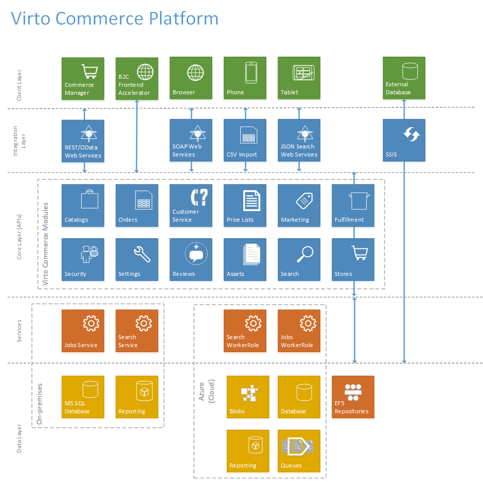

---
title: Architecture
description: Architecture
layout: docs
date: 2015-03-18T20:11:12.560Z
priority: 2
---
## Introduction

This documents provides broad overview of Virto Commerce architecture. The modules and layers mentioned here will be examined in more details in subsequent documents.

## Architecture Overview

VIrto Commerce consists of multiple layers of functionality. The platform or as we call it a core layer contains modules such as Catalog Module, Order Module and so on. Each module then defines a set of interfaces (Repository and Services), POCO model classes that used to represent business logic, factory interfaces for creating business logic and configuration classes. Each module exists completely independently from one another (there is no dependencies within catalog module to the classes defined in order module). This is done to simplify testing, extensibility and maintenance of the platform. Each module can be easily replaced or removed if needed.

Core layer includes repository interfaces, designed using <a href="http://msdn.microsoft.com/en-us/library/ff649690.aspx" rel="nofollow">Repository pattern</a>. The next layer, called Data Layer, implements repository interfaces defined in the core layer and is responsible for persisting POCO objects.

Client layer includes Commerce Manager and Front end accelerator sample. Commerce Manager uses REST/OData Service to communicate with a core layer and Front end uses Repositories.

## Technologies

Virto Commerce utilizes several frameworks including:

* Microsoft .NET 4.5 and ASP.NET 4.5 with MVC4/razor3
* Microsoft Windows Workflow Foundation (WFF)
* Microsoft Windows Communication Foundation (WCF)
* Microsoft Windows Presentation Foundation (WPF)
* Microsoft PowerShell 3.0 
* Microsoft Azure

VC is designed to work both as on-premises application as well as azure cloud application.

## Modularity

Virto Commerce is designed to be modular. The core of the foundation consists of systems that are completely independent from one another and thus can be easily replaced or updated. The systems are:

|Module Name|Description|
|-----------|-----------|
|Catalogs|Define catalog schema, virtual catalogs, import existing catalogs.|
|Orders|Connect payment and shipment gateways, customize order work flow, manage taxes.|
|Customer Service|Respond to customer request, reset customer passwords, create new accounts.|
|Assets|Store binary assets in folder like structure either in cloud services or local file system.|
|Marketing|Create promotions, define and publish dynamic content.|
|Price Lists|Create multiple price lists and prices.|
|Fulfillment|Manage inventory, accept returns, pick/pack shipments|
|Security|Create users, manage claims and permissions.|
|Reviews|Create/approve/reject customer reviews and comments.|
|Settings|Control jobs, email templates and general system wide settings.|
|Stores|Create multiple stores/channels for your items. Assign catalogs to the store.|
|Search|Index and search data.|

Each one of these systems can be replaced by a 3rd party application or disabled.
