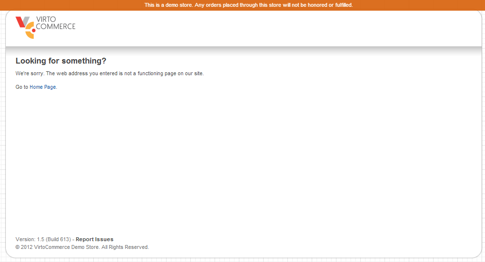
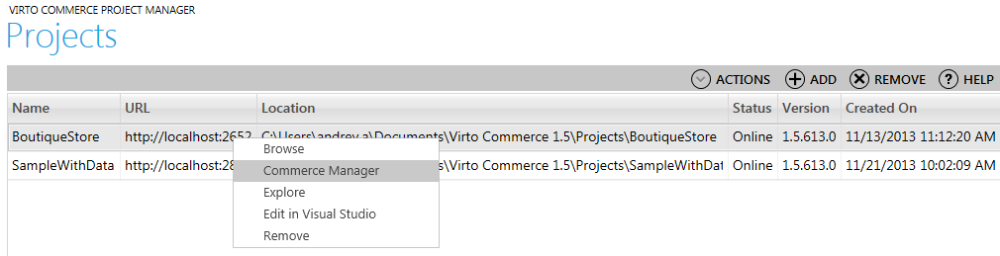
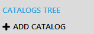

---
title: New Store Getting Started
description: New Store Getting Started
layout: docs
date: 2015-03-18T20:11:12.560Z
priority: 5
---
## Introduction

Creating new project in VirtoCommerce without sample data results the empty page of the frontend and no data in the catalog and store. The purpose of the tutorial is to create sample catalog, fill it with data, configure payment and shipment methods, create active store and configure frontend to show products and to be able to sell them. The result of the complete tutorial will be the fully working store.

The sample store will be the Boutique store.

## Pre-requisites

Once you downloaded and installed VirtoCommerce SDK open the Projects Configurator to create new project **without** sample data.В More on creating a project read in [SDK getting started](docs/old-versions/vc113devguide/development-environment/sdk-getting-started) tutorial.

After new project created open Commerce Manager for that project and login. In order to do that first browse the frontend to launch IIS express for the project. To browse it right-click the project row and click **Browse**. A page like on the screenshot below will show up.



That is because of no open store is configured for the project. The working store will be created and available after you complete the tutorial.

Now right-click the project in the Project Manager and select "Commerce manager" to open it.



<iframe width="560" height="315" src="https://www.youtube.com/embed/8oQ2eNagOqA" frameborder="0" allowfullscreen></iframe>

1. Create new catalog through the CommerceВ Manager. Go to Merchandise Management. Click ADD CATALOG
  
2. Select real Catalog to create
  
3. Enter the id of the catalog and name it. Select languages that will be supported in the catalog
  

Click Finish to complete the wizard.

The created catalog will appear in the catalog tree.


### Creating properties and property sets

All categories and items in the catalog should be assigned to an appropriate property set. So at least one property set should be created. In order to do that right click the catalog and select "Open Catalog" command


In the catalog edit view select "Properties" tab. Let's create "Display name" property for category. The property will be multi-language. There will be "Size" and "Color" properties for products and variations.

### Creating properties

Click "Add" to create new property. Enter Property Name ("Display name") and check the "Multi Language" checkbox as category names will be language dependent. The property type is "ShortString" that suits to the target data that will be stored in this property.


Click "OK" to complete the wizard.

Repeat the "Add" property steps for the "Size" and "Color" properties (markВ "Color" property as Multi Language).

### Creating Property sets

Now let's group the properties into property sets, one for categories another for products and the last one for variations (sku's).

Select "Property sets" tab. Click "Add". In the wizard set the name for the property set, target type and select properties that should be included into the property set.


For category property set select "Category" as target and choose "Display name" to be included into it. Click "OK" to complete the wizard.

For products property set select "Products" as target type and don't select any properties there.


For variations property set select "Sku" as target type and choose "Size" and "Color" properties to be included into it.


Click "OK" to complete the wizard.

Click "SAVE" to permanently store the changes in the catalog.

### Pricelist assignment to the catalog

<iframe width="560" height="315" src="https://www.youtube.com/embed/Pe2OmOcGQME" frameborder="0" allowfullscreen></iframe>

In order to assign prices to items to be able to sell them price lists (there are 3 pricelists by default) should be assigned to the catalog.

1. OpenВ **Price Lists** module.
2. Select **Price List assignments** tab.
3. Click "Add" to create new assignment.
4. Set the name and description.
5. Select the "Sale EUR Price List" from the list of price lists.
6. Select the just created "Boutique" catalog from the list of catalogs.
  
7. Proceed to the next step.
8. Leave the Step 2 options default. And proceed to the next step.
9. In the Step 3 set the dates when the price list will be available. Leave them blank if the price list should be always available.
10. Click "Finish".

Repeat the steps to create similar assignment for MSRP USD price list.

## Catalog setup

There are two options to create items. One is to create them using wizards of the Commerce Manager. Another is to import them from the structured CSV file.

In this tutorial we will cover the import option of catalog data setup. For a complete import tutorial go to [Import tutorial](docs/old-versions/vc113devguide/working-with-import/import-data-from-csv-files). Only steps to import Boutique catalog data will be described here.

The example will demonstrate how to setup "Boutique" catalog.

The Boutique catalog will have the next structure:


Prerequisite: a catalog named "Boutique" with properties and property sets was created.

### Assets & import files

The archive contains all the required import data files and assets required for the catalog items.

<a href="../../../assets/files/Storage.zip">Storage.zip</a>

### Step 1. Prepare or export data to CSV files

CSV file for categories structure:

The file defines Categories data inside selected catalog.

The top row of the file contains column names that will be matched with the Category entity properties in wizard's mapping step or later in the import job edit viewВ **Mapping**В tab.

There are required properties for Category entity that has to be set (not null):

* (string) CategoryId - the unique id for the category (GUID - generated automatically).
* (string) Code - the unique code for the category in scope of catalog.
* (string) Name - name of the category.
* (bool) В  IsActive - if the category is active ("true" by default).
* (string) CatalogId - catalog id to which categories will be added.
* (date) В  StartDate - the date when the category becomes active.

CSV file must have columns that stands to Code and Name properties at least.В StartDateВ andВ IsActiveВ could be set via Custom value selection if all imported categories should be active or inactive initially (default value isВ true).В Catalog is selected in separate control, so it doesn't have to be in the CSV file.

Other important but not required property is parent category code. If CSV file doesn't contain column that applies to this property, than all categories will be set to the root of the selected catalog.

There can be more required properties in the selected property set, that is selected in the first step of the wizard. The selected property set properties will be added to the mapping table, so the user could map them to CSV file columns or set custom values for them.

Here is the import file for categories.


In the example 8 categories will be created in the Boutique catalog. Clothes and Shoes categories will be added to the root of the catalog as their ParentCategory column value is empty. Men, Women, Kids categories will be subcategories of both the Clothes and Shoes categories as their ParentCategory column contains category code value for each of the root categories.

Now prepare file to import Products. Those are the placeholders for variations (SKUs).


In the example there are 8 products that won't be sold directly, they will have related items (variations).

Next, prepare import data to import tax categories.


In this sample store there will be two tax categories. That is "Clothes" and "Shoes" so variations has to be assigned to one of the tax category for taxes to be applied on them.

Next, prepare the variations import file.


There are many variations described in the file. As you can see variations have more properties. Those are weight of the item, tax category and property values for property set assigned.

Next prepare data file for item assets. Those are mainly images of the item.


Assets should be placed under ~\Boutique\App_Data\Virto\Storage folder. In this case the "catalog" subfolder should be created and each product's assets are placed in it's own subfolder named by the product code.

As you can see the path to the asset is relative to theВ ~\Boutique\App_Data\Virto\StorageВ folder. Asset type describes if it is image or some text documentation file, or download link for some electronic good. Asset group describes how the asset will be shown in the store frontend.

Next prepare import file for relations. That is where relations between products and variations are defined.


As you can see the relation type is "sku". That means that child products are SKUs of the main product. The "Group" column defines the property name by which child products will be grouped and shown as an option selection in the store frontend later. Parent and child codes are codes of the items.

Next prepare data file to import prices for the variations.


The code of the price list should be provided in the Pricelist column. Quantity sets the amount of purchased items to apply the price. List price, Sale price and Sku code columnsВ are self explanatory.

> Import data files should be placed underВ ~\Boutique\App_Data\Virto\StorageВ folder in order Commerce Manager could reach them. Create "Imports" subfolder and place all the created files there.

### Step 2. Create Import jobs

The data should be imported in a certain order. There should be categories present before importing the items. Also there should be items in order to import prices. So the sequence should be:

1. Categories.
2. Products.
3. Tax categories.
4. Variations.
5. Assets.
6. Item relations.
7. Prices.

#### 2.1 Create Categories import job

<iframe width="560" height="315" src="https://www.youtube.com/embed/3qpSMlxD2wU" frameborder="0" allowfullscreen></iframe>

1. Open Merchandise Management module.
2. Go to
  
3. Click
  
  to launch wizard.
4. In the Step 1 of the wizard set import type "Category", select property set, click "Select file" navigate toВ ImportsВ folder and choose the categories import file as template. The column delimiter and name will be set automatically. Leave other properties default.

The wizard step should look like on screenshot below:


5. Click "Next" to proceed to Step 2.
6. The system automatically identified which columns match entity properties. The import file doesn't contain the requiredВ **Start Date**В property, so it needs to be set manually. Also check if properties are mapped correctly by automatic mapping. The mapping should look like on the screenshot below.
  
7. Finish the wizard.

#### 2.2 Create Products import job

1. Open catalog module.
2. Go to
  
  tab.
3. Click
  
  to launch wizard.
4. In the wizardВ Step 1 set import type "Product", select property set, click "Select file" navigate toВ ImportsВ folder and choose the products import file as template. The column delimiter and name will be set automatically. Leave other properties default.

The wizard step should look like on screenshot below:


5. Click "Next" to proceed to Step 2.
6. The system automatically identifiedВ which columns match entity properties. The import file doesn't contain the requiredВ **Start Date**В property, it's set automatically to current date. Also check if properties are mapped correctly by automatic mapping. The mapping should look like on the screenshot below.

> **Is Active**В should be set to True as products should be visible in the store,В **Is Buyable**В set to False as products can't be sold directly, only variation of the product can be sold.
> 

7. Finish the wizard.

#### 2.3 Create Tax categories import job

1. Open **Settings** module.
2. Open **Taxes** tab.
3. Go to
  
  tab.
4. Click
  
  to launch wizard.
5. In the wizard Step 1 set import type "TaxCategory", enter import job name, click "Select file", navigate toВ ImportsВ folder and choose the TaxCategories.csv import file as template. The column delimiter and name will be set automatically. Leave other properties default.

The wizard step should look like on screenshot below:


6. Click "Next" to proceed to Step 2.
7. The system automatically identifiedВ which columns match entity properties. Check if properties are mapped correctly by automatic mapping. The mapping should look like on the screenshot below.


8. Finish the wizard.

#### 2.4 Create Variations import job

1. Open Merchandise Management module.
2. Go to
  
  tab.
3. Click
  
  to launch wizard.
4. In the wizardВ Step 1 set import type "Sku", select property set, click "Select file" navigate toВ ImportsВ folder and choose the variations import file as template. The column delimiter and name will be set automatically. Leave other properties default.

The wizard step should look like on screenshot below:


5. Click "Next" to proceed to Step 2.
6. The system automatically identified which columns match entity properties. The import file doesn't contain the requiredВ **Start Date**В property, it's set automatically to current date. Also check if properties are mapped correctly by automatic mapping. The mapping should look like on the screenshot below.

> **Is Buyable**В should be set to True as variations can be sold,В **Is Active**В set to False as variation can't be viewed directly it should be selected through product page.
> 

> As Color is multilingual property it has mapping property per locale.

7. Finish the wizard.

#### 2.5 Create Item relations import job

1. Open Merchandise Management module.
2. Go to
  
  tab.
3. Click
  
  to launch wizard.
4. In the wizard Step 1 set import type "ItemRelation", click "Select file", navigate toВ ImportsВ folder and choose the item relation import file as template. The column delimiter and name will be set automatically. Leave other properties default.

The wizard step should look like on screenshot below:


5. Click "Next" to proceed to Step 2.
6. The system automatically identified which columns match entity properties. Check if properties are mapped correctly by automatic mapping. The mapping should look like on the screenshot below.


> There are two propertiesВ Source item catalogВ andВ Target item catalogВ . These properties can be set in case you're not sure if there can be items with the same codes in several catalogs, to point where to locate the items.

7. Finish the wizard.

#### 2.6 Create Item assets import job

1. Open Merchandise Management module.
2. Go to
  
  tab.
3. Click
  
  to launch wizard.
4. In the wizardВ Step 1 set import type "ItemAsset", click "Select file", navigate toВ ImportsВ folder and choose the assets import file as template. The column delimiter and name will be set automatically. Leave other properties default.

The wizard step should look like on screenshot below:


5. Click "Next" to proceed to Step 2.
6. The system automatically identified which columns match entity properties. Check if properties are mapped correctly by automatic mapping. The mapping should look like on the screenshot below:


7. Finish the wizard.

#### 2.7 Create Prices import job

1. Open **Price Lists** module.
2. Go to
  
  tab.
3. Click
  
  to launch wizard.
4. In the wizardВ Step 1 set import job name, click "Select file", navigate toВ ImportsВ folder and choose the prices import file as template. The column delimiter will be set automatically. Leave other properties default.

The wizard step should look like on screenshot below:


5. Click "Next" to proceed to Step 2.
6. The system automatically identified which columns match entity properties. Check if properties are mapped correctly by automatic mapping. The mapping should look like on the screenshot below:


7. Finish the wizard.

### Step 3. Run import jobs

Run import jobs in the next sequence:

1. Categories
2. Products
3. Tax Categories
4. Variations
5. Item relations
6. Item assets
7. Prices

After all data is imported you will have catalogВ fully set up. Now you have to setup Store: configure ShippingВ and PaymentВ methods in order to complete online store setup.

## Setup Shipping method

Shipping methods should be set in order the customers could select a shipping method and items to be sent during order processing.

In order to do that complete the next steps.

### Step 1. Create Shipping option

Several shipping options are already provided with the VirtoCommerce SDK installation, but user can define more using Commerce Manager:

1. OpenВ **Settings** module.
2. Select **Shipping**В tab.
3. Select **Shipping options** sub-tab.
3. ClickВ **Add**В to create new shipping option.
4. Enter required fields.
5. Choose shipping gateway that will be used to apply shipping data transactions.


> VirtoCommerce contains 1 sample shipping gateway out of the box. If you need to configure your own (new) shipping gateway, you need to implement IShippingGateway interface and add the class description into Gateway table of the VirtoCommerceВ store database:
> 
> Also if gateway requires parameters, they should be added into the GatewayProperty table:
> 

6. In the step 2 the available packages can be configured.
7. Step 3 is available only if the selected shipping gateway has any properties. Fill in the properties here. For example:


8. Complete the wizard.

### Step 2. Create Shipping method

Couple of payment methods are already provided with the VirtoCommerce installation, but user can define more using Commerce Manager:

1. OpenВ **Settings**В module.
2. SelectВ **Shipping**В tab.
3. SelectВ **Shipping methods**В sub-tab.
3. ClickВ **Add**В to create new shipping method.
4. Enter required fields.
5. Choose just created shipping option.
6. Set currency and enter base price for the shipping method.
7. Check **Is Active** checkbox for the shipping method to appear in store checkout page.


8. In the step 2 choose payments under which the shipping method is available as well as tax jurisdiction groups.


9. In the step 3 add shipping method names in different languages.
10. Complete the wizard.

## Setup Payment method

Payment methods should be set in order the customers could pay for the orders.

In order to do that complete the next steps.В 

### Step 1. Create Payment method.

Several payment methods are already provided with the VirtoCommerce installation, but user can create more using Commerce Manager:

1. OpenВ **Settings**В module.
2. SelectВ **Payments**В tab.
3. ClickВ **Add**В to create new payment method.
4. Enter required fields.
5. Set the payment method as active.
6. Select shipping methods that can be applied with the payment method. (Choose the just created one).
7. Choose payment gateway that will be used to complete payment transactions.


> VirtoCommerce provides over 70 payment gateways out of the box. If you need to configure your own new payment gateway, you need to implement IPaymentGateway interface and add the class description into Gateway table of the store database.
> 
> Also if gateway requires parameters, theyВ should be added into the GatewayProperty table.
> 
> More details in theВ [Payment gateway](docs/old-versions/vc113devguide/working-with-orders/payment-gateway)В tutorial.

8. In the step 2 the payment method can be named in different languages.В 
9. Step 3 is available only if the selectedВ paymentВ gateway has any properties. Fill in the properties here. For example:
  
10. Complete the wizard.

## Setup new store

Finally all the parts required to create new store are completed. The only thing missing is the store. Create it:

1. Open **Settings** module.
2. Go to **Stores** tab.
3. Click **Add** to create new store.
4. In step1 enter SampleStore as code.
5. Enter name for the store. That is how the store will be available to the customers.
6. Select the just created Boutique catalog as the catalog for the store.
7. Leave the state option as Open, so the store become visible on frontend.
8. Other settings are optional so you can leave them blank for now.
  
9. Proceed to the next step.
10. In step 2 choose languages of the store (English, Spanish) as well as the default language.
  
11. Choose currencies that will be available in the store as well as the default currency.
  
12. Proceed to step 3.
13. In step 3 Tax jurisdictions and tax codes that should be applied in the store can be set. Leave the default values.
14. In step 4 choose the just created payment method for the store (you can choose more).
  
15. Leave blank navigation information in step 5.
16. Complete the wizard.

## Frontend setup

**If you created new store with different id (not SampleStore) first open web.config and update appSettings and set DefaultStore to your store id.**

The frontend has aВ menu which isВ hard-coded . To modify it go to ~/Views/Shared/DisplayTemplates folderВ and edit TopMenuNodeModel.cshtml file. Open it and add submenu for each category that is available in the just created catalog. For example add the code below for the Clothes category menu submenu:

```
@if (Model.Title == "Clothes")
{
  <div class="dropdown_4columns">
    <table>
      <tr>
        <td>
          <div class="col_3">
            <h3>@("Subcategories".LocalizeHtml())</h3>
            <ul class="greybox">
              <li><a href="@Url.SetParameter(Url.Content(@"~/c/mens-clothes"), "", "")">Men</a></li>
              <li><a href="@Url.SetParameter(Url.Content(@"c/women-clothes"), "", "")">Women</a></li>
              <li><a href="@Url.SetParameter(Url.Content(@"c/kids-clothes"), "", "")">Kids</a></li>
            </ul>
          </div>
        </td>
      </tr>
    </table>
  </div>
}
```

Make similar menu for Shoes category or download theВ TopMenuNodeModel.cshtml and replace theВ ~/Views/Shared/DisplayTemplates/TopMenuNodeModel.cshtml

After all steps are completed you should be able to see the just created store, categories and items on the default web page of the project. There should be a Shoes category like on the screenshot below:


Choose any product to view it and select variation.


You completed the store setup. Now you can define fulfillment centers, tax values, define prices on some conditions, set discounts, dynamic content and more.

## Deployment

### Deployment locally on IIS

In order to run dataservices and frontend configure IIS to theВ projectsВ folder. Set permissions for this folder to allow IIS modify it (IIS_IUSRSВ user).

Your Web application basic configuration should look similar to the screenshot below:


Where Physical path should be path to your project.

If frontend is configured correctly you should be able to browse the sample store


