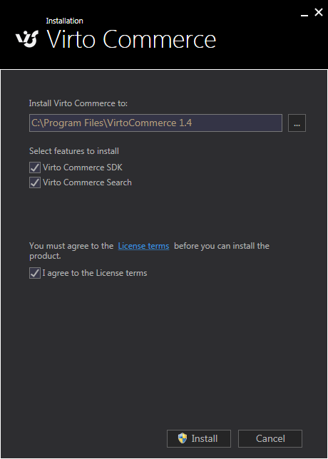
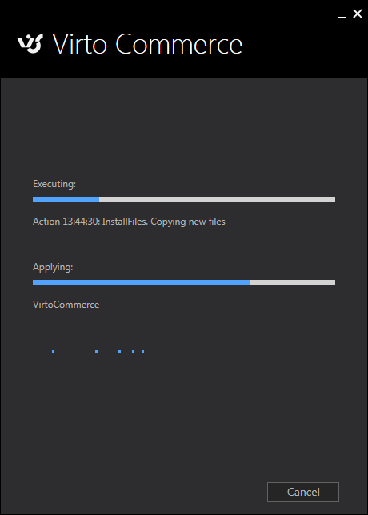
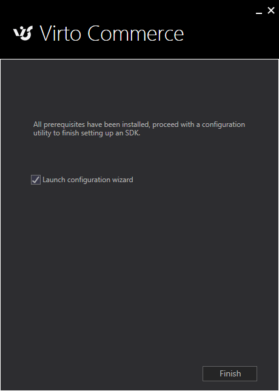
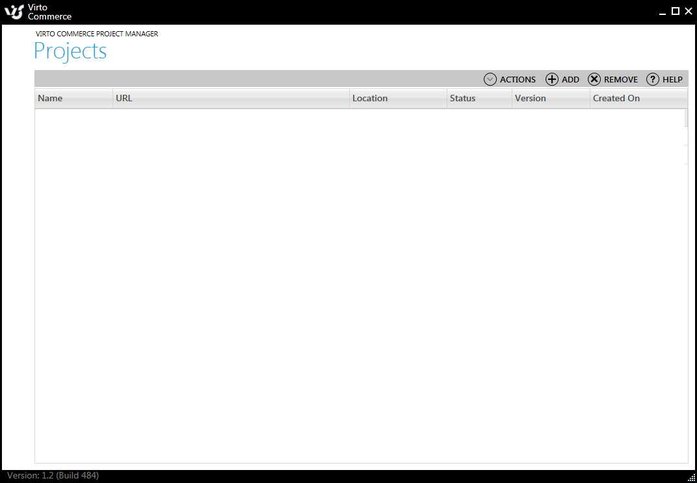
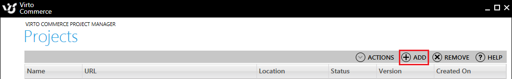
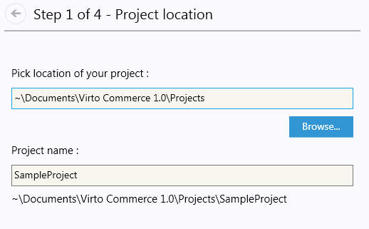
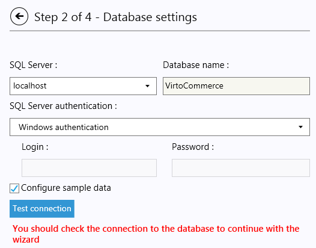
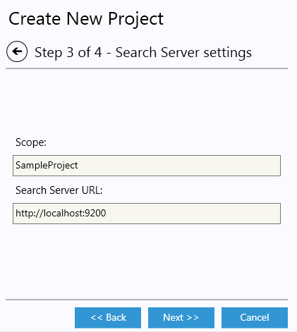
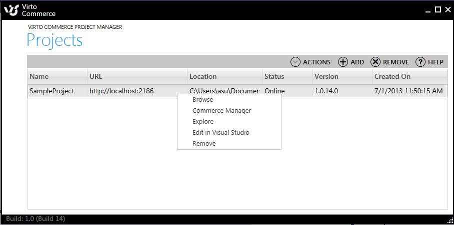

---
title: SDK Getting Started
description: SDK Getting Started
layout: docs
date: 2015-03-18T20:11:12.560Z
priority: 2
---
## Quick video on installing Virto Commerce SDK

<iframe width="560" height="315" src="https://www.youtube.com/embed/swDb5dajk_s" frameborder="0" allowfullscreen></iframe>

## Prerequisites

Windows Management Framework 3.0. Some clean OS misses it. Download and install it manually: <a href="http://www.microsoft.com/en-us/download/details.aspx?id=34595" rel="nofollow">http://www.microsoft.com/en-us/download/details.aspx?id=34595</a>

## Installing VirtoCommerce

1. If you have previous version of VirtoCommerce SDK installed. Uninstall it before installing the new version.
2. Download the latest package from here.
3. Launch setup.
4. Select to install VirtoCommerce SDK and search, check if you agree with the license terms.
  
5. Click install
  
6. When setup finishes copying files click finish.
  
  The configuration manager will launch.
  
7. In configuration manager click Add button.
  
  The project wizard will start.
8. In the first step of the wizard enter project name or leave default values.
  
9. Click next and you should see database configuration screen. Configure your database connection and click **Test connection** button.
  
  If connection is successful next button is enabled.
10. Click next to configure search service settings. You can leave default values.
  
11. Click next and finish. Now the page opens where you can see the progress of configuring the system.
12. When all features are configured click finish. Now you should have a project ready. Right click on SampleProject to launch it in browser or explore the source code. You can also edit in Visual Studio.
  

**NEXT STEPS**: Please follow the [New Store getting started](docs/old-versions/vc113devguide/development-environment/new-store-getting-started) tutorial to set up a new store.

## Troubleshooting

**Q**: When trying to open a project in Commerce Manager, an error message is displayed beginning with: System.UnauthorizedAccessException: Access to the path

**A**: Close and rerun "Configure Demo Site" application as administrator.
