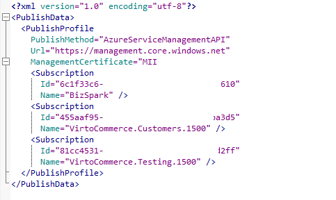
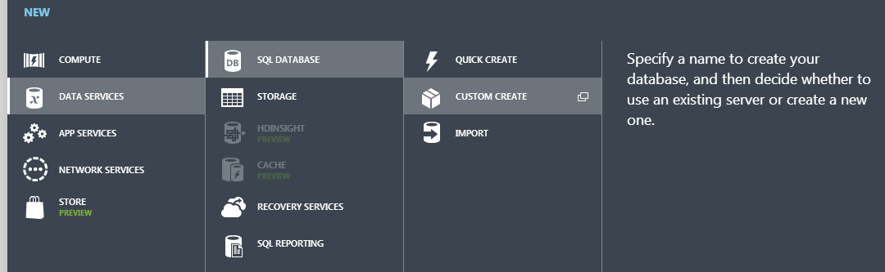
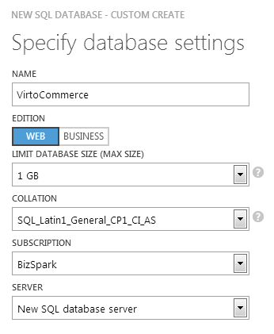
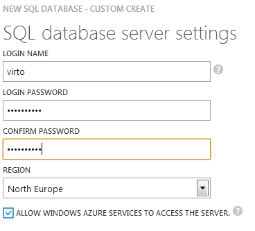
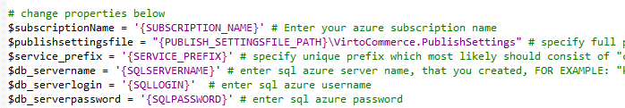
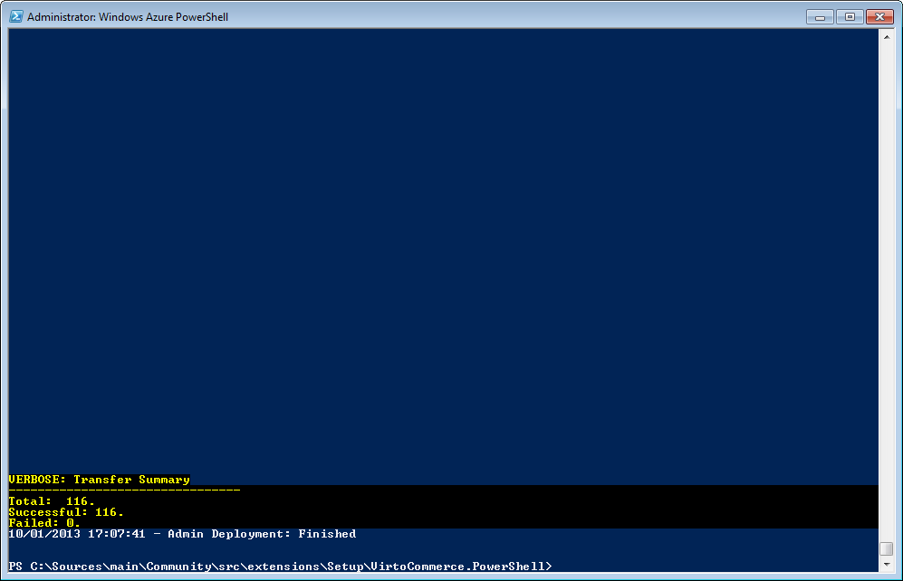

---
title: Source Code Azure Deployment
description: Source Code Azure Deployment
layout: docs
date: 2015-03-18T20:11:12.560Z
priority: 4
---
## Prerequisites

* Visual Studio 2013
* Windows Management Framework 3.0В <a href="http://www.microsoft.com/en-us/download/details.aspx?id=34595" rel="nofollow">download link</a>
* Latest Powershell for Azure (version 0.6.19)В <a href="http://az412849.vo.msecnd.net/downloads02/windowsazure-powershell.0.6.19.msi" rel="nofollow">download link</a>
* Windows Azure SDK for .NET 2.4. Web Platform Installer <a href="http://www.microsoft.com/en-us/download/details.aspx?id=43709" rel="nofollow">download link</a>
* Java Runtime Environment 7.В <a href="http://www.oracle.com/technetwork/java/javase/downloads/java-se-jre-7-download-432155.html" rel="nofollow">Download link</a>
* Full Source Code package

## Deployment

> Execute all commands and scripts in Powershell for Azure.

1. Open the PowerShell and type the following command “Get-AzurePublishSettingsFile”. This will open the browser with azure login page. Once logged in, you will be able to download PublishSettings file, which contains information on how to connect to your azure subscription.
  
2. Rename it to VirtoCommerce.PublishSettingsВ and place it to the deploy.ps1 file folder which is in {base_path}\VirtoCommerce.Source\src\Extensions\Setup\VirtoCommerce.PowerShell\
3. Open your azure management portal.
4. Create new database server and create database in it.
  
  

Select "New SQL database server" and select the closest geografically server in the next step as this has impact on deployment speed. If the server response won't be quick enough you may get timeout errors during database deployment process. You can check which of the servers response is the bestВ <a href="http://azureping.info/" rel="nofollow">here</a>

Remember entered credentials as you will need them to enter later in the deploy.ps1 script.

5. Add your current ip to the firewall (in the azure management portal).
6. Run Set-ExecutionPolicy RemoteSigned В command in PowerShell.
7. Open the deploy.ps1 script and set the variables values as described in comments to each variable
  
8. Run the deploy.ps1 script. Sit back and relax as the deployment script will compile the solution, create 3 deployment packages (frontend, scheduler and search), create storage account in azure, create and populate database and create 3 services. The progress depends on connection speed and selected server but will normally take about 20-30 minutes.

The final result should look like on the screenshot below.

After script completes, you will be able to browse Virto Commerce frontend deployed on azure.

Open the URLВ **http://{service_prefix}-www.cloudapp.net**В whereВ {service_prefix}В is your service prefix value entered in the deploy.ps1 script.
