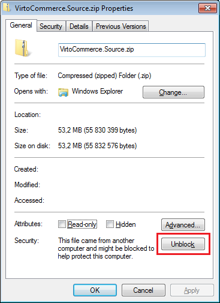
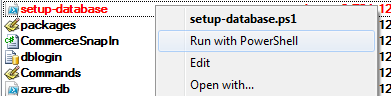
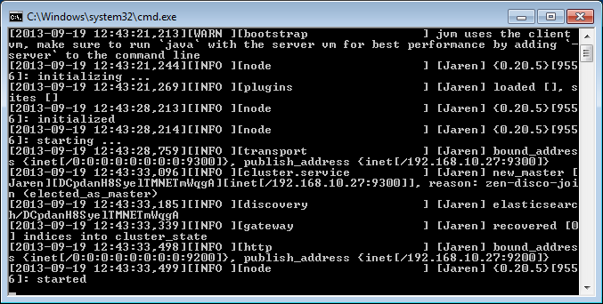
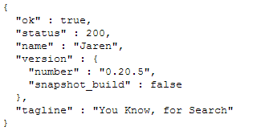
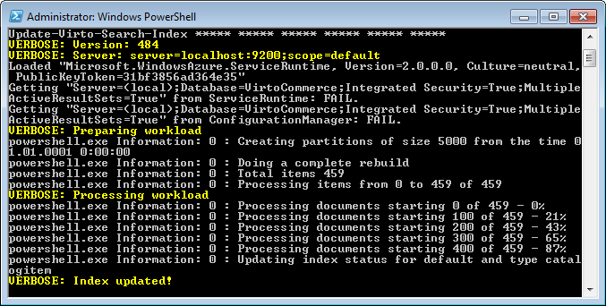
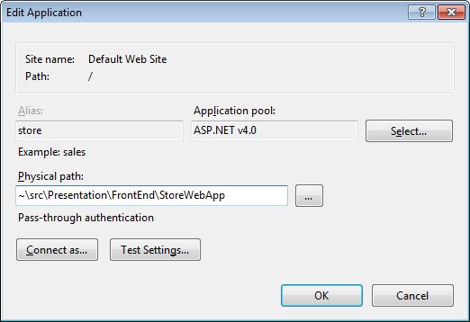
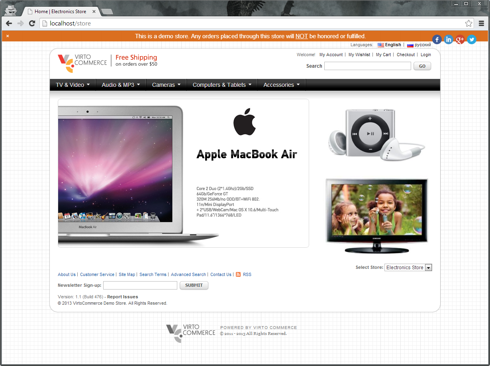
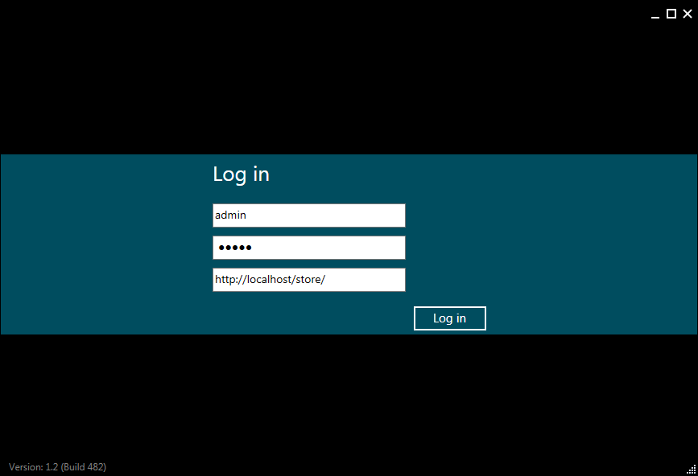

---
title: Source Code Getting Started - Virto Commerce 1.13 Developer Guide
description: Source Code Getting Started
layout: docs
date: 2015-03-18T20:11:12.560Z
priority: 3
---
## В Before you start

* Microsoft .NET Framework 4.5 (download link:В <a href="http://www.microsoft.com/en-us/download/details.aspx?id=30653" rel="nofollow">Microsoft .NET 4.5</a>)
* Internet Information Services 7 or above
* Microsoft Visual Studio 2012 or later
* Microsoft SQL Server 2008 (Express or Full)В or above (download link:В <a href="http://www.microsoft.com/en-us/download/details.aspx?id=35579" rel="nofollow">Microsoft SQL Server 2012 SP1 Express</a>)
* If using Visual Studio 2012 need to install:В Windows Azure SDK for .NET (VS 2012) -В 2.4. Web Platform InstallerВ <a href="http://go.microsoft.com/fwlink/?LinkId=323511" rel="nofollow">download link</a>
* If using Visual Studio 2013 need to install: Windows Azure SDK for .NET (VS 2013) - 2.4. Web Platform InstallerВ <a href="http://go.microsoft.com/fwlink/?LinkId=323510" rel="nofollow">download link</a>
* JRE 7 or above (for search server)

## Getting started

1. Download the latest source code from <a href="http://virtocommerce.codeplex.com" rel="nofollow">http://virtocommerce.codeplex.com</a>
2. Unblock the archive file.
  
3. Extract the source code project.
4. Open the VirtoCommerce.sln solution file and build it.
5. Go to ~\src\Extensions\Setup\VirtoCommerce.PowerShell\В folder right-click and run setup-database.ps1В Powershell script
  

> Powershell v3.0 should be installed (<a href="http://www.microsoft.com/en-us/download/details.aspx?id=34595" rel="nofollow">download</a>) or if you have Powershell v2.0 in the system create a file “powershell.exe.config” in the C:\Windows\System32\WindowsPowerShell\v1.0 with content:
> ```
> <?xml version="1.0"?>В 
> <configuration>В 
> В В <startup useLegacyV2RuntimeActivationPolicy="true">В 
> В В В В <supportedRuntime version="v4.0.30319"/>В 
> В В В В <supportedRuntime version="v2.0.50727"/>В 
> В В </startup>В 
> </configuration>
> ```

Wait until script finishes database deployment.


6. Go to ~\Tools\ElasticSearch\bin\В and run elasticsearch.batВ batch file.



7. Browse the following URL:В **http://localhost:9200/**. If you see the page like in the screenshot below, then the server is running successfully.



8. Index the database. Go toВ ~\src\Extensions\Setup\VirtoCommerce.PowerShell\В folder and run Powershell scriptВ setup-search.ps1



9. Download assets required for frontend fromВ <a href="https://virtocommerce.codeplex.com/releases/view/112289" rel="nofollow">here</a>, extract the archive toВ ~\src\Presentation\FrontEnd\StoreWebApp\AppData\VirtoВ folder.
10. In order to run dataservices and frontend configure IIS to theВ ~\src\Presentation\FrontEnd\StoreWebAppВ folder. Set permissions for this folder to allow IIS modify it (IIS_IUSRS user).

Your Web application basic configuration should look similar to the screenshot below:



> The Alias name must contain only lower case letters ex. "store" and not "Store"!

If frontend is configured correctly you should be able to browse the sample store



11. Set Presentation.Application project of the VirtoCommerce solution as startup and Start it. The backend should be launched.



12. Log in

**user**: admin
**password**: store
**base url**:В {frontend_store_url_registered_in_IIS}

## Appendix

### Appendix A: Internet Information Services configuration

1. Open Internet Information Services (IIS)
2. In the left pane go to Server -> Sites -> Default Web Site
3. Right click it and choose Add application… item
4. In the popup window enter frontend Alias (e.g. store), select DefaultAppPool in the Application pool and navigate to unzipped solutions frontend folder: (~\src\Presentation\FrontEnd\StoreWebApp) Setup permissions for the frontend folder in order IIS would have required permissions on the folder.

### Appendix B:В Database setup

There are two options to create database:

* without sample data
* with sample data

From the user perspective the difference is if you will or won't have sample store with sample data in the backend and frontend.

If you don't want to deploy sample project with all the sample data you can setup only database structure and minimum required data (e.g. default user). In this case the frontend won't be available until you add or import required data (e.g. catalog, store, items etc.) and configure it. Otherwise all sample data will be added to the database.

To setup database go toВ ~\src\Extensions\Setup\VirtoCommerce.PowerShell\В folder and run Powershell script below.

* without sample data:
  ```
  setup-database.ps1 -useSample:$false
  ```
* with sample data:
  ```
  setup-database.ps1
  ```

If sample data is deployed, assets for the frontend should be downloaded and placed correctly.

### Appendix C: Running Powershell scripts

* Use x86 version of Powershell to run scripts.
* Powershell should allow to launch not signed scripts. If not you can do one of the following:
  * Right click the script in the windows explorer and select "Run with PowerShell".
  * Use the following command from the command prompt to run the scripts:
    ```
    PowerShell.exe -File <FileName> -ExecutionPolicy Bypass
    ```
  * Run PowerShellВ (launch with administrator rights)В command:
    ```
    set-executionpolicy unrestricted;
    ```

### Appendix D: Smtp server

For developing customer service/orders email send/receive functionality you need smtp server.В UseВ <a href="http://smtp4dev.codeplex.com/" rel="nofollow">smtp4dev</a>В (dev enviroment preconfigured to use localhost)

## Troubleshooting

**Q**: Source code doesn't build due to some .dlls are missing.

**A**: Some file(-s) could be blocked by the system. Go to the source code folder and unblock it.

* * *

**Q**: Error regarding ASP.NET

**A**: <a href="http://stackoverflow.com/questions/13749138/asp-net-4-5-has-not-been-registered-on-the-web-server" rel="nofollow">Register the .net framework 4.5</a>В for IIS Server

* * *

**Q**: Can't login to store using Commerce Manager, get error starting with: "There was no endpoint listening at http...".

**A**: Enable WCF services on web server (starting from Windows version 8): usingВ Programs and Features -> Turn Windows features on or offВ in the Control Panel. Go toВ .NET Framework 4.5 Advanced Services -> WCF ServicesВ and enableВ HTTP Activation.

* * *

**Q**: Elastic search batch file fails to run

**A**: Check the JAVA_HOME variable (C:\Program files\Java\jre7)

* * *

**Q**: Powershell script doesn't run

**A**: Open Powershell and run command **get-host**

If it returned version 2.0 then there are two options to troubleshoot the problem.

Install Powershell v3.0 (<a href="http://www.microsoft.com/en-us/download/details.aspx?id=34595" rel="nofollow">Download</a> Windows Management Framework) or create a file named “powershell.exe.config” in the C:\Windows\System32\WindowsPowerShell\v1.0 and copy/paste the content below to the file:

```
<?xml version="1.0"?>В 
<configuration>В 
В В <startup useLegacyV2RuntimeActivationPolicy="true">В 
В В В В <supportedRuntime version="v4.0.30319"/>В 
В В В В <supportedRuntime version="v2.0.50727"/>В 
В В </startup>В 
</configuration>
```
