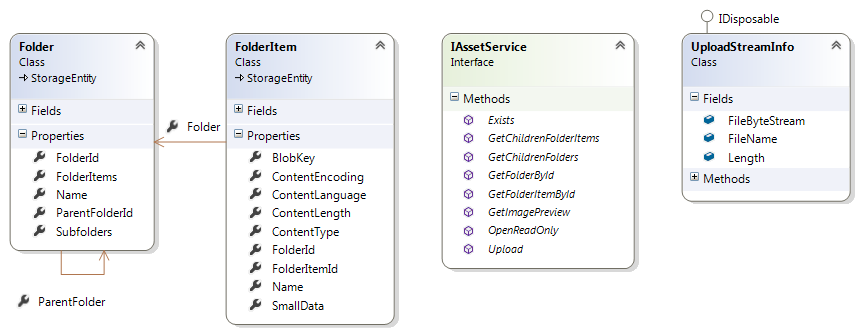

---
title: Working with assets
description: Working with assets
layout: docs
date: 2015-03-18T20:11:12.560Z
priority: 6
---
## Introduction

All resources available in Virto Commerce are referred as assets. The most common asset is image, but it's not limited to that. An asset can be any file, electronic document, multimedia content, etc.  They are accessed from storefront and Commerce Manager as well. Assets are grouped into folders and form a (logical) hierarchy structure. Physical asset storage medium is not limited and currently Virto Commerce provides file system based and Windows Azure Blob Storage based implementations.

You can upload, download or view metadata of the assets trough Virto Commerce API. The API provides IAssetService interface for working with assets.

## Asset class diagram

You can see the main entities depicted in the diagram below:

* **Folder** - a (logical) container for assets and other Folders
* **FolderItem** - an asset metadata information
* **IAssetService** - an interface for working with assets. It defines methods that are available for asset manipulations
* **UploadStreamInfo** - a class passed as a parameter to IAssetService.Upload method. Contains information about asset being uploaded together with it's content



## Asset browsing

Despite of what are you doing, the first step is to acquire a reference to the IAssetService implementation. Assuming you did it and have the variable:

```
IAssetService _assetService;
```

Folders and assets querying is straight forward:

```
var folders = _assetService.GetChildrenFolders(CurrentFolderID);
var assets = _assetService.GetChildrenFolderItems(CurrentFolderID);
```

The only parameter required is the folder id for witch the subfolders and assets are returned (CurrentFolderID in this case). Note that no other parameters are accepted and (optional) results filtering could be done only after the results were returned. Further actions depends on the scenario you are following. For instance, the data could be displayed in UI.

## Asset uploading

Asset (file) uploading could be long running process depending on file size, connection bandwidth, etc. and it should be done in a separate process:

```
ShowLoadingAnimation = true;
 
var worker = new BackgroundWorker();
worker.DoWork += (o, ea) =>
{
  using (var info = new UploadStreamInfo())
  using (var fileStream = new FileStream(fullFileName, FileMode.Open, FileAccess.Read))
  {
    info.FileName = fileName;
    info.FileByteStream = fileStream;
    info.Length = fileStream.Length;
    _assetService.Upload(info);
  }

  RefreshCommand.Execute();
};

worker.RunWorkerCompleted += (o, ea) =>
{
  ShowLoadingAnimation = false;
};

worker.RunWorkerAsync();
```

**ShowLoadingAnimation** in this case is a flag property indicating file upload action in UI.

**fullFileName** is a file name with a full path on the local file system of the file being uploaded.

**fileName** is the name the uploaded asset will get.

## Asset downloading

Asset content downloading is done as:

```
var stream = _assetService.OpenReadOnly(FolderItemId);
```

This also should be done in separate process as described in uploading section.

If an asset is an image, a small thumbnail of 100*100 pixel size can be downloaded for image preview purposes:

```
byte[] thumbnailBytes = _assetService.GetImagePreview(FolderItemId));
```
