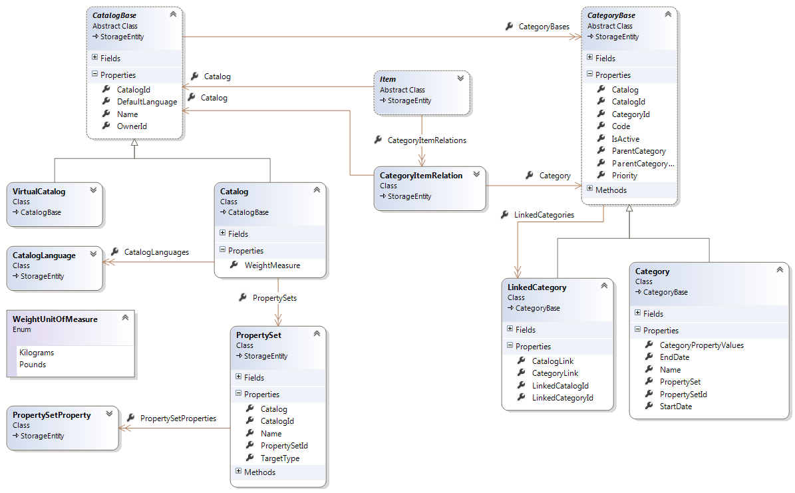
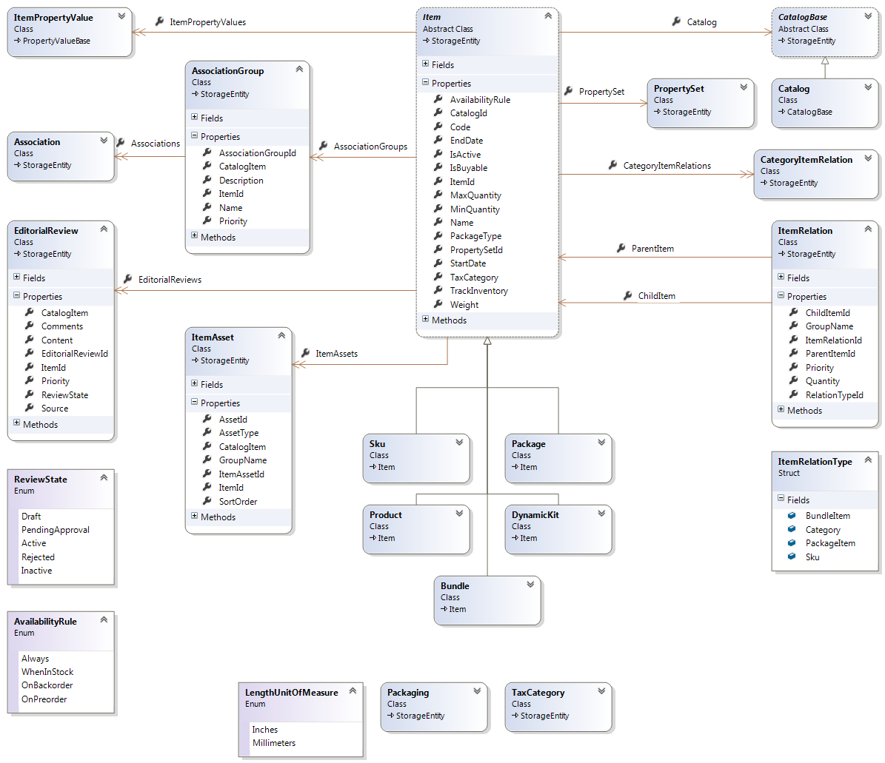
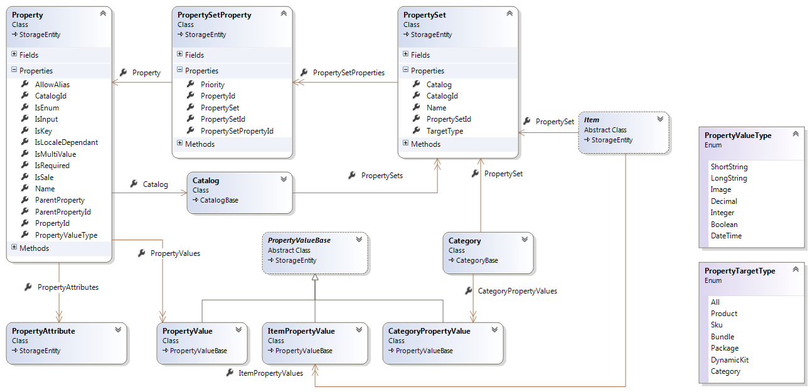

---
title: Object model
description: Object model
layout: docs
date: 2015-03-18T20:11:12.560Z
priority: 1
---
Catalog Object model is the biggest one in VCF. The main entities you will most likely to work with are Catalog and Item. This object model is divided into several parts for clarity and simplicity. These diagrams should help in better understanding of entity relations, class inheritance and characteristics.

## Catalog class diagram

The main features of catalogs and categories.

## Item class diagram

The main features of items (goods).

## Property class diagram

The detailed features of properties (metadata) and their concrete values (data).

