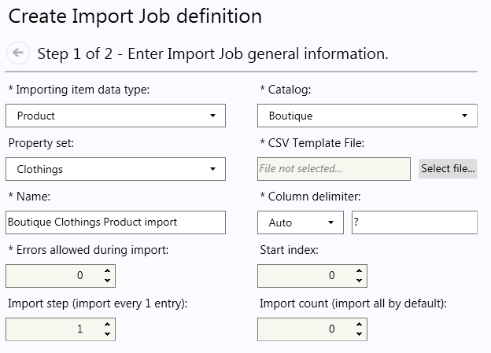
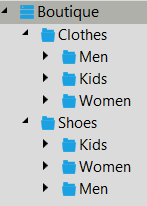
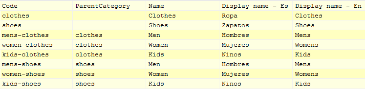
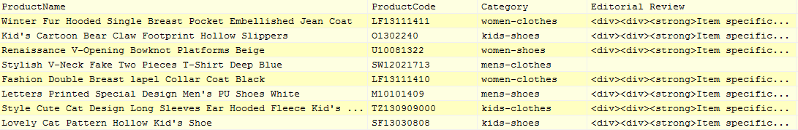
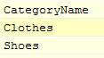
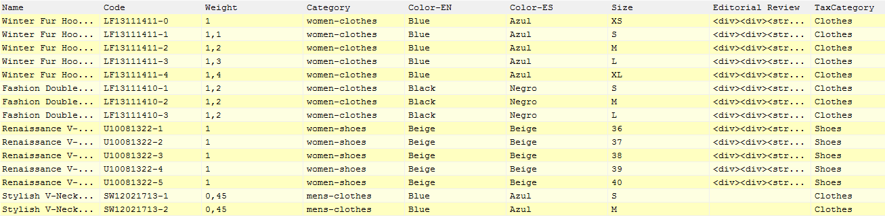
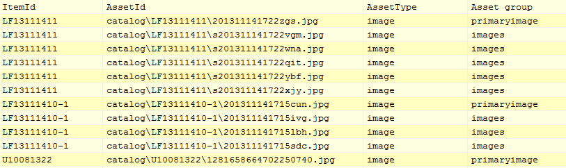
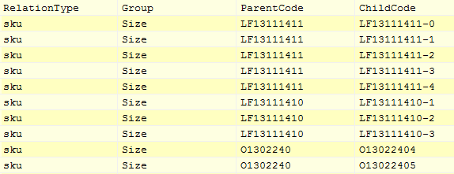
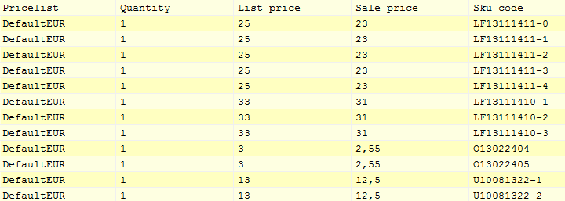

---
title: Import data from CSV files
description: Import data from CSV files
layout: docs
date: 2015-03-18T20:11:12.560Z
priority: 1
---
## The purpose of using CSV files to import entities

The purpose of the import functionality is to import entities from outside using CSV structured files. Such entities as Categories,В Products, Skus, Packages, Associations, Pricelists, Taxes, Customers can be imported in bulk using a CSV file. Alternatively to creating those entities one by one, you can export them from outside system to CSV (Comma Structured Values) files and import to VirtoCommerce storage using import functionality of the VirtoCommerce manager.

Another way of using CSV files is to update huge amount of data, e.g. Prices of items, or delete entities.

## Catalog items import overview

Here is the overview of steps you have to take to import and set up a Catalog using the import functionality. The main prerequisite to import catalog structure is the existence of the target catalog and property sets for categories and items. So if you want to import new Catalog, create it first in the VirtoCommerce manager. If you want to import to the existing catalog select Import tab of the Catalogs module.

**Prerequisite**: Existence of the catalog in the system with property sets targeted to category and item.

1. Create CSV data files (using Excel Spreadsheet, Notepad, etc.) with information about your categories, entries, entry relations and prices.
2. Create necessary property sets with properties for the new Catalog entries (in the VirtoCommerce manager).
3. Upload the created/generated CSV data files to systems Assets directory.
4. Create a import job for each CSV file type. Import job is needed to create mapping of entity property to appropriate column in the CSV file.
5. Run import jobs, first to create Categories structure, next import items, next import associations and prices into the price lists.

## CSV files format

Import CSV files must match particular format:

* First row of the file must contain headers of the columns, that they stand for.
* CSV files must have required columns of the entities they tend to import or if the required property is custom and not unique per item it could be set in column mapping step later while creating the import job.

## Available Mapping types

There are several types of entities that could be imported via import functionality. The import functionality is spread in appropriate modules by the imported types

Under Catalog module the next import types are available:

* **Category** - select this Import type to create Import jobВ for Category structure importing into selected catalog.
* **Product**В - select this Import type toВ create Import job forВ Items importing into selected Catalog
* **Sku (Variation)** - select this Import type toВ create Import job forВ variations importing into selected Catalog
* **Dynamic Kit**- select this Import type toВ create Import job forВ Items importing into selected Catalog
* **Package**В - select this Import type toВ create Import job forВ Items importing into selected Catalog
* **Bundle**В - select this Import type toВ create Import job forВ Items importing into selected Catalog
* **ItemAsset** - select this Import type to create Import job for item assets.
* **Association** - select this Import type to create Import job for items associations (e.g. to associate related items)
* **ItemRelation** - select this Import type to create Import job for item relations.

Uder Pricelists module the next import type is available:

* **Price** - create Import job for price lists.

Under Settings -> Taxes the next import types are available:

* **TaxCategory** - select this Import type to create Import job to import tax categories.
* **Jurisdiction**В - select this Import type to create Import job to import jurisdictions.
* **JurisdictionGroup**В - select this Import type to create Import job to import jurisdiction groups. Those are to group jurisdictions where taxes are common.
* **TaxValue** - select this Import type to create Import job to import tax values.

Under Settings -> Localization the next import type is available:

* **Localization** - create Import job to import localization CSV file.

By selecting each type of import the system will display different entity properties appropriate to the selected entity for you to map CSV file columns to that properties. The import system will try automatically match CSV file columns to entities properties with similar names (e.g. Code property will be matched to ItemCode column name).

## Steps to import CSV file

Steps to import items from the csv file:

1. The CSV import file should be uploaded in the assets storage.
2. Go to the module appropriate to the import entity. E.g. go toВ **Catalog**В moduleВ ImportВ tab to import categories structrue, items etc. Go toВ **Settings**В moduleВ TaxesВ tabВ ImportВ sub-tab.
3. If you already have import job that matches your needs to import entities go to step 5.
4. Add import job.

According to the item type import job wizard can differ from the above. Above is the most complete set of available fields for the import job.

* Importing item data type - contains the available to import data types and sets the importing data type.
* Catalog - catalog property is mostly applicable to catalog related entities importing. It also sets which property sets are available in the Property set field.
* Property set - contains available property sets for items of the selected "data type" for the selected Catalog.
* CSV Template file - select the file that will be used as template to map entity properties to CSV file columns.
* Name - is the name of the import job. By this field the import job could be filtered and defined in the list of import jobs. The field is automatically filled with the selected Import type, catalog and property type. If the automatically filled name is not good enough user can edit it.
* Column delimiter - states the column delimiter sign in the CSV file. It can be left as Auto in that case the delimiter will be guessed by the system while selecting the CSV template file.
* Errors allowed during import - sets the count of applicable errors during importing.
* Start index - set the row number from which the import should be started
* Import step - set the step of importing.
* Import count - set the maximum items to be imported. All items will be imported by default.

Once all required properties are properly set the "Next" button of the wizard becomes available.

Proceed to step 2

In step 2 you map entity fields to the template CSV file columns. The system automatically guesses and matches CSV columns with similar names to the entity columns.

If the system matched wrong column, just double click the row of the field and in the popup dialog select the right one from the available column names.

If entity property should be set to some custom predefined value during importing, double click the row of the desired field and in popup dialog select "Custom" in the available columns list В and set the custom value in the below text box. If the field can have predefined set of custom values only those will beВ available and will be available as options of the combobox. For example, if the property is of bool type, only "True", "False" will be available.

If the field is locale dependant then columns for each locale value can be set.

Click "Finish" to complete the wizard and create the job.

5. Run the import job by selecting desired job from the list and click "Run" button.
6. In the popup dialog select CSV file that you will import.

Click "OK"

7. The import progress popup dialog will appear.

## Example: Create and setup new Catalog

The example will demonstrate how to setup "Boutique" catalog using the above guidelines.

The Boutique catalog will have the next structure:

**Prerequisite**:В Create new Catalog and name it "Boutique" with properties and property sets using the VirtoCommerce manager.

## Step 1: Prepare or export data to CSV files

CSV File for categories structure:

The file defines Categories data inside selected catalog.

The top row of the file contains column names that will be matched with the Category entity properties in wizard's mapping step or later in the import job edit view Mapping tab.

There are required properties for Category entity that has to be set (not null):

* (string) CategoryId - the unique id for the category (GUID - generated automatically).
* (string) Code - the unique code for the category in scope of catalog.
* (string) Name - name of the category.
* (bool) В  IsActive - if the category is active ("true" by default).
* (string) CatalogId - catalog id to which categories will be added.
* (date) В  StartDate - the date when the category becomes active.

CSV file must have columns that stands to Code and Name properties at least. StartDate and IsActive could be set via Custom value selection if all imported categories should be active or inactive initially (default value is true).В Catalog is selected in separate control, so it doesn't have to be in the CSV file.

Other important but not required property is parent category code. If CSV file doesn't contain column that applies to this property, than all categories will be set to the root of the selected catalog.

There can be more required properties in the selected property set, that is selected in the first step of the wizard. The selected property set properties will be added to the mapping table, so the user could map them to CSV file columns or set custom values.

Here is the import file for categories.

In the example 8 categories will be created in the Boutique catalog. Clothes and Shoes categories will be added to the root of the catalog as their ParentCategory column value is empty. Men, Women, Kids categories will be subcategories of both the Clothes and Shoes categories as their ParentCategory column contains category code value for each of the root categories.

Now prepare file to import Products. Those are the placeholders for variations.

In the example there is 8 products that won't be sold directly, they will have related items (variations).

Next, prepare import data to import tax categories.

In this sample store there will be two tax categories. That is "Clothes" and "Shoes" so variations has to be assigned to one of the tax category for taxes to be applied on them.

Next, prepare the variations import file.

There are many variations described in the file. As you can see variations has more properties set in it. Those are weight of the item, tax category and property values for property set assigned.

Next prepare data file fo item assets. Those are mainly images of the item.

Assets should be placed under ~\Frontend\App_Data\Virto\Storage folder. In this case the "catalog" subfolder should be created and each products assets are placed in it's own subfolder named by the products code.

As you can see the path to the asset is relative to theВ ~\Frontend\App_Data\Virto\Storage folder. Asset type describes if it is image or some text documentation file, or download link for some electronic good. Asset group describes how the asset will be shown in the frontend.

Next prepare import file for relations. That is where relations between products and variations will be defined.

As you can see the relation type is "sku". That means that child products are sku's of the main product. The "Group" column defines the property name by which child products will be grouped and shown as an option selection in the frontend later. Parent and child codes are codes of the items.

Next prepare data file to import prices for the variations.

In the pricelist the code of the pricelist should be provided. Quantity sets the amount of purchased items to apply the price. List price and sale price are self explanatory.

> Import data files should be placed underВ ~\Frontend\App_Data\Virto\Storage folder in order VirtoCommerce manager's file manager could reach them. Create "Imports" subfolder and place all the created files there.

## Step 2. Create Import jobs

The data should be imported in a certain order. There should be categories before importing the items. Also there should be items to import prices. So the sequence should be next:

1. Categories.
2. Products.
3. Tax categories.
4. Variations.
5. Assets.
6. Item relations.
7. Prices.

### 2.1 Creating Categories import job

1. Open Catalog module.
2. Go to
  
3. Click
  
  to launch wizard.
4. In the Step 1 of the wizard set import type "Category", select property set, click "Select file" navigate toВ ImportsВ folder and choose the categories import file as template. The column delimiter and name will be set automatically. Leave other properties default.

The wizard step should look like on screenshot below:

5. Click "Next" to proceed to Step 2.
6. The system automatically identified which columns match entity properties. The import file doesn't contain the requiredВ **Start Date**В property, so it needs to be set manually. Also check if properties are mapped correctly by automatic mapping. The mapping should look like on the screenshot below.
  
7. Finish the wizard.

### 2.2 Create Products import job

1. Open catalog module.
2. Go to
  
  tab.
3. Click
  
  to launch wizard.
4. In the wizardВ Step 1 set import type "Product", select property set, click "Select file" navigate toВ ImportsВ folder and choose the products import file as template. The column delimiter and name will be set automatically. Leave other properties default.

The wizard step should look like on screenshot below:

5. Click "Next" to proceed to Step 2.
6. The system automatically identifiedВ which columns match entity properties. The import file doesn't contain the requiredВ **Start Date**В property, it's set automatically to current date. Also check if properties are mapped correctly by automatic mapping. The mapping should look like on the screenshot below.

> **Is Active**В should be set to True as products should be visible in the store,В **Is Buyable**В set to False as products can't be sold directly, only variation of the product can be sold.
> 

7. Finish the wizard.

### 2.3 Create Tax categories import job

1. Open **Settings** module.
2. Open **Taxes** tab.
3. Go to
  
  tab.
4. Click
  
  to launch wizard.
5. In the wizard Step 1 set import type "TaxCategory", enter import job name, click "Select file", navigate toВ ImportsВ folder and choose the TaxCategories.csv import file as template. The column delimiter and name will be set automatically. Leave other properties default.

The wizard step should look like on screenshot below:

6. Click "Next" to proceed to Step 2.
7. The system automatically identifiedВ which columns match entity properties. Check if properties are mapped correctly by automatic mapping. The mapping should look like on the screenshot below.

8. Finish the wizard.

### 2.4 Create Variations import job

1. Open Merchandise Management module.
2. Go to
  
  tab.
3. Click
  
  to launch wizard.
4. In the wizardВ Step 1 set import type "Sku", select property set, click "Select file" navigate toВ ImportsВ folder and choose the variations import file as template. The column delimiter and name will be set automatically. Leave other properties default.

The wizard step should look like on screenshot below:

5. Click "Next" to proceed to Step 2.
6. The system automatically identified which columns match entity properties. The import file doesn't contain the requiredВ **Start Date**В property, it's set automatically to current date. Also check if properties are mapped correctly by automatic mapping. The mapping should look like on the screenshot below.

> **Is Buyable**В should be set to True as variations can be sold,В **Is Active**В set to False as variation can't be viewed directly it should be selected through product page.
> 

> As Color is multilingual property it has mapping property per locale.

7. Finish the wizard.

### 2.5 Create Item relations import job

1. Open Merchandise Management module.
2. Go to
  
  tab.
3. Click
  
  to launch wizard.
4. In the wizard Step 1 set import type "ItemRelation", click "Select file", navigate toВ ImportsВ folder and choose the item relation import file as template. The column delimiter and name will be set automatically. Leave other properties default.

The wizard step should look like on screenshot below:

5. Click "Next" to proceed to Step 2.
6. The system automatically identified which columns match entity properties. Check if properties are mapped correctly by automatic mapping. The mapping should look like on the screenshot below.

> There are two propertiesВ Source item catalogВ andВ Target item catalogВ . These properties can be set in case you're not sure if there can be items with the same codes in several catalogs, to point where to locate the items.

7. Finish the wizard.

### 2.6 Create Item assets import job

1. Open Merchandise Management module.
2. Go to
  
  tab.
3. Click
  
  to launch wizard.
4. In the wizardВ Step 1 set import type "ItemAsset", click "Select file", navigate toВ ImportsВ folder and choose the assets import file as template. The column delimiter and name will be set automatically. Leave other properties default.

The wizard step should look like on screenshot below:

5. Click "Next" to proceed to Step 2.
6. The system automatically identified which columns match entity properties. Check if properties are mapped correctly by automatic mapping. The mapping should look like on the screenshot below:

7. Finish the wizard.

### 2.7 Create Prices import job

1. Open **Price Lists** module.
2. Go to
  
  tab.
3. Click
  
  to launch wizard.
4. In the wizardВ Step 1 set import job name, click "Select file", navigate toВ ImportsВ folder and choose the prices import file as template. The column delimiter will be set automatically. Leave other properties default.

The wizard step should look like on screenshot below:

5. Click "Next" to proceed to Step 2.
6. The system automatically identified which columns match entity properties. Check if properties are mapped correctly by automatic mapping. The mapping should look like on the screenshot below:

7. Finish the wizard.

## Step 3. Run import jobs

Run import jobs in the next sequence:

1. Categories
2. Products
3. Tax Categories
4. Variations
5. Item relations
6. Item assets
7. Prices

After all data is imported you will have fully setup catalog. Now you have to setup Store. Configure Payment and Shipping methods in order to complete online store setup.

## Assets & import files

<a href="../../../assets/files/Storage.zip">Storage.zip</a>
