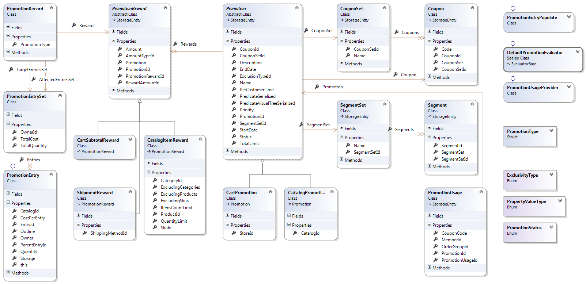
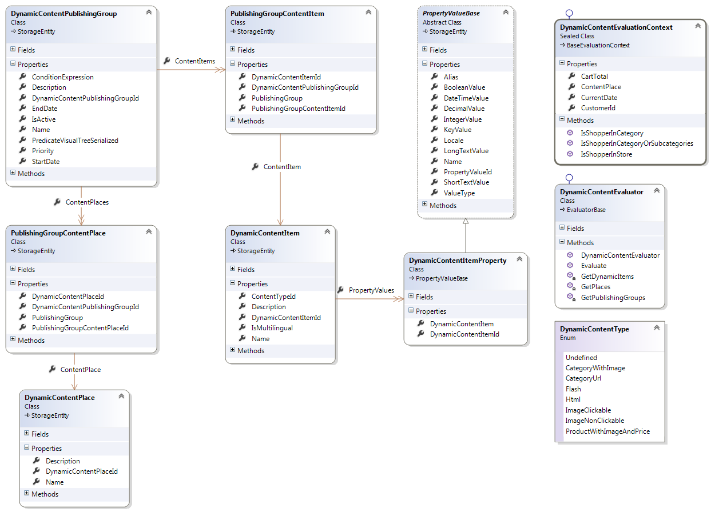

---
title: Marketing object model
description: Marketing object model
layout: docs
date: 2015-03-18T20:11:12.560Z
priority: 1
---
## Promotions class diagram

The following figure shows the marketing promotions related classes with their properties and relationships between them.

## Dynamic content class diagram

The following figure shows the dynamic content subsystem related classes with their properties and relationships between them.

