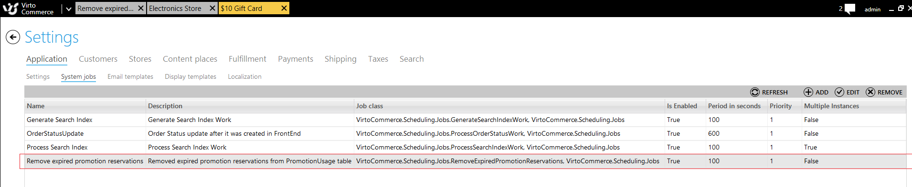
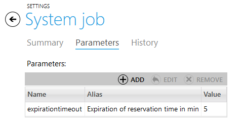
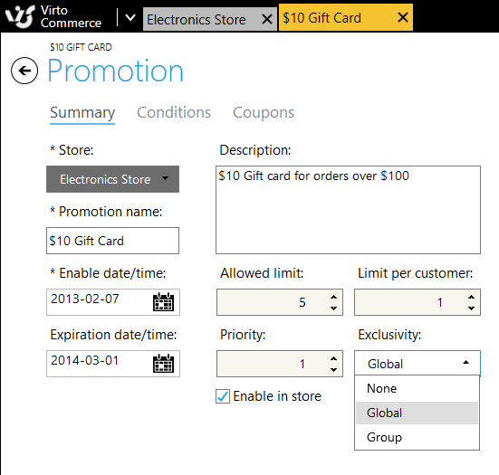

---
title: Promotion usage reservation
description: Promotion usage reservation
layout: docs
date: 2015-03-18T20:11:12.560Z
priority: 2
---
## Introduction

Promotion usage reservation functionality allows to record an event of using certain promotion. This is needed to correctly apply limitations when evaluating other promotions. The basic functionality consists of three parts: workflow activity that records promotion usage, system job that removes expires reservations and promotion evaluator that takes advantage of reservations when evaluating valid promotions.

## Promotion usage

The promotion usage entity consist of the following key fields:

* **PromotionUsageId**: a unique identifier for promotion usage record
* **MemberId**: a membeId of the user whomever the promotion is applied to
* **OrderGroupId**: and id of the shopping cart (if reserved) or order (if used) where the promotion is applied
* **CouponCode**: a coupon code if one was used when applying given promotion
* **Status**:
  * **0 - Expired** (not used now as expired promotions are removed physically)
  * **1 - Reserved**. This status is used only when promotion is applied to shopping cart, before it is purchased or expired.
  * **2 - Used**. This status marks permanent usage after order is completed. Such usage never expire.
* **UsageDate**: an actual date time of usage. This field is required for system job to determine if promotion has expired.
* **PromotionId**: an id of the promotion that has been applied.
* Other system fields: **LastModified**, **Created**, **Discriminator**

## Workflow activity

The workflow activity named RecordPromotionUsageActivity is used to create promotion reservation records. The status (Reserved or Expired) is passed to workflow as constant parameter. It is used in two workflows: ShoppingCartPrepareWorkflow (with status Reserved) and ShoppingCartCheckoutWorkflow (with status Used). The activity first removes all usages for current shopping cart that are not used and then iterates over all discounts and adds usage record with status passed to it.

```
using System;
using System.Collections.Generic;
using System.Linq;
using VirtoCommerce.Foundation.Customers.Services;
using VirtoCommerce.Foundation.Marketing.Model;
using VirtoCommerce.Foundation.Marketing.Repositories;
using VirtoCommerce.Foundation.Orders.Model;
namespace VirtoCommerce.OrderWorkflow
{
  public class RecordPromotionUsageActivity : OrderActivityBase
  {
    ICustomerSessionService _customerSessionService;
    protected ICustomerSessionService CustomerSessionService
    {
      get
      {
        return _customerSessionService ?? (_customerSessionService = ServiceLocator.GetInstance<ICustomerSessionService>());
      }
      set
      {
        _customerSessionService = value;
      }
    }
    IMarketingRepository _marketingRepository;
    protected IMarketingRepository MarketingRepository
    {
      get { return _marketingRepository ?? (_marketingRepository = ServiceLocator.GetInstance<IMarketingRepository>()); }
      set
      {
        _marketingRepository = value;
      }
    }
    public PromotionUsageStatus UsageStatus { get; set; }
    public RecordPromotionUsageActivity()
    {
    }
    public RecordPromotionUsageActivity(ICustomerSessionService customerService, IMarketingRepository marketingRepository)
    {
      _marketingRepository = marketingRepository;
      _customerSessionService = customerService;
    }
    protected override void Execute(System.Activities.CodeActivityContext context)
    {
      base.Execute(context);
      if (ServiceLocator == null)
        return;
      if (CurrentOrderGroup == null || CurrentOrderGroup.OrderForms.Count == 0)
        return;
      //Remove usages for current orderGroup
      var usages = MarketingRepository.PromotionUsages.Where(x => x.OrderGroupId == CurrentOrderGroup.OrderGroupId && x.Status != (int)PromotionUsageStatus.Used).ToList();
      foreach (var promotionUsage in usages)
      {
        MarketingRepository.Remove(promotionUsage);
      }
      var currentUsages = new List<PromotionUsage>();
      foreach (var orderForm in CurrentOrderGroup.OrderForms)
      {
        //create records for order form discounts
        orderForm.Discounts.ToList().ForEach(formDiscount => UpdatePromotionUsage(currentUsages, formDiscount));
        //create records for line item discounts
        orderForm.LineItems.SelectMany(x => x.Discounts).ToList().ForEach(lineItemDiscount => UpdatePromotionUsage(currentUsages, lineItemDiscount));
        //create records for shipment discounts
        orderForm.Shipments.SelectMany(x => x.Discounts).ToList().ForEach(shipmentDiscount => UpdatePromotionUsage(currentUsages, shipmentDiscount));
      }
      MarketingRepository.UnitOfWork.Commit();
    }
    private PromotionUsage UpdatePromotionUsage(ICollection<PromotionUsage> currentUsages, Discount discount)
    {
      var usage = currentUsages.FirstOrDefault(x => x.PromotionId == discount.PromotionId);
      if (usage != null)
      {
        usage.Status = (int)UsageStatus;
        usage.UsageDate = DateTime.UtcNow;
      }
      else
      {
        usage = new PromotionUsage
        {
          CouponCode = discount.DiscountCode,
          MemberId = CustomerSessionService.CustomerSession.CustomerId,
          OrderGroupId = CurrentOrderGroup.OrderGroupId,
          PromotionId = discount.PromotionId,
          Status = (int)UsageStatus,
          UsageDate = DateTime.UtcNow
        };
        //Need to add here too to avoid duplicates
        currentUsages.Add(usage);
        MarketingRepository.Add(usage);
      }
      return usage;
    }
  }
}
```

## System job

The system job named RemoveExpiredPromotionReservations is executing every 100 seconds by default and removing promotion reservation older then configured in expirationtimeout parameter (default: 5min). The task of the job is straightforward: find reservations where UsageDate is less than UTC.now - timeout and remove them.





```
using System;
using System.Linq;
using VirtoCommerce.Foundation.Marketing.Model;
using VirtoCommerce.Foundation.Marketing.Repositories;
namespace VirtoCommerce.Scheduling.Jobs
{
  /// <summary>
  /// Processes removes reserved promotion usages after predifened expirationtimeout
  /// </summary>
  public class RemoveExpiredPromotionReservations : IJobActivity
  {
    private readonly IMarketingRepository _marketingRepository;
    public RemoveExpiredPromotionReservations(IMarketingRepository marketingRepository)
    {
      _marketingRepository = marketingRepository;
    }
    public void Execute(IJobContext context)
    {
      int parsedTimeout;
      var timeout = context.Parameters != null
        && context.Parameters.ContainsKey("expirationtimeout")
        && int.TryParse(context.Parameters["expirationtimeout"], out parsedTimeout)
        && parsedTimeout > 0 ? parsedTimeout  : 5; //Default timeout 5mins

      using (_marketingRepository)
      {
        var expiredTime =  DateTime.UtcNow.AddMinutes(-timeout);
        var expiredPromotions =_marketingRepository.PromotionUsages.Where(p =>
          p.Status == (int) PromotionUsageStatus.Reserved && p.UsageDate.HasValue &&
          p.UsageDate.Value < expiredTime).ToList();
        if (expiredPromotions.Any())
        {
          foreach (var item in expiredPromotions)
          {
            //item.Status = (int)PromotionUsageStatus.Expired;
            _marketingRepository.Remove(item);
          }
          _marketingRepository.UnitOfWork.Commit();
        }
      }
    }
  }
}
```

## Promotion evaluation

The promotion evaluator takes use of reservations by allowing special conditions to be evaluated for promotions. The following conditions are possible:

* The limit of how many times promotion can be used
* The limit of how many times promotion can be used by one customer



### PromotionUsageProvider

```
using System.Linq;
using VirtoCommerce.Foundation.Marketing.Repositories;
namespace VirtoCommerce.Foundation.Marketing.Model
{
  public class PromotionUsageProvider : IPromotionUsageProvider
  {
    private readonly IMarketingRepository _repository;
    public PromotionUsageProvider(IMarketingRepository repository)
    {
      _repository = repository;
    }
    #region IPromotionUsageProvider Members
    public int GetTotalUsageCount(string promotionId)
    {
      var retVal = _repository.PromotionUsages.Count(x => x.PromotionId == promotionId && x.Status != (int)PromotionUsageStatus.Expired);
      return retVal;
    }
    public int GetUsagePerCustomerCount(string promotionId, string customerId)
    {
      var retVal = _repository.PromotionUsages.Count(x => x.PromotionId == promotionId && x.MemberId == customerId && x.Status != (int)PromotionUsageStatus.Expired);
      return retVal;
    }
    #endregion
  }
}
```

* The global exclusivity policy determines that when such promotion is applied no other promotions can be applied except promotions with higher priority
* The group exclusivity policy determines that when such promotion is applied to the group (catalog, or cart) no other promotions in that group can be applied except promotions with higher priority

### Global exclusivity policy

```
public PromotionRecord[] FilterPromotions(IPromotionEvaluationContext evaluationContext, PromotionRecord[] records)
{
  // applied global promotion, set to empty at the beginning
  var appliedGlobalPromotionId = String.Empty;
  var appliedRecords = new List<PromotionRecord>();
  foreach (var record in records)
  {
    if (appliedGlobalPromotionId == String.Empty)
    {
      if (record.Reward.Promotion.ExclusionTypeId == (int)ExclusivityType.Global)
      {
        // set promotion id so we can filter all the rest of promotions
        appliedGlobalPromotionId = record.Reward.Promotion.PromotionId;
      }
      appliedRecords.Add(record);
    }
    else // remove the rest of promotion records unless it was generated by the applied global promotion
    {
      if (record.Reward.Promotion.PromotionId == appliedGlobalPromotionId)
        appliedRecords.Add(record);
    }
  }
  return appliedRecords.ToArray();
}
```

### Group exclusivity policy

```
public PromotionRecord[] FilterPromotions(IPromotionEvaluationContext evaluationContext, PromotionRecord[] records)
{
  var appliedRecords = new List<PromotionRecord>();
  var groups = new Dictionary<string, string>();
  foreach (var record in records)
  {
    if (!groups.ContainsKey(record.PromotionType)) // we already have exclusive withing a current group, so ignore
    {
      if (record.Reward.Promotion.ExclusionTypeId == (int)ExclusivityType.Group)
      {
        groups.Add(record.PromotionType, record.Reward.Promotion.PromotionId);
      }
      appliedRecords.Add(record);
    }
    else // remove the rest of promotion records unless it was generated by the applied group promotion
    {
      if (groups.ContainsValue(record.Reward.Promotion.PromotionId))
        appliedRecords.Add(record);
    }
  }
  return appliedRecords.ToArray();
}
```

The priority of the promotion is determines using these rules:
* The highest priority are promotions that have a coupon code defined ordered descending by priority field
* Then goes catalog promotions ordered descending by priority field
* Finally goes cart promotions ordered descending by priority field

### Promotion sorting

```
// make sure to sort the records correctly
// 1st: items with a coupon applied
// 2nd: catalog items
// 3rd: order
// 4th: shipping
private PromotionRecord[] SortPromotionRecords(PromotionRecord[] records)
{
  var all = new List<PromotionRecord>();
  var recordsWithCoupons = from r in records where !String.IsNullOrEmpty(r.Reward.Promotion.CouponId) orderby r.Reward.Promotion.Priority descending select r;
  // all all coupon records first
  all.Add(recordsWithCoupons);
  var catalogRecords = from r in records where r.PromotionType == PromotionType.CatalogPromotion && !all.Contains(r) orderby r.Reward.Promotion.Priority descending select r;
  all.Add(catalogRecords);
  var cartRecords = from r in records where r.PromotionType == PromotionType.CartPromotion && !all.Contains(r) orderby r.Reward.Promotion.Priority descending select r;
  all.Add(cartRecords);
  return all.ToArray();
}
```
