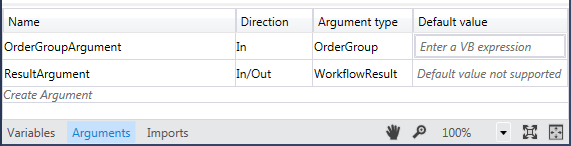
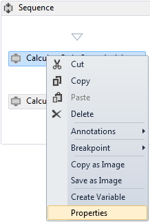
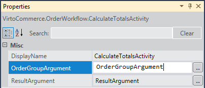

---
title: Creating workflow activities
description: Creating workflow activities
layout: docs
date: 2015-03-18T20:11:12.560Z
priority: 3
---
## Creating and using Order workflows

Creating and using a workflow consists of several steps:

1. Creating an activity
2. Creating a workflow and configuring its settings
3. Registering the workflow
4. Calling the workflow through services

## Creating an activity

1. Create a new project for activities. Steps to be taken are described in `To create the activity library project` paragraph in <a href="http://msdn.microsoft.com/en-us/library/dd489453.aspx" rel="nofollow">http://msdn.microsoft.com/en-us/library/dd489453.aspx</a> tutorial.
2. Add a reference to VirtoCommerce.OrderWorkflowActivities.dll library.
3. Create activity code class. Add a new class, declare it public and derive it from **OrderActivityBase** class from namespace **VirtoCommerce.OrderWorkflow**. The base class has the
  ```
  protected OrderGroup CurrentOrderGroup { get; set; }
  ```
  property, which should be used for activity actions. All changes are saved to this property and returned back from activity.
4. Implement activity logic by overriding the **Execute** method.
5. Repeat steps 3-4 for every individual activity needed.

## Creating a workflow and configuring its settings

The new activity can be added to an existing workflow or a new workflow can be created.

1. Create a new project for workflows. Steps to be taken are described in `To create the activity library project` paragraph in <a href="http://msdn.microsoft.com/en-us/library/dd489453.aspx" rel="nofollow">http://msdn.microsoft.com/en-us/library/dd489453.aspx</a> tutorial.
2. Create a workflow. Steps to be taken are described in `To create the workflow` paragraph in <a href="http://msdn.microsoft.com/en-us/library/gg983473.aspx" rel="nofollow">http://msdn.microsoft.com/en-us/library/gg983473.aspx</a> tutorial.
3. Open workflow designer. Double-click workflow xaml file in **Solution Explorer** to display the workflow in the designer, if it is not already displayed.
4. Fill arguments for a workflow. Required argument data is:

|Name|Direction|Argument type|
|----|---------|-------------|
|OrderGroupArgument|In|OrderGroup|
|ResultArgument|In/Out|WorkflowResult

How to: Use the Argument Designer: <a href="http://msdn.microsoft.com/en-us/library/dd489400.aspx" rel="nofollow">http://msdn.microsoft.com/en-us/library/dd489400.aspx</a>

After filling the arguments in the Argument Designer, they should look like this:



5. Activities to a workflow are added using a Toolbox. Adding your custom activities to the Toolbox: Open the Toolbox window, if it is not already displayed. Next steps to be taken are described in `To add an activity to the Toolbox from an assembly` paragraph in <a href="http://msdn.microsoft.com/en-us/library/dd797579.aspx" rel="nofollow">http://msdn.microsoft.com/en-us/library/dd797579.aspx</a> tutorial.
6. Drag and drop a **Sequence** activity from the **Control Flow** section of the **Toolbox** onto the workflow designer pane.
7. Drag your activity from the **Toolbox** and drop it onto the **Sequence** activity.
8. Setting activity properties. Select the activity just added to the **Sequence** and open properties dialog from context menu:



Set **OrderGroupArgument** and **ResultArgument** values: `OrderGroupArgument` and `ResultArgument` respectively:



9. Build current project.

## Registering the workflow

### Configuration

1. Add the following section under VirtoCommerce sectionGroup to web.config or app.config file:
  ```
  <sectionGroup name="VirtoCommerce">
  <section name="Workflow" type="VirtoCommerce.Foundation.Frameworks.Workflow.WorkflowConfiguration, VirtoCommerce.Foundation" />
    ...
  </sectionGroup>
  ```
2. Add the following configuration of workflows under VirtoCommerce:
  ```
  <VirtoCommerce>
    ...
    <Workflow>
      <activityProvider defaultProvider="ResourceActivityProvider">
        <providers>
          <add name="ResourceActivityProvider" type="VirtoCommerce.Foundation.Frameworks.Workflow.Providers.ResourceWorkflowActivityProvider, VirtoCommerce.Foundation" />
        </providers>
      </activityProvider>
      <availableWorkflows>
        <add name="ShoppingCartValidateWorkflow" type="VirtoCommerce.OrderWorkflow.ShoppingCartValidateWorkflow, VirtoCommerce.OrderWorkflow"/>
        <add name="ShoppingCartPrepareWorkflow" type="VirtoCommerce.OrderWorkflow.ShoppingCartPrepareWorkflow, VirtoCommerce.OrderWorkflow"/>
        <add name="ShoppingCartCheckoutWorkflow" type="VirtoCommerce.OrderWorkflow.ShoppingCartCheckoutWorkflow, VirtoCommerce.OrderWorkflow"/>
        <add name="OrderRecalculateWorkflow" type="VirtoCommerce.OrderWorkflow.OrderRecalculateWorkflow, VirtoCommerce.OrderWorkflow"/>
        <add name="CalculateReturnTotalsWorkflow" type="VirtoCommerce.OrderWorkflow.CalculateReturnTotalsWorkflow, VirtoCommerce.OrderWorkflow"/>
      </availableWorkflows>
    </ Workflow >
  ```
3. Call workflow using the name used in configuration.  For example to call order workflow useOrderService.ExecuteWorkflow(string workflowName, OrderGroup orderGroup); method.  (ex.:_orderService.ExecuteWorkflow("CalculateReturnTotalsWorkflow", order); )

### Activity provider

Default activity provider is using reflection to load workflow activity by name. First it initializes by reading avaiableWorkflows config and creates dictionary mapping for workflow name and full type name. Then provider loads type, creates instance and returns it by casting to System.Activities.Activity. If type cannot be loaded provider will throw TypeLoadExeption.

### Available workflows

This configuration line defines mapping between full type name and internal name used to call workflows. When calling workflow by name it is important that name in configuration matches called workflow name.

## Calling the workflow through services

**IOrderService.ExecuteWorkflow** method is used for executing workflows remotely. Typical code:

```
var orderService = ServiceLocator.Current.GetInstance<IOrderService>();
var result = orderService.ExecuteWorkflow(WorkflowName, InnerItem);
InnerItem.InjectFrom<CloneInjection>(result.OrderGroup);
```

where variables WorkflowName is a workflow name configured in `Registering the workflow` step and InnerItem is an OrderGroup.
