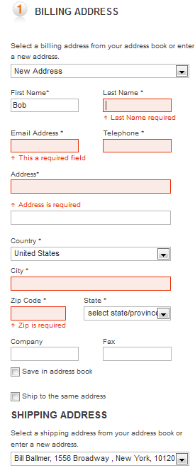
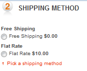

---
title: Creating an order in frontend
description: Creating an order in frontend
layout: docs
date: 2015-03-18T20:11:12.560Z
priority: 1
---
## Introduction

This guide describes order life cycle starting from front end where user has to add items to his shopping cart, then proceed to checkout where order is validated and created. Later order is processed in management tool.

## Searching products

The very first step in order life cycle is finding the product that buyer wants to purchase. For this purpose user can browse catalog using menu, choose item from top promoted items in menu or home page, search for products and filter them to narrow down the search results. The most important thing is that buyer could always find what he or she is looking for in fastest and easiest way possible.

Here is sample code from SearchController in web application:

```
public ActionResult SearchResultsByKeywords(string keywords, SearchParameters parameters)
{
  ViewBag.Title = String.Format("Searching by '{0}'", keywords);
  var criteria = new CatalogItemSearchCriteria {SearchPhrase = keywords};
  var results = SearchResults(criteria, parameters);
  return PartialView("SearchResultsPartial", results);
}

public CatalogItemSearchModel SearchResults(CatalogItemSearchCriteria criteria, SearchParameters parameters)
{
  var pageNumber = parameters.PageIndex;
  var pageSize = parameters.PageSize;

  if (pageSize == 0)
    Int32.TryParse(StoreHelper.GetCookieValue("pagesizecookie"), out pageSize);
  else
    StoreHelper.SetCookie("pagesizecookie", pageSize.ToString(CultureInfo.InvariantCulture), DateTime.Now.AddMonths(1));

  if (pageSize == 0)
    pageSize = SearchParameters.DefaultPageSize;

  criteria.Locale = "en-us";
  criteria.Catalog = UserHelper.CustomerSession.CatalogId;
  criteria.RecordsToRetrieve = pageSize;
  criteria.StartingRecord = (pageNumber - 1)*pageSize;
  criteria.Pricelists = UserHelper.CustomerSession.Pricelists;
  return GetModelFromCriteria(criteria, parameters);
}

private CatalogItemSearchModel GetModelFromCriteria(CatalogItemSearchCriteria criteria, SearchParameters parameters)
{
  criteria.Currency = UserHelper.CustomerSession.Currency;
  var dataSource = CreateDataModel(criteria, parameters, true);
  return dataSource;
}

private CatalogItemSearchModel CreateDataModel(CatalogItemSearchCriteria criteria, SearchParameters parameters, bool cacheResults)
{
  var session = UserHelper.CustomerSession;
  // Create a model
  var dataSource = new CatalogItemSearchModel();
  // Now fill in filters
  var searchHelper = new SearchHelper(_storeClient.GetCurrentStore());
  var filters = searchHelper.Filters;
  // Add all filters
  foreach (var filter in filters)
  {
    // Check if we already filtering
    if (parameters.Facets.ContainsKey(filter.Key))
      continue;
    criteria.Add(filter);
  }
  // Get selected filters
  var facets = parameters.Facets;
  dataSource.SelectedFilters = new List<SelectedFilterModel>();
  if (facets.Count != 0)
  {
    foreach (var key in facets.Keys)
    {
      var filter = (from f in filters where f.Key == key select f).SingleOrDefault();
      var val = (from v in searchHelper.GetFilterValues(filter) where v.Id == facets[key] select v).SingleOrDefault();
      if (val != null)
      {
        criteria.Add(filter, val);
        dataSource.SelectedFilters.Add(new SelectedFilterModel(searchHelper.Convert(filter), searchHelper.Convert(val)));
      }
    }
  }
  // Perform search
  var sort = parameters.Sort; //CommonHelper.GetCookieValue("sortcookie");
  if (String.IsNullOrEmpty(sort))
  {
    sort = StoreHelper.GetCookieValue("sortcookie");
  }
  else
  {
    StoreHelper.SetCookie("sortcookie", sort, DateTime.Now.AddMonths(1));
  }
  SearchSort sortObject = null;
  if (!String.IsNullOrEmpty(sort))
  {
    if (sort.Equals("name", StringComparison.OrdinalIgnoreCase))
    {
      sortObject = new SearchSort("name");
    }
    else if (sort.Equals("price", StringComparison.OrdinalIgnoreCase))
    {
      sortObject = new SearchSort(session.Pricelists.Select(priceList =>
        new SearchSortField(String.Format("price_{0}_{1}", criteria.Currency.ToLower(),В priceList.ToLower()))
        {
          IgnoredUnmapped = true
        }).ToArray());
    }
  }
  // Put default sort order if none is set
  if (sortObject == null)
  {
    sortObject = CatalogItemSearchCriteria.DefaultSortOrder;
  }
  criteria.Sort = sortObject;
  // Search using criteria, it will only return IDs of the items
  var results = _catalogClient.SearchItems("default", criteria, cacheResults);
  // Now load items with appropriate 
  Item[] items = null;
  if (results.Items.Any())
  {
    var itemsOrderedList = results.Items.ToList();
    var itemsTemp = _catalogClient.GetItems(results.Items, true, ItemResponseGroups.ItemAssets |В ItemResponseGroups.ItemProperties);
    items = itemsTemp.OrderBy(i => itemsOrderedList.IndexOf(i.ItemId)).ToArray();
  }
  // Now convert it to the model
  var itemModelList = new List<CatalogItemWithPriceModel>();
  if (items != null)
  {
    var prices = _priceListClient.GetLowestPrices(session.Pricelists, results.Items, 1);
    foreach (var item in items)
    {
      PriceModel priceModel = null;
      if (prices != null && prices.Any())
      {
        var lowestPrice = (from p in prices where p.ItemId.Equals(item.ItemId, StringComparison.OrdinalIgnoreCase) select p).SingleOrDefault();
        if (lowestPrice != null)
        {
          priceModel = _marketing.GetItemPriceModel(item, lowestPrice);
        }
      }
      var itemModel = new CatalogItemWithPriceModel(item, priceModel, null);
      itemModelList.Add(itemModel);
    }
  }
  dataSource.FilterGroups = searchHelper.Convert(results.FacetGroups);
  dataSource.CatalogItems = itemModelList.ToArray();
  dataSource.Criteria = criteria;
  // Create pager
  var pager = new PagerModel
  {
    TotalCount = results.TotalCount,
    CurrentPage = criteria.StartingRecord/criteria.RecordsToRetrieve + 1,
    RecordsPerPage = criteria.RecordsToRetrieve,
    StartingRecord = criteria.StartingRecord,
    DisplayStartingRecord = criteria.StartingRecord + 1,
    SortValues = new[] {"Position", "Name", "Price"},
    SelectedSort = sort
  };
  var end = criteria.StartingRecord + criteria.RecordsToRetrieve;
  pager.DisplayEndingRecord = end > results.TotalCount ? results.TotalCount : end;
  dataSource.Pager = pager;

  return dataSource;
}
```

## Adding products to shopping cart

The next step, when shopper has found items that he or she desires to purchase, is to add those item to the shopping cart. The shopping cart model shares the same base model OrderGroup with the Order and can be easily converted to Order. In order to add item to shopping cart user must specify quantity (if quantity is not specified it is assumed that only one item is added).

* First the cart is retrieved using VirtoCommerce.Web.Client.Helpers.CartHelper. The default shopping cart name is "ShoppingCart"
* Then code checks if there is item in wish list and if so it moves item from wish list to shopping cart
* Item is added to cart
* SaveChanges is called, which subsequently calls "ShoppingCartValidateWorkflow" to check item quantities and adjust what is not valid.

Below is the sample code from CartController:

```
private LineItem DoAddToCart(string cartName, decimal qty, Item catalogItem)
{
  LineItem addedLineItem = null;
  if (catalogItem != null)
  {
    var ch = GetCartHelper(cartName);
    // add entry to the cart. If it's in the wish list, move it from the wish list to the cart.
    var helper = GetCartHelper(CartHelper.WishListName);
    var li = helper.LineItems.FirstOrDefault(item => item.CatalogItemId == catalogItem.ItemId);
    if (li != null)
    {
      addedLineItem = ch.AddItem(catalogItem, li.Quantity, false);
      helper.Remove(li);
      // If wish list is empty, remove it from the database
      if (helper.IsEmpty)
      {
        helper.Delete();
      }
      helper.SaveChanges();
    }
    else
    {
      // Add item to a cart.
      addedLineItem = ch.AddItem(catalogItem, qty, false);
      SaveChanges(ch);
    }
  }
  return addedLineItem;
}

private Dictionary<string, string> SaveChanges(CartHelper helper)
{
  ...
  var errors = new Dictionary<string, string>();
  helper.RunWorkflow("ShoppingCartValidateWorkflow", errors);
  helper.SaveChanges();
  return errors;
}
```

## Checking out

The final step in front-end is checkout page, where quite many actions have to be done in order to successfully create the order that can be further processed. User is not required to be logged in or even have an account to complete the purchase. However user can sign in at any time and then his latest order and all carts are migrated from anonymous user to his/her account.

Below is the sample code from web app Global.asax that does the profile migration:

```
private void Profile_MigrateAnonymous(Object sender, ProfileMigrateEventArgs pe)
{
  // Associate orders with a current customer
  var orderId = HttpContext.Current.Session["LatestOrderId"];
  if (orderId != null)
  {
    var client = ServiceLocator.Current.GetInstance<OrderClient>();
    var orders = client.GetAllCustomerOrders(pe.AnonymousID, UserHelper.CustomerSession.StoreId);
    if (orders != null)
    {
      foreach (var order in orders)
      {
        order.CustomerId = UserHelper.CustomerSession.CustomerId;
        order.CustomerName = User.Identity.Name;
      }
      client.SaveChanges();
    }
  }
  // Migrate shopping cart
  var cart = new CartHelper(CartHelper.CartName);
  var anonymousCart = new CartHelper(CartHelper.CartName, pe.AnonymousID);
  // Only perform merge if cart is not empty
  if (!anonymousCart.IsEmpty)
  {
    // Merge cart
    cart.Add(anonymousCart.Cart, true);
    cart.SaveChanges();
    // Delete anonymous cart
    anonymousCart.Delete();
    anonymousCart.SaveChanges();
  }
  var wishlist = new CartHelper(CartHelper.WishListName);
  var anonymousWishlist = new CartHelper(CartHelper.WishListName, pe.AnonymousID);
  // Only perform merge if cart is not empty
  if (!anonymousWishlist.IsEmpty)
  {
    // Merge wish list
    wishlist.Add(anonymousWishlist.Cart, true);
    if (String.IsNullOrEmpty(wishlist.Cart.BillingCurrency))
    {
      wishlist.Cart.BillingCurrency = UserHelper.CustomerSession.Currency;
    }
    wishlist.SaveChanges();
    // Delete anonymous wish list
    anonymousWishlist.Delete();
    anonymousWishlist.SaveChanges();
  }
  //Delete the anonymous data from the database
  //ProfileManager.DeleteProfile(pe.AnonymousID);
  //Remove the anonymous identifier from the request so 
  //this event will no longer fire for a logged-in user
  AnonymousIdentificationModule.ClearAnonymousIdentifier();
}
```

The checkout page consist of those parts that must be filled in correctly to proceed:

* The address selection part
* The shipment method selection part
* The payment method selection part
* [Optional] Coupon apply

## Addresses

If user is authenticated, application can use addresses from his/her address book. Otherwise user must specify all required fields in address section to proceed. User can also add new addresses to his/her address book from checkout page if there are no suitable addresses in book. User can also create an account by selecting check box and entering passwords. There are two addresses required: one for billing and one for shipping. By default those addresses are same, but user can specify another address for shipping when needed.



## Shipping method

It is required to select one shipping method. Shipping methods are configured in commerce manager.

Below is a sample code to retrieve shipping methods and create model for view:

```
/// <summary>
///В Gets all shipping methods.
/// </summary>
/// <returns>shipping method model</returns>
public static ShippingMethodModel[] GetAllShippingMethods(this CartHelper cart)
{
  var list = new List<ShippingMethodModel>();
  var methodIds = new List<string>();
  var options = cart.ShippingClient.GetAllShippingOptions();
  foreach (var option in options)
  {
    foreach (var method in option.ShippingMethods)
    {
      var model = new ShippingMethodModel(method, cart.Cart);
      methodIds.Add(method.ShippingMethodId);
      list.Add(model);
    }
  }
  var rates = GetAllShippingRates(cart, methodIds.ToArray(), cart.LineItems);
  if (rates != null)
  {
    foreach (var sm in list)
    {
      sm.Rate = (from r in rates where r.Id == sm.Id select r).SingleOrDefault();
    }
  }
  return list.ToArray();
}
```



## Payment method

A valid Payment method must be selected in order to proceed. Payment methods are configured in commerce manager

Below is a sample code for creating payment methods:

```
private List<PaymentModel> GetPayments()
{
  var paymentsString = (from c in _storeClient.GetCurrentStore().PaymentGateways select c.PaymentGateway).ToArray();
  var methods = _paymentClient.GetAllPaymentsMethods(paymentsString);
  var methodModels = new List<PaymentModel>();
  var cardTypes = new List<ListModel>
  {
    new ListModel("--Please Select--", ""),
    new ListModel("American Express", "AE"),
    new ListModel("Visa", "VI"),
    new ListModel("Master Card", "MC"),
    new ListModel("Discover", "DI")
  };
  var months = new List<ListModel>
  {
    new ListModel("Month", ""),
    new ListModel("01 - January", "1"),
    new ListModel("02 - February", "2"),
    new ListModel("03 - March", "3"),
    new ListModel("04 - April", "4"),
    new ListModel("05 - May", "5"),
    new ListModel("06 - June", "6"),
    new ListModel("07 - July", "7"),
    new ListModel("08 - August", "8"),
    new ListModel("09 - September", "9"),
    new ListModel("10 - October", "10"),
    new ListModel("11 - November", "11"),
    new ListModel("12 - December", "12")
  };
  var years = new List<ListModel> { new ListModel("Year", "") };
  for (var index = DateTime.Now.Year; index <= DateTime.Now.Year + 10; index++)
  {
    years.Add(new ListModel(index.ToString(CultureInfo.InvariantCulture), index.ToString(CultureInfo.InvariantCulture)));
  }
  foreach (var method in methods.OrderBy(m => m.Priority).ThenBy(m => m.Name))
  {
    if (method.Name.Equals("Credit", StringComparison.OrdinalIgnoreCase))
    {
      if (!Request.IsAuthenticated)
        continue;
    }
    var paymentMethodLanguage = method.PaymentMethodLanguages.FirstOrDefault(pml => pml.LanguageCode == UserHelper.CustomerSession.Language);
    var model = new PaymentModel
    {
      Name = method.Name,
      DisplayName = paymentMethodLanguage != null ? paymentMethodLanguage.DisplayName : method.Description,
      Months = months.ToArray(),
      Years = years.ToArray(),
      CardTypes = cardTypes.ToArray()
    };
    methodModels.Add(model);
  }
  return methodModels;
}
```


## Discount coupon

Optionally user can apply the discount coupon. Discounts are configurable in commerce manager marketing/promotions tab.


Below is sample code for applying discounts

```
public ActionResult ApplyCoupon(string couponCode)
{
  if (HttpContext.Session != null)
  {
    HttpContext.Session["CurrentCouponCode"] = couponCode;
  }
  _catalogClient.CustomerSession.CouponCode = couponCode;
  var helper = GetCartHelper(CartHelper.CartName);
  var warnings = SaveChanges(helper);
  var message = warnings != null && warnings.ContainsKey(WorkflowMessageCodes.COUPON_NOT_APPLIED) ? warnings[WorkflowMessageCodes.COUPON_NOT_APPLIED] : null;
  return Json(message);
}
```

## Validation

Each time something changes cart is reset, updated, validated and workflows are called to update and validate cart. Then changes are saved and cart is refrehed to user. The actions that fire updates to cart are chaining shipping method, applying coupon or pressing submit button. The following actions must be done in correct order:

* The cart is reset to remove previous payment, shipping method and lineItems.
* Update cart with new selections before calling workflows
* Run workflow "ShoppingCartPrepareWorkflow"
* Run workflow "ShoppingCartValidateWorkflow"
* Save the changes made
* Display updates

Below is action code for updating cart.

```
public ActionResult SubmitChanges(CheckoutModel checkoutModel)
{
  // reset the cart
  Ch.Reset();
  // Update cart from the postback
  UpdateCart(checkoutModel);
  // run workflows
  Ch.RunWorkflow("ShoppingCartPrepareWorkflow");
  Ch.RunWorkflow("ShoppingCartValidateWorkflow");
  // save changes
  Ch.SaveChanges();
  return DisplayCart();
}
```

The UpdateCart method does the actual changes to shopping cart and report any errors that were found in validating model while updating cart:

* Updates the billing address by taking it from address book or new address
* Validates billing address
* Updates shipping address by taking it from billing address (if use same chosen), or takes it from address book or creates new address
* Validates shipping address
* Creates and validates payment method
* Update shipping method for all lineItems

```
private void UpdateCart(CheckoutModel model, bool isFinalStep = false)
{
  PrepareCheckoutModel(model);
  var errors = new List<string>();
  var form = Ch.OrderForm;
  #region Process billing address
  var billingAddress = Ch.FindAddressByName("Billing");
  if (billingAddress == null)
  {
    billingAddress = new OrderAddress();
    Ch.Cart.OrderAddresses.Add(billingAddress);
  }
  var orderAddressId = billingAddress.OrderAddressId;
  // if not empty, then we use existing customer address
  if (!String.IsNullOrEmpty(model.AddressBook.BillingAddressId))
  {
    // load address from the customer address book
    var userAddress = _userClient.GetUserAddress(model.AddressBook.BillingAddressId);
    if (userAddress != null)
    {
      billingAddress.InjectFrom(userAddress);
    }
  }
  else
  {
    billingAddress.InjectFrom(new IgnorePropertiesInjection("OrderGroupId", "OrderGroup", "OrderAddressId", "Created"), model.BillingAddress.Address);
  }
  billingAddress.Name = "Billing";
  billingAddress.OrderAddressId = orderAddressId;
  model.BillingAddress.Address = billingAddress;
  var hasValidBillingAddress = DoValidateModel(billingAddress);
  if (hasValidBillingAddress)
  {
    Ch.Cart.AddressId = orderAddressId;
    Ch.OrderForm.BillingAddressId = orderAddressId;
  }
  else
  {
    //Remove invalid address from cart if not final step
    //otherwise saving cart will fail
    if (!isFinalStep)
    {
      Ch.Cart.OrderAddresses.Remove(billingAddress);
    }
    errors.Add("Billing address is invalid");
  }
  #endregion
  #region Process shipping address
  var shippingAddress = Ch.FindAddressByName("Shipping");
  if (shippingAddress == null)
  {
    shippingAddress = new OrderAddress();
    Ch.Cart.OrderAddresses.Add(shippingAddress);
  }
  var shippingAddressId = shippingAddress.OrderAddressId;
  if (model.UseForShipping)
  {
    shippingAddress.InjectFrom(billingAddress);
  }
  else if (!String.IsNullOrEmpty(model.AddressBook.ShippingAddressId))
  {
    // load address from the customer address book
    var userAddress = _userClient.GetUserAddress(model.AddressBook.ShippingAddressId);
    if (userAddress != null)
    {
      shippingAddress.InjectFrom(userAddress);
    }
  }
  else
  {
    shippingAddress.InjectFrom(new IgnorePropertiesInjection("OrderGroupId", "OrderGroup", "OrderAddressId", "Created"), model.ShippingAddress.Address);
  }
  shippingAddress.Name = "Shipping";
  shippingAddress.OrderAddressId = shippingAddressId;
  model.ShippingAddress.Address = shippingAddress;
  var hasValidShippingAddress = DoValidateModel(shippingAddress);
  if (!hasValidShippingAddress)
  {
    //Remove invalid address from cart if not final step
    //otherwise saving cart will fail
    if (!isFinalStep)
    {
      Ch.Cart.OrderAddresses.Remove(shippingAddress);
    }
    errors.Add("Shipping address is invalid");
  }
  #endregion
  #region Update payment info
  var paymentmethod = model.PaymentMethod;
  var paymentCreated = false;
  if (!String.IsNullOrEmpty(paymentmethod))
  {
    PaymentModel paymentModel = null;
    if (model.Payments != null)
    {
      paymentModel = model.Payments.Single(p => p.Name.Equals(paymentmethod, StringComparison.OrdinalIgnoreCase));
    }
    var payment = CreatePayment(form, paymentmethod, paymentModel);
    form.Payments.Clear();
    if (DoValidateModel(payment))
    {
      form.Payments.Add(payment);
      paymentCreated = true;
    }
  }
  if (!paymentCreated)
  {
    errors.Add("Failed to create payment");
  }
  #endregion
  #region Update shipment delivery method
  foreach (var lineItem in form.LineItems)
  {
    var shippingMethod = Ch.GetAllShippingMethods().First(s => s.Id == model.ShippingMethod);
    lineItem.ShippingMethodName = shippingMethod.DisplayName;
    lineItem.ShippingMethodId = shippingMethod.Id;
    if (hasValidShippingAddress)
    {
      lineItem.ShippingAddressI d = model.ShippingAddress.Address.OrderAddressId;
    }
  }
  #endregion
  foreach (var err in errors)
  {
    ModelState.AddModelError("", err);
  }
}
```

The final step is actual checkout that is very similar to submit cart except different wokflow is called and checkout is not allowed until all validation errors are fixed.

* Update cart is called to do final changes to cart and validate
* If there are any error they are displayed and proceeding is not allowed
* Otherwise run workflow "ShoppingCartCheckoutWorkflow"
* Do save cart
* Save cart as order (generate unique tracking number, update cart names)
* If user is authorized save new addresses to book when needed
* If user is anonymous and wants to create account, register new user based on addresses and password entered
* Show order success page

```
public ActionResult ProcessCheckout(CheckoutModel checkoutModel)
{
  UpdateCart(checkoutModel, true);
  if (!ModelState.IsValid)
  {
    return View("Index", checkoutModel);
  }
  // run business rules
  Ch.RunWorkflow("ShoppingCartCheckoutWorkflow");
  Ch.SaveChanges();
  // Create order
  var order = Ch.SaveAsOrder();
  if (HttpContext.Session != null)
    HttpContext.Session["LatestOrderId"] = order.OrderGroupId;
  if (Request.IsAuthenticated)
  {
    var orgs = _userClient.GetOrganizationsForCurrentUser();
    if (orgs != null)
    {
      var org = orgs.SingleOrDefault();
      if (org != null)
        Ch.Cart.OrganizationId = org.MemberId;
    }
  }
  if (Request.IsAuthenticated)
  {
    var user = _userClient.GetCurrentCustomer(false);
    var changed = false;
    // Save addresses to customer address book
    if (checkoutModel.AddressBook.SaveBillingAddress)
    {
      var billing = OrderClient.ConvertToCustomerAddress(checkoutModel.BillingAddress.Address);
      billing.AddressId = Guid.NewGuid().ToString();
      user.Addresses.Add(billing);
      changed = true;
    }
    if (checkoutModel.AddressBook.SaveShippingAddress)
    {
      var shipping = OrderClient.ConvertToCustomerAddress(checkoutModel.ShippingAddress.Address);
      shipping.AddressId = Guid.NewGuid().ToString();
      user.Addresses.Add(shipping);
      changed = true;
    }
    if (changed)
    {
      _userClient.SaveCustomerChanges();
    }
  }
  //Create account for later use
  if (!Request.IsAuthenticated && checkoutModel.CreateAccount)
  {
    var regModel = new RegisterModel
    {
      ActionResult = RedirectToAction("ProcessCheckout", "Checkout", new { id = order.OrderGroupId })
    };
    regModel.InjectFrom(checkoutModel, checkoutModel.BillingAddress.Address);
    //Save billing address to book
    var billing = OrderClient.ConvertToCustomerAddress(checkoutModel.BillingAddress.Address);
    billing.AddressId = Guid.NewGuid().ToString();
    regModel.Addresses.Add(billing);
    //save shipping address to book
    if (!checkoutModel.UseForShipping)
    {
      var shipping = OrderClient.ConvertToCustomerAddress(checkoutModel.ShippingAddress.Address);
      shipping.AddressId = Guid.NewGuid().ToString();
      regModel.Addresses.Add(shipping);
    }
    TempData["RegisterModel"] = regModel;
    return RedirectToAction("Register", "Account");
  }
  // display success screen
  return RedirectToAction("ProcessCheckout", "Checkout", new { id = order.OrderGroupId });
}
```
