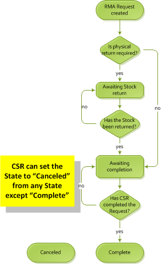

---
title: Returns lifecycle
description: Returns lifecycle
layout: docs
date: 2015-03-18T20:11:12.560Z
priority: 6
---
## Introduction

RMA request (return) is modeled as RmaReturn entity in VCF data model. RmaReturn is integral part of an Order. RmaReturn may be created for an Order of state Completed. A return life cycle is divided into separate distinct states (enumeration):

```
public enum RmaRequestStatus
{
  Complete = 1,
  Canceled = 2,
  AwaitingStockReturn = 4,
  AwaitingCompletion = 8
}
```

RmaReturn is always in one of enumeration's RmaRequestStatus states. If exact enumeration mach wouldn't be found then it's considered to be in a state of **AwaitingStockReturn**. State changing is controlled by StateMachineBase<string> implementation (RmaRequestStateMachineImpl class). This actually implements the state diagram depicted below and controls state transitions.



## Create return

Return is created as a part of an order. It's initial state can be **AwaitingStockReturn** or **AwaitingCompletion**. Return amount is calculated in external workflow, which is accessible trough service.

```
public Order CreateRmaReturn(Order order)
{
  CurrentOrder = order;
  var rmaRequest = CreateEntity<RmaRequest>();
  CurrentOrder.RmaRequests.Add(rmaRequest);

  // fill the RmaRequest properties, add/remove returning items using AddReturnItem / RemoveReturnItem respectively

  // setting correct status is essential
  if (rmaRequest.IsPhysicalReturnRequired)
    rmaRequest.Status = RmaRequestStatus.AwaitingStockReturn.ToString();
  else
    rmaRequest.Status = RmaRequestStatus.AwaitingCompletion.ToString();
}

public void AddReturnItem(LineItem lineItem, decimal returnQuantity, string returnReason)
{
  var returnItem = RmaReturnItems.FirstOrDefault(x => x.RmaLineItems[0].LineItemId == lineItem.LineItemId && x.ReturnReason == returnReason);

  if (returnItem == null)
  {
    var rmaLineItem = CreateEntity<RmaLineItem>();
    rmaLineItem.LineItemId = lineItem.LineItemId;
    rmaLineItem.LineItem = lineItem;

    returnItem = CreateEntity<RmaReturnItem>();
    returnItem.RmaLineItems.Add(rmaLineItem);
    returnItem.ItemState = RmaLineItemState.AwaitingReturn.ToString();
    returnItem.ReturnReason = returnReason;

    RmaRequest.RmaReturnItems.Add(returnItem);
    RmaReturnItems.Add(returnItem);
  }

  returnItem.RmaLineItems[0].ReturnQuantity += returnQuantity;
  lineItem.Quantity -= returnQuantity;

  if (lineItem.Quantity == 0)
  {
    _deletedLineItemList.Add(lineItem);
    AvailableForReturnLineItems.Remove(lineItem);
  }

  Recalculate();
}

public void RemoveReturnItem(RmaReturnItem returnItem, decimal returnQuantity)
{
  returnItem.RmaLineItems[0].ReturnQuantity -= returnQuantity;
  if (returnItem.RmaLineItems[0].ReturnQuantity <= 0)
  {
    RmaRequest.RmaReturnItems.Remove(returnItem);
    RmaReturnItems.Remove(returnItem);
  }

  var availableLineItem = AvailableForReturnLineItems.FirstOrDefault(x => x.LineItemId == returnItem.RmaLineItems[0].LineItemId);
  if (availableLineItem == null)
  {
    availableLineItem = _deletedLineItemList.FirstOrDefault(x => x.LineItemId == returnItem.RmaLineItems[0].LineItemId);
    // undelete
    AvailableForReturnLineItems.Add(availableLineItem);
  }

  availableLineItem.Quantity += returnQuantity;

  Recalculate();
}
 
// Recalculates current Return's amounts: fees, subtotals, totals, etc.
private void Recalculate()
{
  var orderService = ServiceLocator.Current.GetInstance<IOrderService>();
  var result = orderService.ExecuteWorkflow(RecalculateWorkflowName, CurrentOrder);
  CurrentOrder = result.OrderGroup;
}
```

## Transition to AwaitingCompletion state

State transition **AwaitingStockReturn** --> **AwaitingCompletion** is initiated upon RmaReturn RmaLineItems quantity change:

```
private void RecalculateRmaRequestStatuses()
{
  //if all lineItems physically returned to stock need change status 
  //to AwaitingCompletion
  var retVal = InnerItem.RmaReturnItems.All(x0 => x0.RmaLineItems.All(x => x.ReturnQuantity == x.Quantity));
  InnerItem.Status = retVal ? RmaRequestStatus.AwaitingCompletion.ToString() : RmaRequestStatus.AwaitingStockReturn.ToString();
}
```

where **InnerItem** is instance of **RmaReturn**.

## Complete

RMA request can gain status of Complete when there exists a state transition to RmaRequestStatus.Complete. Steps to complete:

1. If RmaReturn.ReturnTotal > 0, then "Create Refund" process with ReturnTotal amount should be initialized. 
2. If previous step completed successfully, then set the status: RmaReturn.Status =  RmaRequestStatus.Complete.ToString();
