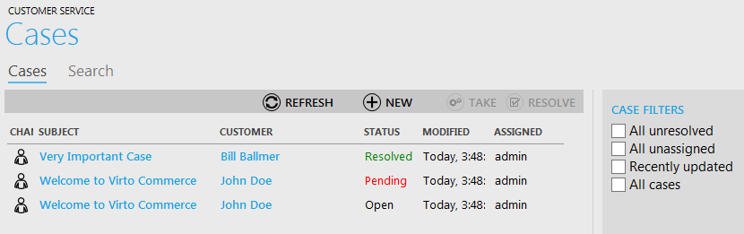
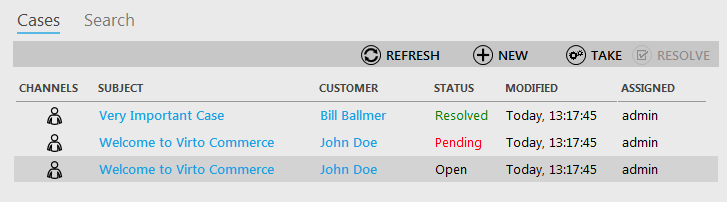
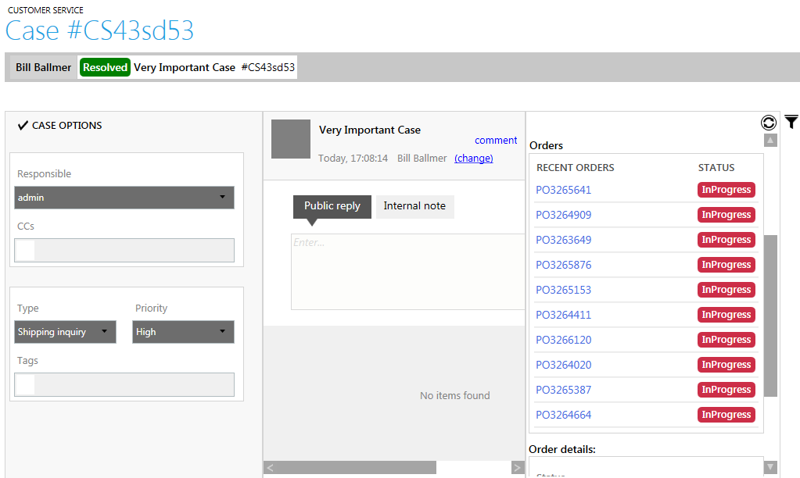
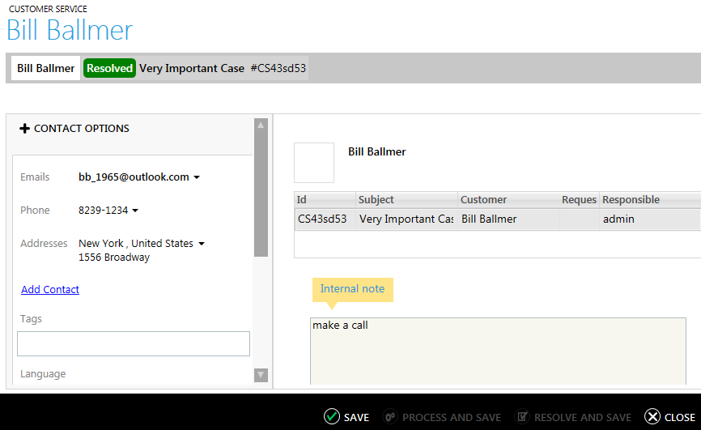

---
title: Customer service
description: Customer service
layout: docs
date: 2015-03-18T20:11:12.560Z
priority: 12
---
## Introduction

The Customer Service block is intended for the use of customer service representatives (CSRs). This section enables users to manage customers' cases, view order details and switch to order management when it is required.

What actions can be done by CSRs in this block:

* Viewing list of cases
* Applying filters to the list of cases
* Taking selecting cases (assigning yourself as a responsible)
* Resolving selected cases
* Creating new cases
* Searching cases
* Viewing case details
* Changing type and priority of the case
* Making public replies and internal notes
* Searching for a customer
* Viewing details of orders made by the customer and etc.

All actions available in the block must be done according to aplied scheme of service desk. This way various schemes can be managed and controled. Quick access to any order details allows CSRs resolving issues as soon as possible and leave customers satisfied with replies.

## Viewing Cases

All customers' cases created within the Virto Commerce Manager are displayed when you open "Customer Service" block.

The data fields of the cases:

* Channel - the way this case was initiated (internal, from e-mail and etc);
* Subject - a brief description of the case;
* Customer - a customer this case is related to;
* Status (open, pending, resolved) - the state of an issue according to its nearness of resolution;
* Modified - the date and time when the case was edited;
* Assigned - a user of Virto Commerce Manager whom ths case is assigned.

When there is a too large list of cases, use special filters on the right to search for the required case. This way you can view unresolved cases or cases that are not assigned to anyone yet. The graet meaning for using of this commerce manager block refers to the workflow applied in the customer service department. For instance, it does matters who will have to search for unassigned cases and assign them to CSRs, control unresolved cases and etc.

From this page cases can be **taken**. This means that a user assigns himself as responsible for this case and has to make a resolution. Just use "Take" button after click on a required case (or multiple cases).

> only open or unassigned cases can be taken.

## Editing Case Details

Open a case in "Customer Service" block. Here you can find full information about the case, related customer, his orders and etc. This information can be edited in case a user has enough rights and access.

1. **Case number** - number of the case that can be used for searching;
2. **Customer name** - a merchant related to this case;
3. **Title and status** - descriptive name or email subject of the case and case state (open. resolved, pending, closed and etc);
4. **Responsible** - a person who is in charge for resolving this case;
5. **CCs** - copies of messages wihtin the this case can be sent to other users somehow related to the order, the customer or the case;
6. **Type** - category of the case according to predefined list of categories (for instance, "payment issues", "claims", "shipment" and etc.);
7. **Priority** - selected according to the urgency of the case resolution. This is especially useful when there are too much of cases and CSRs need to resolve urgent and high priority cases first.
8. **Tags** - assigned keywords for the case. This field is also usually used for quick searching and categorization of cases in the system.
9. **Public reply** - message sent by e-mail and received by the customer.
10. **Internal note** - message visible only for internal users related to the case. This is udually used to resolve internal issues before sending an resolution or reply to the customer.

You can also view the **orders** related to the customer (the list of all orders and order details for each of them).

All of the details can be edited if the user has enough rights. Once the case is edited, click "Save".

## Editing Customer Details

When viewing case details, users can switch to customer edit mode and make any modifications of customer details. Just click customer's name to switch to this tab.

In this tab it is allowed to change customer details such as:

* Emails (customer can have more than one email, one of them is set as primary one and used for contact, alerts and newsletter);
* Phone (number of customer's phone);
* Addresses (customer can use different addresses for shipping);
* Tags (use them to differentiate customers, for instance "new", "vip", "partnership" and etc.);
* Language (customer's localization options);
* Time zone (time zone of a customer can be useful for email and sms newsletters);
* Birthday (also can be used for birthday newsletters and promo).

Here you can also leave an internal note (for instance, mark this customer as to make call to and etc.)

