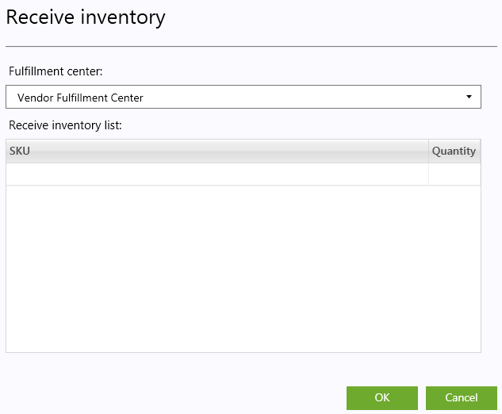
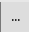
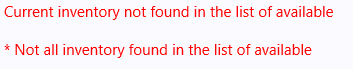
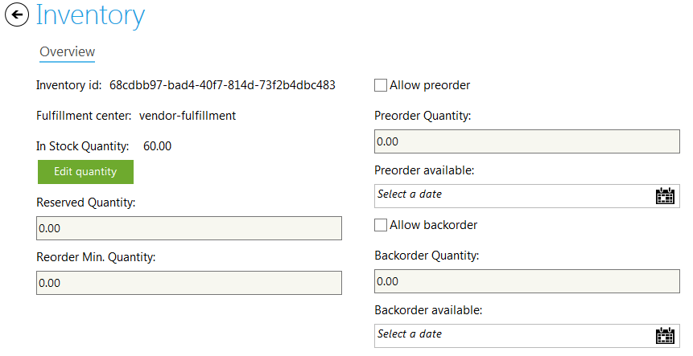
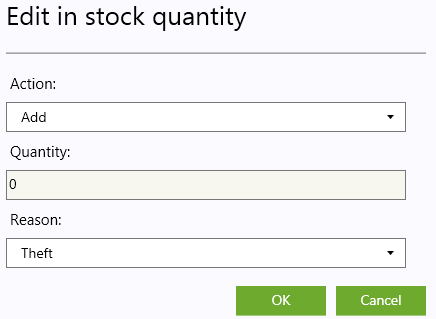
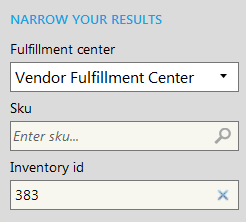

---
title: Inventory
description: Inventory
layout: docs
date: 2015-03-18T20:11:12.560Z
priority: 1
---
## Introduction

When shipments of existing products arrive, warehouse staff may update the system to reflect the new inventory. Receiving inventory is a feature of the Commerce Manager that allows authorized users to increase the stock quantity of existing products.

## Receiving inventory

1. Open **Fulfillment** module.
2. Open **Inventory** tab.
3. Click **Add** button.
  
4. In the popup dialog select appropriate Fulfillment center
  
5. Click the empty SKU entry enter Sku by hand or click
  
  button on the right of the text box and select the SKU.
6. Edit quantity and click keyboard's Enter.

> Inventory/Sku that is not in the list of available could be entered, but the warning message will appear
> 

7. After all inventory and quantities entered click OK button.

The quantity of the already available inventory will increase, and not found inventory will be added to the list.

## Editing iventory

1. Open **Fulfillment** module.
2. Open **Inventory** tab.
3. Select the inventory to edit. double-click it.
4. Edit the required fields
  

|Property|Description|
|--------|-----------|
|In Stock Quantity|The quantity that is in stock|
|Reserved Quantity|The quantity that is reserved (not allowed for ordering)|
|Reorder Min. Quantity|The minimum quantity that should be ordered to the supplier|
|Allow preorder|Sets if the inventory can be preordered|
|Preorder Quantity|The quantity that could be preordered|
|Preorder available|The date when the preorder will be available|
|Allow backorder|Sets if the inventory can be backordered|
|Backorder Quantity|The quantity that could be backordered|
|Backorder available|The date when the preorder will be available|

4.1 Edit **Quantity**

In the Edit quantity popup dialog enter if the quantity should be Increased or Decreased the quantity and the Reason for the edit.

5. Save changes.

## Searching for the Inventory

To find an inventory in the list, go to "Fulfillment" block and use filter on the right for searching.

