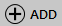
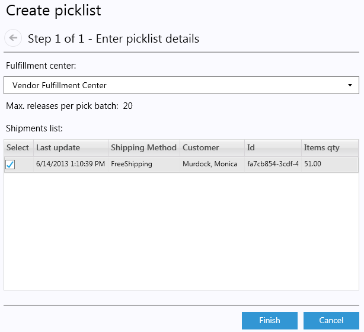
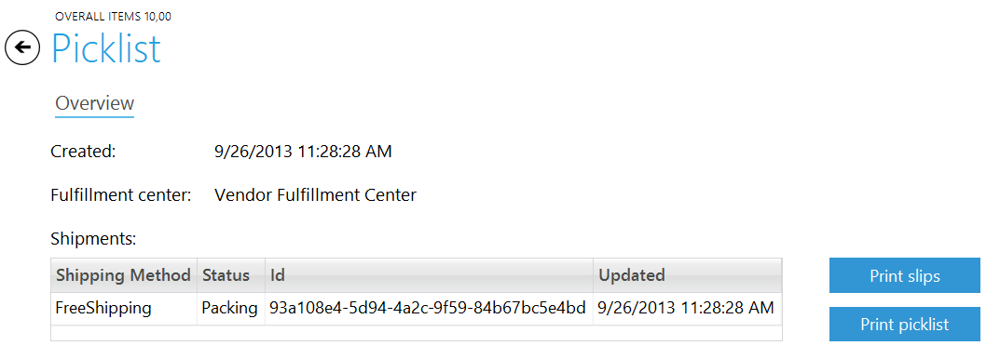
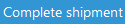
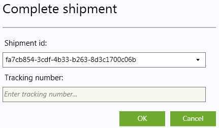

---
title: Picklists
description: Picklists
layout: docs
date: 2015-03-18T20:11:12.560Z
priority: 2
---
## Introduction

When a shipment is ready for release, warehouse staff retrieves, packs, and ships the contents of the order. Warehouse picklists are tools to assist in order fulfillment.

Picklists are lists detailing which items to retrieve from the warehouse, and how to assemble those items into orders. The picker can limit the number of shipments the picklist covers. For example, while there may be 153 shipments awaiting packing, a picker may only want to retrieve items for the first 10 shipments.

The following details are included in the picklist by default:

* Order Number
* Shipment Number
* SKU Code
* Product Name
* Quantity
* Customer details – Name, email, and shipping address

Once a picklist has been created, the status of the shipment is changed to "Packing". A picklist is assigned to the user who created it. An administrator or worker can view the status of all picklists and, if necessary, to reprint a picklist.

Once a shipment is in the “Packing” state, users may print a packing slip for the order. A packing slip is similar to an invoice, and is included with the parcel. 

At this stage in the order life cycle, the funds for the shipment have not yet been captured. The picker must “complete the order” when a shipment has been packaged and shipped. At that point, funds will be transferred.

## Creating a picklist

1. OpenВ **Fulfillment**В module.
2. Open **Picklists** tab.
3. ClickВ **Add**В button.
  
4. In the popup dialog select appropriate Fulfillment center (if it is the only one - it will be selected automatically)
  
5. In the Shipments list select shipments to be picked. Note that only shipments with "Released" will be available here.
6. Click **Finish**.

The created picklist will be added to the list of picklists.

## Printing a picklist

1. OpenВ **Fulfillment**В module.
2. Open **Picklists** tab.
3. Select the pick list to edit. double-click it.
4. Click **Print picklist** button.

The picklist PDF file will be generated and opened to print.

## Printing a picklist slips

1. OpenВ **Fulfillment**В module.
2. Open **Picklists** tab.
3. Select the pick list to edit. double-click it.
4. ClickВ **Print slips**В button.

The slips PDF file will be generated and opened to print.

## Completing a shipment

1. OpenВ FulfillmentВ module.
2. In the right upper corner click
  
  button.
3. In the popup dialog select Shipment that is shipped should be completed and enter the optional field 'Tracking number' if provided by the post service.
  
4. Click **OK** to complete the shipment.

> Only shipments that are Packing are available for completion.
