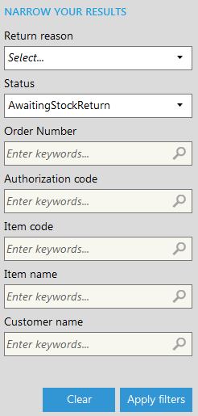
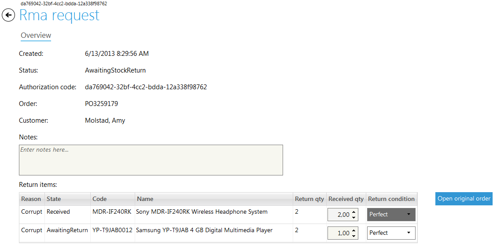

---
title: Returns & Exchanges
description: Returns & Exchanges
layout: docs
date: 2015-03-18T20:11:12.560Z
priority: 3
---
## Introduction

CSRs and warehouse staff may perform and accept returns, respectively. Returns and exchanges maximize user satisfaction and increase customer confidence and sales.

Only CSRs with required permissions can create a return or exchange. The system automatically creates a unique code, called the Return Merchandise Authorization (RMA) code, for all such transactions. Typically, the RMA number is recorded on the physical return to assist warehouse employees in matching the receipt of the return to the correct customer account.

For each SKU being returned, the CSR must enter the following details:

* Quantity being returned.
* Reason for return.
* Comment.

The CSR must also specify whether theВ  physical return of items is required before refund can be issued

Depending on whether the customer wants a refund or an exchange, the CSR has additional steps to execute:

* Refund: The CSR must enter a refund amount to be credited to the customer.
* Exchange: The CSR must select a SKU to exchange the incoming product for.

Refunds must be credited to the purchase medium used in the original purchase. In special situations, CSRs may issue a refund to another payment source. For example, if the buyer used a now-expired credit card for the purchase, a CSR may issue the refund to another credit card.

## Return completion

Once the return shipment received by the warehouse the Rma request can be completed.

1. Open **Fulfillment** module.
2. Open **Returns & Exchanges** tab.
3. Filter the required rma request using filter fields
  
4. Double click the required Rma request
5. In the popup dialog edit required fields
  

If all items that stated to be returned has been received and when saved the return status changes from AwaitingStockReturn to AwaitingCompletion.

When CSR does all work related to return or exchange (refunds money or ships exchanged items) he can go to original order and click Complete on return/exchange request. This changes return status to Completed.

> Comments and item state regarding returned items can be provided to CSR's and Customer support staff.

6. Click **Save** button

Click **Open original order**В button if original order information need to be reviewed.
