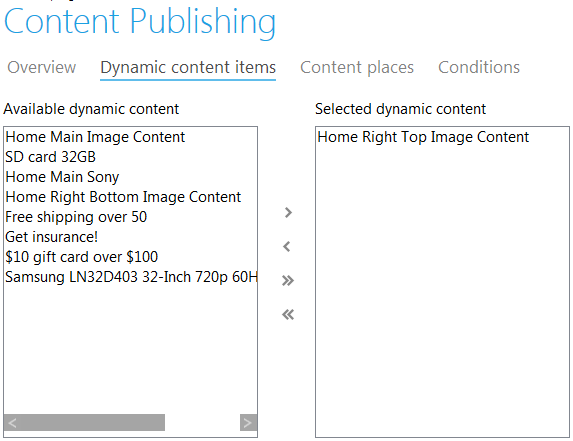
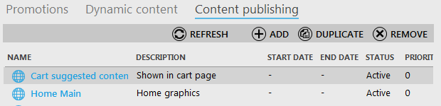
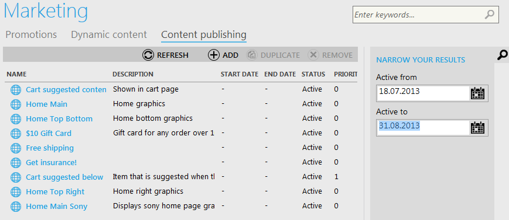

---
title: Content publishing
description: Content publishing
layout: docs
date: 2015-03-18T20:11:12.560Z
priority: 2
---
## Introduction

"Content Publishing" tab in Marketing module is intended to manage content blocks and define where, when and how it will be published (shown) on the site.

In [Dynamic Content](docs/old-versions/vc113userguide/marketing/dynamic-content) block we described how content of this kind is used and adjusted with help of Virto Commerce Manager. Content Publishing adjustment allows Commerce users to continue working with content without developers' assistance and apply chosen marketing strategy in the online shop.

Actions available in the block:

1. Creating and editing publishing content groups.
2. Duplicating content publishing items.
3. Applying filters for content publishing items search;
4. Defining content publishing properties (conditions of content publishing, content places and etc.)
5. Deleting content publishing groups.

## Create Content Publishing Group

Navigate to "Content Publishing" tab of Marketing block in Virto Commerce Manager and use "Add" button to create a content publishing item.

Then fill out the fields displayed onВ the 4thВ step of creating and save new item:

* Name - a descriptive name of a new content publishing;
* Description - full or brief description of content publishing;
* Priority - define the priority of the item;
* Check the box "Is active" to make this item available on the site;
* Define the date the item will be available from-to (you can leave them blank to make the item availableВ  constantly);
* Content places - where the content publishing will be available, for instance, in the cart or on the Home page (selected from the list);
* Dynamic Content - also selected from the list of available options, defines which kind of adjusted dynamic content will be related to this content publishing item.
* Availability conditions - conditions that content publishing must meet to be available on the site.

## Duplicate Content Publishing Group

When you need to create a content publishing group that has similar properties as already created item, you can use duplicating option. This will help to clone content publishing group and then edit any parameters that differ from its clone.

Navigate to the Marketing block, open Content Publishing Group tab, click the required item to clone and use "Duplicate" button.

## Editing Content Publishing

To edit content publishing details, navigate to Content Publishing block of Marketing module, double-click an item and make all required modifications. This way you can change any parameters described in theВ Create Content Publishing GroupВ article.

Editing may be required when you need to change the name or description of content publishing, change its content places or specify other conditions. Save the publishing when finished.

## Remove Dynamic Content Publishing

When you need to delete a dynamic content publishing, navigate to the Marketing block, open "Content Publishing" tab. Double-click the item you need to delete and use "Remove" button.

Confirm removing of content publishing to finish.

## Filtering Content Publishing Groups

When the list of content publishing groups isВ  too large, you canВ filter by dates on the right part of the block.

Navigate to "Content Publishing" tab of Marketing module. On the right define the period when the searchedВ items are active (active form, active to or active from-to).

