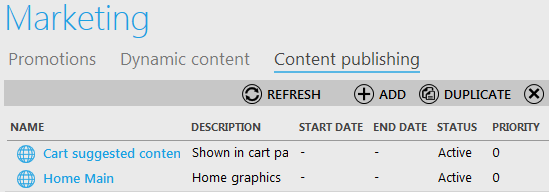

---
title: Create Content publishing group
description: Create Content publishing group
layout: docs
date: 2015-03-18T20:11:12.560Z
priority: 1
---
Navigate to "Content Publishing" tab of Marketing block in Virto Commerce Manager and use "Add" button to create a content publishing item.

Then fill out the fields displayed onВ the 4thВ step of creating and save new item:

* Name - a descriptive name of a new content publishing;
* Description - full or brief description of content publishing;
* Priority - define the priority of the item;
* Check the box "Is active" to make this item available on the site;
* Define the date the item will be available from-to (you can leave them blank to make the item availableВ  constantly);
* Content places - where the content publishing will be available, for instance, in the cart or on the Home page (selected from the list);
* Dynamic Content - also selected from the list of available options, defines which kind of adjusted dynamic content will be related to this content publishing item.
* Availability conditions - conditions that content publishing must meet to be available on the site.
