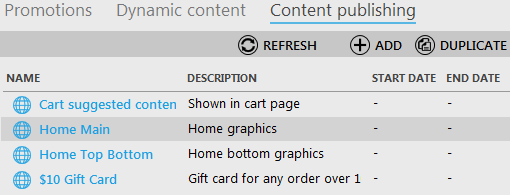

---
title: Duplicate Content publishing group
description: Duplicate Content publishing group
layout: docs
date: 2015-03-18T20:11:12.560Z
priority: 2
---
When you need to create a content publishing group that has similar properties as already created item, you can use duplicating option. This will help to clone content publishing group and then edit any parameters that differ from its clone.

Navigate to the Marketing block, open Content Publishing Group tab, click the required item to clone and use "Duplicate" button.

