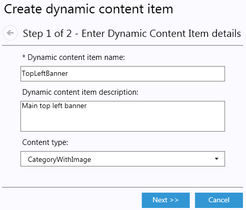
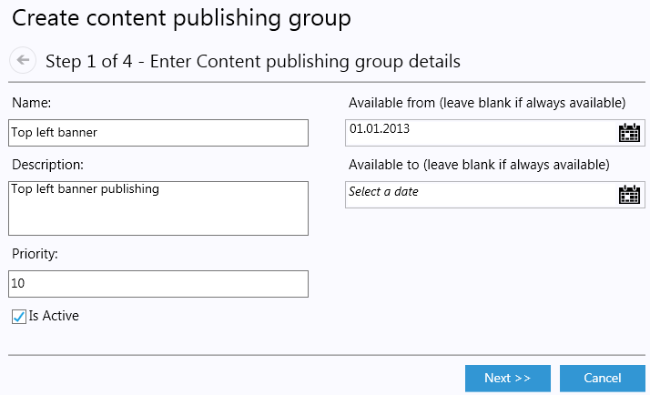
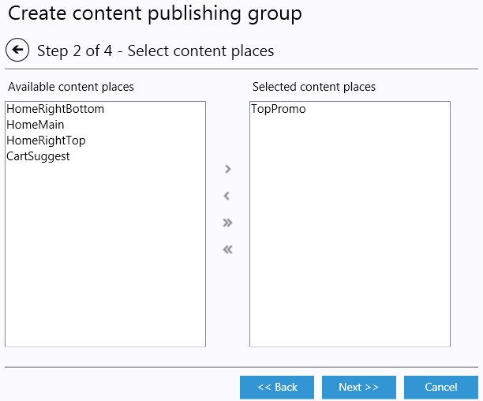
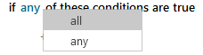

---
title: Dynamic content - Virto Commerce 1.13 User Guide
description: Dynamic content
layout: docs
date: 2015-03-18T20:11:12.560Z
priority: 1
---
## Introduction

The Dynamic Content feature allows marketers to create personalized shopping experiences for customers. Using this feature, you can deliver elements of a shopping experience based on a set of conditions or context.

To determine the conditions under which Dynamic Content will be shown to a customer, you need to consider:

* What content to display
* Who will see the content
* When should the content be displayed
* Where should the content be displayed

An example of Dynamic Content is the display of a USB memory stick, targeting customers who arrived at your frontend store from a search engine for "USB memory". In this example, Dynamic Content retrieves the image of the USB memory, along with the product price from the catalog database and displays it only to the customers that match the target conditions.

Dynamic Content is configured using the Virto Commerce administration application so that marketing personnel can set up Dynamic Content without relying on developers and server administrators. For images and Flash animations, you may need a graphic designer to create the file and upload it to the Assets. However, once that's done, the marketer can configure rules for displaying it without any assistance.

## Concepts

Traditionally, Marketing relies on a web designer to create the layout of each page of a store website. The web developer sets frames, links, promotions and other visual stuff layout in a specific arrangement. Dynamic Content allows marketing to change the content within that layout dynamically, without involving the web developer beyond the initial set up of the page layout. Initially, the web developer will set up placeholders named Content places on the page for Dynamic Content.

There are four interdependent components in Dynamic Content:

* Dynamic Content
* Content publishing
* Content type
* Content Place

The first two components, Dynamic Content and Content Publishing, are set up through the Virto Commerce administration tool by a marketer. The Dynamic Content provides a name for and a description of the type of content to be displayed. The Content publishing object tells the system when, under what conditions, and in which content place the dynamic content should be displayed.

The Content Places, are also created through Virto Commerce administration tool, but they are created by developers, web designers and system management personnel. Once a web developer has added a Content Place to a template, the developer or another user with appropriate permissions must register it in Virto Commerce administration application.

## Content types

A Content type is a template used to define a Dynamic Content Type. It describes how a particular content type is displayed and what information is required to display it. Virto Commerce includes several Content types for the most common types of Dynamic Content. For example, there is a Content type to display images with links (banner) another to display product data (product with image and price).

The following Dynamic Content Types are shipped with Virto Commerce out-of-the-box. Each requires one or more parameter values to specify things such as, what image file should display or what the target web page should display when clicked.

|Content type|Description|Parameters|
|------------|-----------|----------|
|CategoryWithImage|Displays a linked image to category within a catalog.|**CategoryId** - id of the category **ImageUrl** - link to the image **ExternalImageUrl** - link to the external image **Message** - message|
|CategoryUrl|Displays a link to category title text.|**Categoryid** - id of the category **Title** - user friendly title of the category|
|Flash|Displays an animated Flash file that cycles through three images. This Flash animation shows each of three images in succession, each having a clickable link that shows the shopper a different promotion. You will need to specify the URLs for each link within the Flash file.|**FlashFilePath** - path to the Flash animation file **Link1Url**, **Link2Url**, **Link3Url** - enter the complete URL to the target page (item, promotion etc)|
|Html|Displays HTML content.|**RawHtml** - enter raw Html formatted text here|
|ImageClickable|Displays an image that can be clicked to perform some action. For example, redirect to another page, product or promotion.|**Alternative text** - text if the image can not be displayed. **ImageUrl** - link to the image **TargetUrl** - link to the target when image clicked **Title** - text (optional)|
|ImageNonClickable|Displays an image. For example, use this type to alert customers to a shopping cart promotion that will give them a discount on checkout.|**Alternative text** - text if image can not be displayed **ImageFilePath** - path to the image file|
|ProductWithImageAndPrice|Displays the image, price and product name detail for an item in your catalog.|**ProductCode** - target product code|

## Content places

Content Place is a location within an HTML page that can display Dynamic Content. You can think of it as the physical space on the frontend page where the Dynamic Content specified by the Content types appears.

Content Places are created by web developers in templates. Once they have been created in the template, a user with Configuration/ContentPlaces permissions (Administrator) [must register the Content Place in Virto Commerce administration application](docs/old-versions/vc113userguide/marketing/dynamic-content/registering-content-places), using the same name as the Content Place in the template. It is this registered entry that is selected as a target Content Place by a Marketer when he creates and configures a Dynamic Content.

## Tags

Dynamic Content shows specific content to targeted customers. The system determines the customers properties via Tags. Virto Commerce incorporates tagging system that is used to set and evaluate tags that you can use to segment Customers, and to decide when, where and to which Customer to display content. The tagging data about a customer is captured in a variety of ways, including:

* Information provided in a registered users customer account
* Information entered by a Customer Service about a customer during a customer service call
* Target and Referring URLs and search terms captured when the user clicks a link to bring them to a frontend.
* Customer Geo location

Information captured by the tags is stored in the users session while he shops in an frontend. The information can then be used to evaluate whether the customer meets conditions set for displaying Dynamic Content. Tag information is captured only when the customer first visits a frontend during a browser session.

A Marketer or other Manager user with granted Dynamic Content permissions, uses the tags when creating conditions that determine whether a customer will see a piece of Dynamic Content or not.

Virto Commerce is shipped with the most commonly used tags. The following tag groups are included with Virto Commerce:

* Browse Behavior
* Customer Profile
* Geo location
* Shopping cart

## Condition operators

By default, condition statements within a statement block are inclusive. They are considered to be joined by an all clause unless explicitly joined by a any operator.

Tag operators for Dynamic Content conditions are either string or integer.

* matching implies that the characters in the value for the tag must match those returned by the tag in order for the condition to be true. (the match is NOT case-sensitive.)
* contains operator is true if the value set for the condition is found anywhere within the returned string.
* matching (case sensitive) and contains (case sensitive) perform their expected match or includes operations but will only evaluate to true if the founded values match the upper and lower case characters of those searched.

## Working with Dynamic Content

Virto Commerce manager main tasks concerning Dynamic Content or Dynamic Content management and Content Publishing management. Once created Dynamic Content can be reused as many times as required in Content Publishing items.

Creating Dynamic Content in Virto Commerce management application specifies what Content to deliver (e.g. Image, Clickable image, Product etc.) and setting up its parameters.

Creating Content Publishing specifies which Dynamic Content(s) to view and conditions under which the Dynamic Content should be available.

> Dynamic Content won't be available in frontend until it's not assigned to any of the Content Publishing item.

### Creating Dynamic Content

1. Open **Marketing** module.
2. Select **Dynamic Content** tab.
3. Click **Add** button.
  
4. In the first step of the wizard enter Name, Description and Content Type of the Dynamic Content
  

> Select the right Content type that matches the content you want to add.

5. Click **Next**.
6. In the second step of the wizard setup properties of the selected content type

In the example screenshot the ImageClickable is selected, so AlternativeText, ImageUrl, TargetUrl, Title should be set in step 2.

7. Double-click the selected property or click it and click **EDIT** button in menu strip above the list.
  * Alternative text - in the edit popup view enter the text in the textbox.
  * ImageUrl - in the edit popup click Select Image button and in the assets dialog box choose the image file for the Dynamic Content. The image should be uploaded to the assets beforehand

  * TargetUrl - in the edit popup enter target link where should be navigated when the Image will be clicked.
  * Title - in the edit popup enter Title text or leave it blank if no text should appear.

8. Click **Finish** after all required properties are set.

### Editing Dynamic Content

1. Open **Marketing** module.
2. Select **Dynamic content** tab.
3. Double click the selected Dynamic content.
4. Edit the required fields.
5. Save changes.

> You can't edit Content type of the Dynamic Content.

### Deleting Dynamic Content

1. Open **Marketing** module.
2. Select **Dynamic content** tab.
3. Click the Dynamic content you want to delete.
4. Click **DELETE** button
5. Confirm deletion.

> Only Dynamic Content that doesn't belong to any of Content publishing can be deleted otherwise the message will be shown that the associated Content Publishing should be deleted first.

### Duplicating Dynamic Content

If you want to create Dynamic Content that is much similar to the already created Dynamic Content than the clone of that already present Dynamic Content can be created. And after the Dynamic Content has been cloned just edit the required properties to match your needs.

1. Open **Marketing** module.
2. Select **Dynamic content** tab.
3. Click the Dynamic content you want to clone.
4. Click **DUPLICATE** button
5. Confirm duplication.

As the result the new Dynamic Content item will be created and added to the list with the name of the original and suffix _1. For example if you duplicate Dynamic Content named Banner the clone with the name Banner_1 will be created.

### Creating Content Publishing

Content publishing sets the delivery conditions of the Dynamic Content. Therefore before creating Content Publishing the required Dynamic Content and Content Place should be registered (created) in the system.

1. Open **Marketing** Module.
2. Select **Content publishing** tab.
3. Click **Add** button.
  
4. In the wizard's step 1 setup the Content Publishing Name, Description, Priority, Activity and Availability dates.
  

Name and Description fields are self explanatory. The main suggestion is to use meaningful name to easily find the Content Publishing in the future. The good example of name is "15% Christmas discount for TVs", the bad is "Content Publishing 17". Priority property sets the priority of the Content Publishing. If more than one Dynamic Content configured to be displayed in the Content Place at some conditions, the Dynamic Content configured in the Content Publishing with higher priority will be displayed.

Is Active property sets activity of the Content Publishing. If checkbox not checked the Dynamic Content set in the Content Publishing won't be available in the front-end. Available from and Available to sets the dates range when the Content should be available. These properties are useful to set banners for promotions that are limited by dates (e.g. banner for promotion that is active until Christmas should be available only up to 25 of December. If the Content should be displayed always, just leave those fields blank.

5. Click **Next**.
6. In step 2 of the Content Publishing wizard set Content Place(s) where the Dynamic Content should be displayed.

Content Places are predefined by the personnel that has permissions to register Content Places in the system. More than one Content Place can be selected if the Dynamic content should be displayed in more than one Content Place.

7. After the required Content has been selected click **Next**.
8. In step 3 of the Content Publishing wizard set Dynamic Content items that should be displayed.

9. Click **Next**
10. In step 4 of the wizard setup conditions in which the dynamic content should be published.

By default the Dynamic Content will be displayed to any customer that viewed the page with the selected Content Place. If the Dynamic Content should be displayed under specified conditions set them in this step using Expression builder.

11. After all conditions has been set, if any, click **Finish**.

The created Content Publishing should appear in the list.

### Expression builder

Expression builder is used to create a human readable conditions set under which the Dynamic Content should be displayed.

Expression builder consists of two main parts. The first is the global operator for the whole conditions set. It sets if the expression returns true if any of the conditions satisfied or if all of the conditions are satisfied. The behavior is set using all/any operand.

The second part is the conditions collection. Available conditions are grouped into four groups:

* Browse Behavior
* Customer Profile
* Geo location
* Shopping cart

Names of the conditions under those groups are self-explanatory. Values of the conditions can be of two types string and decimal.

Thus operators for string value conditions can be:

* matching (means the value of the context appropriate Tag should match the entered value)
* contains (means the value of the context appropriate Tag should contain the entered value. The comparison is case-invariant)
* not matching (means the value of the context appropriate Tag should not match the entered value).
* not contains (means the value of the appropriate context Tag should not contain the entered value. The comparison is case-invariant)

Operators for decimal value conditions can be:

* greater than (means the value of the appropriate context Tag should be greater than the entered value)
* greater than or equals (means the value of the appropriate context Tag should be greater than or equals the entered value)
* less than (means the value of the appropriate context Tag should be less than the entered value)
* less than or equals (means the value of the appropriate context Tag should be less than or equals the entered value)
* matching (means the value of the appropriate context Tag should match the entered value)

There are special conditions that uses system values.

For example, "**Current store is**" condition uses registered stores selector (combobox) as available values for the operand of comparison operation.

It compares the store id Tag of the context to the selected and if those match - returns true.

Another example of special condition is "**Shopper gender**", which can only be male of female. Thus only those two options available.

To add a new condition to the expression click "+ add condition". The menu with condition groups will appear. Hover the required group the conditions of the group will expand. Click the required condition. It will appear in the expression builder. Set the operator and operand values of the condition. If you need to setup more conditions click "+ add condition" and add conditions as many times as many conditions you need.

### Editing Content Publishing

1. Open **Marketing** module.
2. Select **Content publishing** tab.
3. Double click the selected Content publishing.
4. Edit the required fields.
5. Save changes.

### Deleting Content Publishing

1. Open **Marketing** module.
2. Select **Content publishing** tab.
3. Click the Content publishing you want to delete.
4. Click **DELETE** button
5. Confirm deletion.

### Duplicating Content Publishing

If you want to create Content Publishing that is much similar to the already created Content Publishing than the clone of that already available Content Publishing can be created. And after the Content Publishing has been cloned just edit the required properties to match your needs.

1. Open **Marketing** module.
2. Select **Content publishing** tab.
3. Click the Content Publishing you want to clone.
4. Click **DUPLICATE** button
5. Confirm duplication.

As the result the new Content Publishing item will be created and added to the list with the name of the original added _1. For example if you duplicate Content Publishing named Banner_Publishing the clone with the name Banner_Publishing_1 will be created.
